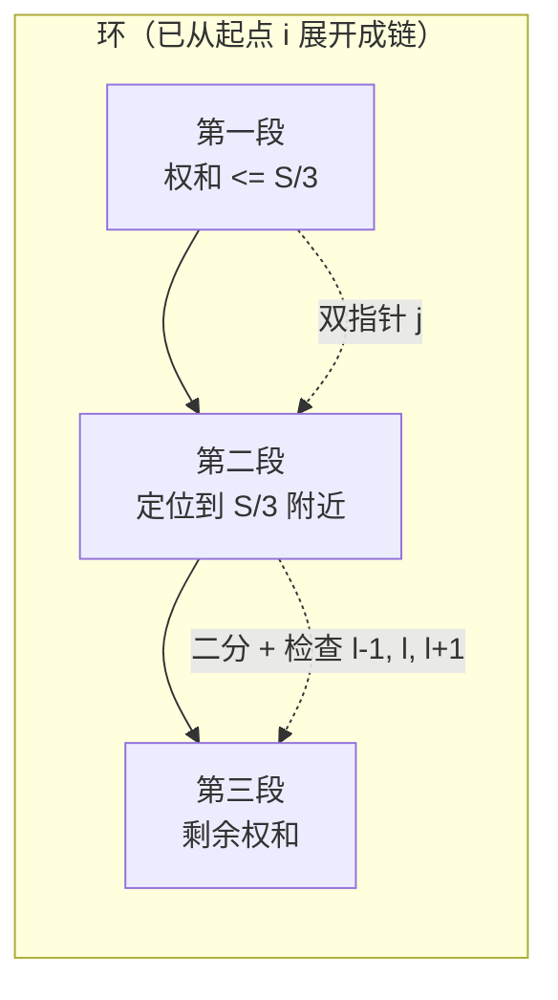

[[TOC]]

## 形式化题目

给定一个长度为 $N$ 的环形序列 $L_1, L_2, \dots, L_N$（首尾相接），把它沿环切成 $K$ 段，
每段对应环上一段连续的舱室，各段长度和为 $s_1, \dots, s_K$。记总长 $S = \sum L_i$、
平均段长 $s_{avg} = S / K$，求

$$\min \sum_{i=1}^{K} \left(s_i - s_{avg}\right)^2 \cdot K^2$$

即方差最小值与 $K^2$ 的乘积。

约束：$1 \leqslant L_i \leqslant 1000$，$K \leqslant N$。

**两个容易读漏的点**：题面定义的"方差"没有除以 $K$，就是 $\sum (s_i - s_{avg})^2$；
要求输出的又是它再乘 $K^2$，所以最终答案一定是个整数。

## 解法路线

本题的难度全部来自"数据规模分层"：$N$ 很小时 $K$ 可以大到 20，
而 $N$ 很大（$10^5$、$3 \times 10^5$）时 $K$ 反而只有 2 或 3。
于是三层的瓶颈各不相同：小数据要处理高维分段，大数据要处理难以 O(1) 定位的切点。

| 层 | 适用约束 | 上一层瓶颈 | 本层用到的观察 |
| --- | --- | --- | --- |
| 暴力枚举 | $N \leqslant 400$、$K \leqslant 20$ | —— | 切段代价只与段长和有关 |
| 子任务解法 | $N \leqslant 400$、$K \leqslant 20$ | 枚举所有切点组合是 $O(N^K)$ | 转移可写成直线取最小，凸包优化 |
| 正解 | $N$ 大、$K = 2$ 或 $3$ | 断环起点任意，无法整体 DP | 段数极少，最优切点必然贴着 $S/K$ |

正式主解为 `main.cpp` 与 `main.py`，两者同一套分层算法。

## 暴力解法

### 适用范围

$N \leqslant 400$ 且 $K$ 较小，用于验证公式本身；枚举量随 $K$ 爆炸，只作为理解起点。

### 思路

先做代数化简。注意 $S = \sum s_i$ 是定值，与切法无关：

$$
\sum_{i=1}^{K} (s_i - s_{avg})^2
= \sum_{i=1}^{K} s_i^2 - 2 s_{avg}\sum_{i=1}^{K} s_i + K s_{avg}^2
= \sum_{i=1}^{K} s_i^2 - \frac{S^2}{K}.
$$

两端同乘 $K^2$：

$$K^2 \sum_{i=1}^{K} (s_i - s_{avg})^2 = K^2 \sum_{i=1}^{K} s_i^2 - K S^2.$$

$K$ 与 $S$ 都是常量，所以**目标等价于最小化 $\sum s_i^2$**，
最后再套 $K^2 \cdot \text{minSumSq} - K S^2$ 输出即可。
用样例 1 验算：$K=2$，切法 $[2\,6][1\,3\,4]$ 得 $s = 8, 8$，
$\text{minSumSq} = 128$，$2^2 \times 128 - 2 \times 16^2 = 0$ ✓。

暴力就是枚举环上所有切点组合（$N$ 个断环位置 $\times$ 在剩下 $N-1$ 个缝里选 $K-1$ 个），
逐组算 $\sum s_i^2$ 取最小。

### 复杂度

枚举量 $O(N^K)$，$N = 400, K = 20$ 时完全不可行。

### 瓶颈

瓶颈在"切点组合数"，而不是"每组算代价"。化简后单组代价可以 $O(1)$ 求出，
所以只要把枚举过程改成 DP、再优化转移，就能同时解决小数据的高 $K$。

## 子任务解法：$N \leqslant 400$

### 适用范围

$N \leqslant 400$（可以承受 $O(N^2 K)$），$K$ 最大到 20。

### 思路

**化环为链：枚举断环起点。** 环形问题是"切 $K$ 段"，等价于先指定某条缝不被切开
（作为第 1 段的起点），再在剩下的链上切 $K-1$ 刀。于是枚举 $N$ 个断环位置 $d$，
每次把序列旋转成长度 $N$ 的链 $L_d, L_{d+1}, \dots$，做一次区间 DP，$O(N)$ 种旋转取最小。

对一条链设 $pre[i] = \sum_{t \leqslant i} L_t$，$f_t[i]$ 表示前 $i$ 个舱室分成 $t$ 段的
最小 $\sum s^2$，则

$$f_t[i] = \min_{0 \leqslant j < i}\Big(f_{t-1}[j] + \big(pre[i] - pre[j]\big)^2\Big).$$

把平方展开，把与 $j$ 无关的 $pre[i]^2$ 提到外面：

$$f_t[i] = pre[i]^2 + \min_{j < i}\Big(\underbrace{-2\,pre[j]}_{m_j} \cdot pre[i] + \underbrace{f_{t-1}[j] + pre[j]^2}_{b_j}\Big).$$

括号里是"一堆直线 $y = m_j x + b_j$ 在 $x = pre[i]$ 处取最小值"，
$x = pre[i]$ 单调不减、斜率 $m_j = -2\,pre[j]$ 单调递减，正是**斜率优化（凸包）**的标准形态：
维护一个下凸壳，查询时在下标上二分（或指针右移），每层转移 $O(N \log N)$、
不带 $\log$ 是 $O(N)$，总 $O(N^2 K)$。

举一个把转移写成表格的推演，取自样例 2（$K = 3$）的断环起点 $d$，使链为
$4, 2, 6, 1, 3$，$pre = 0, 4, 6, 12, 13, 16$：

| $i$ | $pre[i]$ | $f_1[i]$ | 最优 $f_2[i]$ | 切点 $j$ |
| --- | --- | --- | --- | --- |
| 1 | 4 | 16 | ∞ | —— |
| 2 | 6 | 36 | $16 + 2^2 = 20$ | 1 |
| 3 | 12 | 144 | $36 + 6^2 = 72$ | 2 |
| 4 | 13 | 169 | $144 + 1^2 = 145$ | 3 |
| 5 | 16 | 256 | $\min(144+4^2,\,169+3^2)=178$ | 3 |

表中 $f_1[i] = pre[i]^2$（一段就是整条前缀），$f_2$ 之后再做一层得到 $f_3[5]$。
注意 $K$ 层只需滚动两个数组，空间是 $O(N)$。

### 复杂度

时间 $O(N^2 K)$：外层 $N$ 个断环起点，内层 $K$ 层转移、每层 $O(N)$（凸包查询二分则为 $O(N \log N)$）。
空间 $O(N)$。$N = 400, K = 20$ 时约 $3.2 \times 10^6$，实测毫秒级。

### 代码

与整体解法共用，见下文正解的 `main.cpp` / `main.py` 分支 `N <= 400`。

### 复杂度与瓶颈

瓶颈在 $O(N^2 K)$ 的常数上：$N$ 一旦到 $10^5$，
单是 $N^2$ 就已经 $10^{10}$，必须换方法。而题面数据里 $N$ 大的点 $K$ 只取 2 或 3，
这提示我们：大数据要按 $K$ 的具体值另做文章。

## 正解

### 关键观察

**观察一：$K$ 大和 $N$ 大不会同时出现。** 题面数据规模表里，
$N \leqslant 400$ 的点 $K$ 可以到 20；$N = 10^5, 3 \times 10^5$ 的点 $K$ 只有 2 或 3。
（这一点被仓库素材里的生成脚本 `data.py` 印证：大数据点的 $K$ 也正是 2、3。）

**观察二：$K = 2$ 时可双指针。** 目标 $\sum s_i^2$ 在两段时等于 $v^2 + (S-v)^2$，
它是 $v$ 的凸函数，在 $v = S/2$ 处最小。枚举第一段起点 $i$ 后，第一段权和
$v = pre[j] - pre[i-1]$ 随 $j$ 单调增，所以"权和不超过 $S/2$ 的最远切点 $j$"
本身也随 $i$ 单调右移 —— 这正是双指针，$O(N)$ 就能对每个起点取到 $S/2$ 两侧的两个切点。

**观察三：$K = 3$ 时切点仍贴着 $S/3$。** 若三段分别为 $v_1, v_2, v_3$，
和固定为 $S$，$\sum s_i^2$ 在"三者尽量接近 $S/3$"时最小。于是：
固定第一段权和不超 $S/3$ 的最远切点 $j$ 之后，第二、三段的分配就是个 $K=2$ 子问题，
继续用单调指针 + 二分把它压到 $S/3$ 附近，并检查切点左右各一格即可。

### 思路

分三种情况写，全部复用一个倍长前缀和数组 $pre$（$pre[i] = \sum_{t \leqslant i} L_{(t-1) \bmod N + 1}$，
两倍长度以支持任意环上区间和）：

1. **$K = 1$**：只有一段，方差恒为 0，直接输出 $0$。
2. **$N \leqslant 400$**：如上一节的枚举断环起点 + 凸包斜率优化 DP，精确求解。
3. **$N > 400$ 且 $K = 2$**：双指针，对每个起点 $i$ 取 $j$ 与 $j+1$ 两个切点算代价，精确。
4. **$N > 400$ 且 $K = 3$**：先双指针定第一个切点 $j$（第一段权和 $\leqslant S/3$ 的最远点），
   再在 $(j,\ i+N-2]$ 上二分找第二个切点 $l$（第二段权和 $\leqslant S/3$ 的最远点），
   检查 $l-1, l, l+1$ 三个候选。

最后统一套公式 $\text{ans} = K^2 \cdot \text{minSumSq} - K \cdot S^2$。
$K \leqslant 20$、$S \leqslant 3 \times 10^8$ 时 $K S^2$ 可达 $1.8 \times 10^{18}$，
接近 `long long` 上限，所以 C++ 里用 `__int128` 计算；Python 整数天然无溢出。

### 代码

Python 版：

@include-code(./main.py, python)

C++ 版（同一算法）：

@include-code(./main.cpp, cpp)

### 复杂度

| 分支 | 时间 | 空间 |
| --- | --- | --- |
| $K = 1$ | $O(N)$ | $O(N)$ |
| $N \leqslant 400$ | $O(N^2 K)$ | $O(N)$ |
| $N > 400,\ K = 2$ | $O(N)$ | $O(N)$ |
| $N > 400,\ K = 3$ | $O(N \log N)$ | $O(N)$ |

瓶颈点是 $N \leqslant 400$ 的 $O(N^2 K)$ 与大数据点的 $\log$（二分第二个切点），
在 $N = 3 \times 10^5$、1 s 时限下都绰绰有余。

## 总结

- **先化简再谈算法**：方差乘 $K^2$ 后只剩 $\sum s_i^2$ 一项依赖切法，
  这一步把"求方差"变成"求最小平方和"，是整题的地基。
- **化环为链有两条路**：小数据枚举断环起点（$O(N)$ 倍代价换回普通线性 DP），
  大数据直接在两倍长前缀和上做双指针/二分（不枚举起点）。
- **按 $K$ 分层是本题的题眼**：$K$ 大必然 $N$ 小，$N$ 大必然 $K$ 小，
  两处瓶颈不会叠加，所以可以放心写两套完全不同的代码。
- **候选切点要两侧都看**：双指针只能停在 $\leqslant$ 目标的那一侧，
  必须同时检查 $j$ 与 $j+1$（$K=3$ 时是 $l-1, l, l+1$），否则会漏掉更优解。

## 图示解析

下图展示 $K = 3$ 时"切点贴着 $S/3$"是怎么落到环上的：第一刀放在权和不超过 $S/3$
的最远缝处，第二刀在剩下的区间里同法定位，被检查的三个切点候选只差一个舱室。

观察重点：三段权和一旦都在 $S/3$ 附近，$\sum s_i^2$ 自动最小；
图中两条虚线分别标出第一刀和第二刀的定位方式，
它们都不需要遍历整个环，只依赖"权和随切点单调增"这一个性质。
