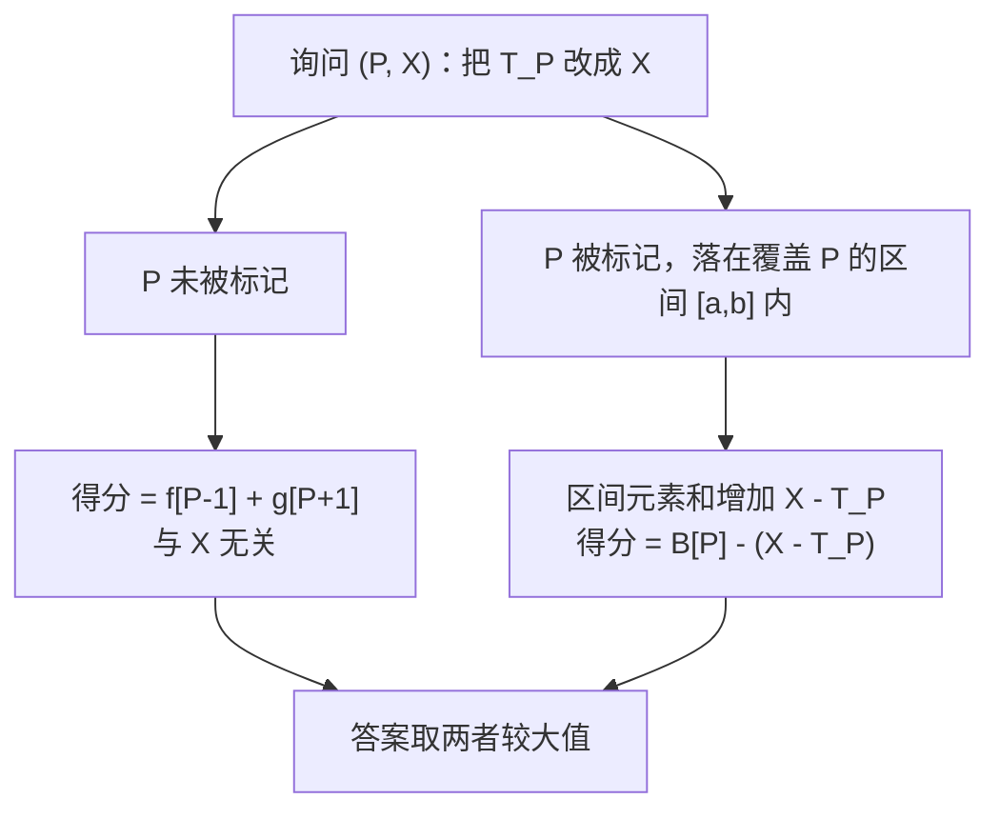
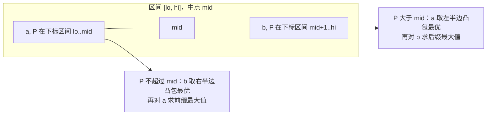

[[TOC]]

## 形式化题目

给定长度为 $N$ 的序列 $T_1, \dots, T_N$。选择一个标记集合 $S \subseteq \{1, \dots, N\}$，
它按极大连续段分解成若干互不相邻的区间。若某段区间为 $[l, r]$，长度 $c = r - l + 1$，
则它贡献 $\dfrac{c(c+1)}{2}$（完全落在段内的子区间个数）减去 $\sum_{i=l}^{r} T_i$
（被标记数字之和）。总得分是所有极大连续段贡献之和。

有 $M$ 组询问，第 $i$ 组给出 $P_i, X_i$，要求把 $T_{P_i}$ 临时改成 $X_i$ 后总得分的最大值。
每组询问相互独立。

于是整个问题等价于：选若干个互不相交的区间 $[l, r]$，最大化
$\sum \left( \dfrac{c(c+1)}{2} - \sum T \right)$，每组询问把某个 $T_P$ 换成 $X$ 后重求这个最大值。

## 正解

### 思路

**朴素做法的瓶颈。** 单次静态序列可以用 DP 求解：设 $f[i]$ 为前缀 $1..i$ 的最优得分，
枚举最后一个标记段 $[m+1, i]$：

$$f[i] = \max\left(f[i-1],\; \max_{0 \le m < i}\Big\{ f[m] + \tfrac{(i-m)(i-m+1)}{2} - (S_i - S_m) \Big\}\right)$$

其中 $S$ 为前缀和，$m = 0$ 表示 $f[0]=0$。内层是斜率优化，单次静态序列可 $O(N)$ 或 $O(N \log N)$
解决。但 $M$ 组询问若各跑一次就是 $O(NM) = 9 \times 10^{10}$，必须换思路。

**关键观察：一次单点修改到底改变了什么？** 看位置 $P$ 在最优方案中的处境：

1. **$P$ 未被标记**：它只起断点作用，值是多少（$T_P$ 还是 $X$）完全不影响得分。
   此时最优值 = 前缀 $[1, P-1]$ 的最优 + 后缀 $[P+1, N]$ 的最优 = $f[P-1] + g[P+1]$。
2. **$P$ 被标记**：它落在某个覆盖 $P$ 的标记区间 $[a, b]$ 中。把 $T_P$ 改成 $X$ 只让
   这一个区间的元素和增加 $X - T_P$，于是总得分恰好减少 $X - T_P$，其余部分的决策不受影响。

所以若定义 $B[P]$ = **在原序列中强制标记 $P$ 时的最大总得分**，那么 $P$ 被标记时的答案
就是 $B[P] - X + T_P$。而因为标记区间互不相交，覆盖 $P$ 的区间至多一个，两种情况穷尽了所有
方案：

$$\mathrm{ans}(P, X) = \max\Big( \underbrace{f[P-1] + g[P+1]}_{\text{与 } X \text{ 无关}},\; \underbrace{B[P] - X + T_P}_{\text{与 } X \text{ 线性相关}} \Big)$$

动态询问就这样被压成了纯静态预处理——只要算出 $f, g, B$ 三个数组，每次询问 $O(1)$。

**求 $f$ 与 $g$（斜率优化）。** 把转移式里的交叉项拆出来：

$$f[i] = \max\left(f[i-1],\; \tfrac{i^2+i}{2} - S_i + \max_{0 \le m < i}\big\{ c_m - i \cdot m \big\}\right),\qquad
c_m = f[m-1] + S_m + \tfrac{m(m-1)}{2}$$

内层就是对直线 $y = m x + c_m$ 在 $x = -i$ 处取最大值。$m$ 随 $i$ 递增而递增，
$x = -i$ 递减，维护斜率递增的上凸包即可，但查询点不单调——用二分查询，得 $O(N \log N)$。
$g$ 完全对称：$g[i]$ 表示后缀 $i..N$ 的最优值，$g[N+1] = 0$，把区间右端写成 $[i, j-1]$ 后
同样化为直线查询。

**求 $B[P]$（CDQ 分治 + 凸包）。** 强制标记 $P$ 即要求区间 $[a, b]$ 满足 $a \le P \le b$，
此时左右两侧仍是独立的前缀/后缀问题，于是

$$B[P] = \max_{a \le P \le b}\Big( f[a-2] + \tfrac{(b-a+1)(b-a+2)}{2} - (S_b - S_{a-1}) + g[b+2] \Big)$$

把区间贡献展开并按 $a$、$b$ 分离（$\dfrac{(b-a+1)(b-a+2)}{2}$ 里含交叉项 $ab$）：

$$f[a-2] + \Big(\tfrac{(b-a+1)(b-a+2)}{2} - (S_b - S_{a-1})\Big) + g[b+2] = \text{leftPart}[a] + \text{rightPart}[b] - a \cdot b$$

$$\text{leftPart}[a] = f[a-2] + S_{a-1} + \tfrac{a^2 - 3a}{2},\qquad
\text{rightPart}[b] = g[b+2] - S_b + \tfrac{b^2 + 3b + 2}{2}$$

（$a \le 2$ 时 $f[a-2]$ 视为 $0$，$b \ge N-1$ 时 $g[b+2]$ 视为 $0$。）

现在的任务变成：对每个 $P$ 求 $\max\{ \text{leftPart}[a] + \text{rightPart}[b] - ab : a \le P \le b \}$。
直接做是 $O(N^2)$。用 CDQ 分治（分治下标区间 $[lo, hi]$，$mid$ 为中点）：

- **更新左半边 $P \in [lo, mid]$**：条件 $a \le P$，而只要 $b \ge mid+1$ 就自动有 $b \ge P$。
  于是对每个 $a$ 只需在右半边 $b \in [mid+1, hi]$ 的凸包里查 $\max(\text{rightPart}[b] - a b)$，
  得到 $val(a)$；再对 $val$ 做**前缀最大值**（把 $a \le P$ 内的所有 $a$ 都取到），
  一次性覆盖左半边所有 $P$。
- **更新右半边 $P \in [mid+1, hi]$**：对称地，对每个 $b$ 在左半边 $a$ 的凸包里查
  $\max(\text{leftPart}[a] - a b)$，得 $val'(b)$，再做**后缀最大值**覆盖右半边所有 $P$。

两边的凸包斜率与查询 $x$ 都单调，指针扫描即可 $O(\text{区间长})$。每层总长 $O(N)$，
共 $O(\log N)$ 层，总复杂度 $O(N \log N)$。

### 代码

@include-code(./main.py, python)

@include-code(./main.cpp, cpp)

### 复杂度

时间 $O(N \log N + M)$：斜率优化 DP $O(N \log N)$，CDQ 分治 $O(N \log N)$，询问 $O(1)$；
空间 $O(N)$。最大点 $N = M = 3 \times 10^5$ 时，C++ 实测最慢 $0.4$ s（峰值内存 24 MB），
Python 同阶但常数较大，实测约 $2.5$ s。

## 总结

本题的核心是把「单点修改 + 询问最优值」的在线问题转成离线预处理：只要观察到修改值 $X$
只通过 $\pm(X - T_P)$ 影响得分，且是否覆盖 $P$ 只有两种互斥情形，就能把 $X$ 从 DP 中剖出去，
留下三个与 $X$ 无关的静态数组。剩下的是两次斜率优化加一次「区间包含约束下的二维最值」，
后者正是 CDQ 分治 + 凸包的经典形状——$a \le P \le b$ 被中点劈成两段条件，各退化成一次
单调凸包扫描。

与前缀 DP 相比，$B[P]$ 多出来的是 $a, b$ 两侧独立的乘积项，这使权矩阵成为反 Monge 矩阵，
也是分治能成立的结构性原因。

实现上要注意两点：$\tfrac{c(c+1)}{2}$ 在 $N = 3 \times 10^5$ 时可达 $4.5 \times 10^{10}$，
凸包叉积涉及 $10^{12} \times 10^{5}$ 量级，C++ 用 `__int128` 比较；答案不可为负，
所有不标记就是 0 分。

> 素材说明：本题素材源带自造数据生成脚本（`data.py`），题面按一本通《高手训练篇》
> 原题文字重建，测试点为分层自造，与官方原始测试数据不保证一致。

## 图示解析

### 询问的两种处境

### CDQ 分治的一层

