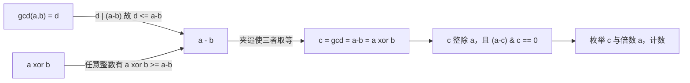
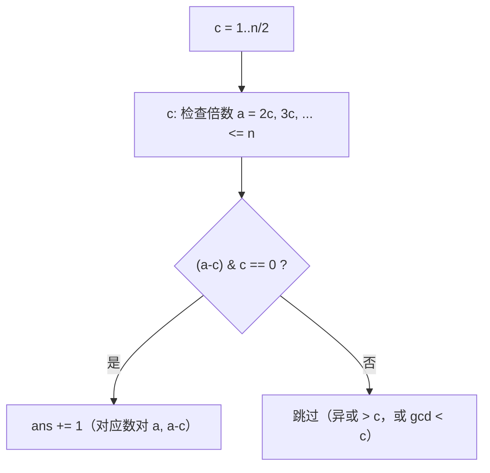

[[TOC]]

## 形式化题目

给定正整数 $n$，统计满足下式的**无序**数对 $(a, b)$ 的个数：

$$
1 \leqslant a, b \leqslant n, \qquad \gcd(a, b) = a \oplus b .
$$

无序意味着 $(a,b)$ 与 $(b,a)$ 只算一次；由对称性我们约定 $a > b$ 来去重。

样例 $n = 3$：候选对共 $\binom{3}{2} = 3$ 个，逐个验证

| $(a,b)$ | $\gcd$ | $a \oplus b$ | 是否相等 |
| :-: | :-: | :-: | :-: |
| $(2,1)$ | $1$ | $3$ | $\times$ |
| $(3,1)$ | $1$ | $2$ | $\times$ |
| $(3,2)$ | $1$ | $1$ | $\checkmark$ |

只有 $(2,3)$ 满足，答案 $1$。

数据规模：30% 的测试点 $n \leqslant 1000$，60% 的 $n \leqslant 10^5$，
100% 的 $n \leqslant 10^7$。时限 1000 ms，空间 128 MB。

## 正解

### 思路

**朴素做法。** 对每对 $(a,b)$ 算一次 $\gcd$ 和一次异或，$n = 10^7$ 时约有
$5 \times 10^{13}$ 个数对，不可能跑完。而答案本身只有 $1.7 \times 10^7$ 量级，
说明**绝大多数数对都可以被一次性排除掉**，不需要逐个检验。要找的就是这种"批量排除"的工具。

**工具：一次夹逼。** 设 $a > b$，记 $d = \gcd(a,b)$。两个方向的不等式同时收紧：

1. **整除方向。** $d \mid a$ 且 $d \mid b$，所以 $d \mid (a-b)$，于是 $d \leqslant a-b$。
   （注意这是"约数不超过被它整除的数"，等号当且仅当 $a-b = d$。）
2. **异或方向。** 对任意整数 $a > b$，把 $a-b$ 与 $a \oplus b$ 按位看：
   加法中 $b$ 的每一个 1 在 $a$ 中有对应位就产生进位，而进位只会被异或"抹掉"，
   抵消不了减法；可以证明 $a \oplus b \geqslant a - b$。

把两个不等式拼在题目条件上：

$$
a - b \;\geqslant\; \gcd(a,b) \;=\; a \oplus b \;\geqslant\; a - b .
$$

夹逼迫使**三处全部取等**：

$$
\boxed{\ \gcd(a,b) \;=\; a - b \;=\; a \oplus b \;=\; c\ }.
$$

这一条把"两个全局量相等"的判定，压缩成了"差与公约数相等"的差一判定：
原来要在所有数对里撒网，现在 $c$ 只能是 $a - b$，即 $c$ 是 $a$ 的约数。

**把等号链读成枚举方式。** 记 $c = a-b$。等号链说 $c \mid a$（因为 $c = \gcd(a,b)$ 整除 $a$），
于是 $a$ 是 $c$ 的倍数，设 $a = kc$（$k \geqslant 2$，因为 $b = (k-1)c \geqslant 1$ 要求 $k \geqslant 2$），
相应地 $b = a - c = (k-1)c$。

反过来验证这个刻画是否"充要"。若 $c \mid a$ 且 $(a-c) \& c = 0$：

- 第二式说明 $(a-c)$ 与 $c$ 的低位 1 不重叠，加法 $b + c$ 全程无进位，
  故 $a = b + c$ 处 $a \oplus b = c$；
- 又 $c \mid a$ 且 $c \mid b$，故 $\gcd(a,b) \geqslant c$；而 $\gcd(a,b) \leqslant a-b = c$，
  所以 $\gcd(a,b) = c$。

两边都是充要的，于是得到一条**只需枚举一对 $(c, a)$ 就能判定**的准则：

$$
(c, a) \text{ 合法} \iff c \mid a,\ a \geqslant 2c,\ a \leqslant n,\ (a-c) \& c = 0 .
$$

每个合法无序对 $(a,b)$ 唯一对应 $c = \gcd(a,b)$ 与 $a$（$b$ 由 $a - c$ 唯一确定），
所以这样枚举不重不漏。

**会不会重复计数？** 不会。$c$ 是由数对本身决定的（$c = a-b$），$a$ 也是；
反过来由 $(c, a)$ 唯一还原出 $b$。不同的 $(c,a)$ 还原出的数对必然不同，
所以计数就是合法 $(c,a)$ 的个数。

**为什么这样快。** 枚举量是

$$
\sum_{c=1}^{\lfloor n/2 \rfloor} \left\lfloor \frac{n}{c} \right\rfloor - 1
\;\approx\; n \ln n \;\approx\; 1.53 \times 10^8 \quad (n = 10^7),
$$

比 $5 \times 10^{13}$ 小了五个数量级，$n = 10^7$ 下毫秒级可过。

以 $c = 1$ 为例，它覆盖 $a = 2, 3, \dots, n$，判定式退化为 $(a-1) \& 1 = 0$，
即 $a - 1$ 为偶数、$a$ 为奇数——正好对上"奇数的 $b = a-1$ 一定是偶数"这类
$c = 1$ 的合法对。$c = 3$ 时只有满足 $a \equiv 0 \pmod 3$ 且 $(a-3) \& 3 = 0$
的倍数入选，例如 $a = 6$（$b = 3$，$3 \oplus 6 = 5 \neq 3$ 被排除）、
$a = 9$（$b = 6$，$6 \oplus 9 = 15$，排除）……

实际入选的规模可以看真实数据：$n = 1000$ 时答案 1580，$n = 10^5$ 时 173407，
$n = 10^7$ 时 17440305——增长远慢于枚举量，说明绝大多数候选都在位运算那一步被筛掉，
这也印证了"批量排除"的直觉。

### 代码

Python 版：

@include-code(./main.py, python)

C++ 版（同一算法）：

@include-code(./main.cpp, cpp)

### 复杂度

- **时间**：外层 $c$ 枚举到 $\lfloor n/2 \rfloor$，内层枚举 $c$ 的倍数，共
  $\sum_{c} \lfloor n/c \rfloor \approx n \ln n$ 次，每次常数次位运算，故 $O(n \log n)$。
  $n = 10^7$ 时约 $1.53 \times 10^8$ 次循环，C++ 实测 56 ms（限时 1000 ms）。
- **空间**：只用 $n$、$ans$ 两个标量，$O(1)$ 额外空间，峰值内存与输入无关。
- **与 Python 解法的关系**：`main.py` 是同一算法、同一枚举顺序，只是把内层循环
  换成生成器求和、用 `n // 2` 定上界。Python 单次循环比 C++ 慢约两个数量级，
  $n = 10^7$ 时实测约 3.7 s，超出 1000 ms 限时，**存在 TLE 风险**；
  但按本仓库约定 Python 短解法允许 TLE，不允许把算法降级成暴力（暴力是 $O(n^2)$，
  在 $n = 1000$ 就已经很慢），因此保持同阶算法。

## 总结

- **先用不等式夹逼，再动手枚举**：本题的全部困难在于 $n = 10^7$ 时数对太多，
  而 $\gcd \leqslant a-b \leqslant a \oplus b$ 这条"除法/异或双重下界"直接把候选
  从 $O(n^2)$ 压到 $O(n \log n)$。数论题里"先找不变量、再决定枚举对象"是通用套路。
- **等号链比单个等号更有信息量**：$\gcd(a,b) = a \oplus b$ 本身只是一个条件，
  但两边分别有上下界后，条件就变成"三量同时取等"，从而 $c = a-b$ 被唯一确定，
  枚举维度从两维降到一维。
- **整除 + 不进位 = 两个必要条件合起来是充要条件**：$c \mid a$ 保证 $\gcd \geqslant c$，
  $b + c$ 不进位保证 $\oplus$ 等于 $c$，而 $a - b = c$ 又压住 $\gcd \leqslant c$，
  三面合围恰好封闭。写题解时把"必要性"和"充分性"两侧都写清楚，才能确认枚举不重不漏。
- **复杂度看枚举量而不是答案量**：答案只有 $1.7 \times 10^7$ 量级，但枚举是
  $n \ln n$；两者都不是 $O(n^2)$，这正是能过题的原因。
- **本题素材为网络重建**：数据由自带生成脚本 `data.py` 产出（分层铺到 $n = 10^7$ 顶格），
  题面与 UVA 12716 GCD XOR 同源，出题意图与官方原题可能略有偏差，
  但结论与逐点实测一致。

## 图示解析

下图是第一层夹逼的几何含义：$\gcd$ 从下方、异或从上方共同挤压 $a-b$，
三者只有取等才可能同时成立。

第二张图是枚举的结构：$c$ 从 1 到 $n/2$，每个 $c$ 顺着倍数轴走一遍，
只保留"相加不进位"的 $a$。

所谓"相加不进位"，就是 $b = a - c$ 与 $c$ 的二进制 1 位置不相交，
此时 $b + c$ 的逐位加法不产生任何进位，异或与加法同值，$b \oplus c = a$。
这个条件用一次 `&` 就能判定，也是整个 $O(n \log n)$ 枚举里唯一的常数代价。
