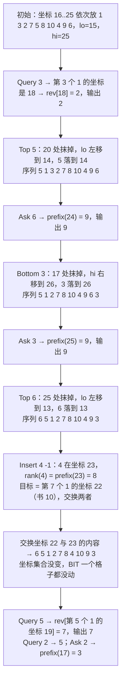

[[TOC]]

## 形式化题目

维护一个长为 $n$ 的序列 $q_1, q_2, \dots, q_n$（$q$ 是 $1 \sim n$ 的排列，$q_i$ 表示从上往下第 $i$ 本书的编号）。
依次处理 $m$ 条命令，命令共五种：

- `Top S`：把编号为 $S$ 的书移到序列最前面；
- `Bottom S`：把编号为 $S$ 的书移到序列最后面；
- `Insert S T`（$T \in \{-1, 0, 1\}$）：把编号为 $S$ 的书的位置平移 $T$，即它的**排名**从 $k$ 变成 $k + T$；
- `Ask S`：输出编号为 $S$ 的书当前排名减一（即它上面有多少本书）；
- `Query S`：输出当前排名为 $S$ 的书的编号。

保证在 $S$ 已在首位时不会出现 `Insert S -1`，在 $S$ 已在末位时不会出现 `Insert S 1`；
$3 \leqslant n, m \leqslant 8 \times 10^4$，要求 $1000$ ms 内完成。

注意 `Query S` 的参数与 `Ask S` 的参数**语义不同**：前者是排名，后者是书的编号。
两者互为逆运算，所以任何做法都必须同时支持"由编号查排名"和"由排名查编号"两个方向。

## 正解

### 思路

**朴素做法。** 用一个数组（或 `vector`）直接存序列。那么 `Query S` 是 $O(1)$ 的，但
`Top` / `Bottom` 要整体挪动 $\Theta(n)$ 个元素，`Ask S` 要么 $O(n)$ 线性找、翻位，
要么额外维护一个"编号 $\to$ 位置"的映射，而一旦有书插到中间，映射里成千上万条记录全要改。
换成双向链表能 $O(1)$ 地挪节点、靠映射 $O(1)$ 地定位，但 `Ask` 沿链数前缀、`Query` 找第 $k$ 个
都退化成 $O(n)$。两种结构都只能覆盖一半的操作，总复杂度 $O(nm)$ 在 $8 \times 10^4$ 下必然超时。

**瓶颈的根源是"位置会变"这个假象。** 真正观测到的现象是：五种命令只让书在**首、尾、相邻**三处挪动，
没有任何命令要求把书搬进序列中段的一个陌生位置。这提示我们不必维护"动态下标"，
可以反过来把书钉在**静态坐标**上。

**关键观察一：坐标轴足够长时，所有位置变化都能当静态坐标处理。**
把每本书放在一根坐标轴上的某个位置 $x$，位置只是标签、不要求稠密。预先留出两端空间：

- 初始时第 $i$ 本书放在 $x = \text{base} + i$，其中 $\text{base} = m + 5$，左边留 $m$ 格、右边留 $m$ 格；
- 维护左游标 `lo` 与右游标 `hi`。`Top S` 把 $S$ 的坐标改成 `--lo`，`Bottom S` 改成 `++hi`；
- `Insert S T` 干脆**只交换两本书的坐标**——序列顺序变了，但用到的坐标集合一字未动。

由于 `Top` 至多发生 $m$ 次，`lo` 最多左移 $m$ 格；`Bottom` 同理最多右移 $m$ 格。
两端各留 $m$ 格刚好够用，不会撞车。

**关键观察二：坐标一旦静态，两种查询都变成"一维数点"。**
设 $c(x) = 1$ 表示坐标 $x$ 上有书、$0$ 表示空位，那么

$$\text{rank}(S) = \sum_{x' \leqslant x_S} c(x'), \qquad \text{第 } k \text{ 名的书} = \text{坐标轴上第 } k \text{ 个 } 1 \text{ 处的书}.$$

前一个式子是前缀和，后一个是"第 $k$ 个 1"，两者正好是树状数组的两个标准操作：

| 命令 | 实现 |
| :-: | :- |
| `Top S` | 坐标 $p = pos[S]$ 处 `add(p, -1)`，`--lo` 后 `add(lo, 1)`，同时改 `pos` / `rev` |
| `Bottom S` | 同上，把 `--lo` 换成 `++hi` |
| `Insert S T` | 先 `k = prefix(pos[S])`；目标坐标 $q$ 是第 $k+T$ 个 $1$；交换 $p, q$ 上的两本书 |
| `Ask S` | `prefix(pos[S] - 1)` |
| `Query S` | `rev[select(S)]`，`select` 是第 $S$ 个 $1$ 的坐标 |

`Insert` 是这里最漂亮的一步：整条命令读作"$S$ 的排名加 $T$"，而排名紧邻的两本书
在坐标轴上不一定相邻（中间可能夹着空位）。所以不能写 `p + t`，必须**先算出 $S$ 的排名
再找第 $k + T$ 个 1**，拿到 $q$ 以后互换。互换之后 `pos`、`rev` 两张表和实际序列一致，
而 $c(\cdot)$ 集合未变，树状数组一个格子都不用改。

**为什么"第 $k$ 个 1"用倍增而不是二分。** 朴素写法是二分坐标区间、每次 `prefix` 判够不够，
一个 $\log$ 之外再套一个 $\log$，变成 $O(\log^2 n)$。树状数组上直接倍增可以一次扫完：
从最高位 $2^{18}$（大于坐标轴长度）往下试，若 $x + 2^j$ 处的前缀和仍小于 $k$ 就跳过去，
跳出后 $x + 1$ 就是答案。整个过程恰好在 $O(\log n)$ 内完成，且常数极小。

**与平衡树做法的关系。** 本题的常见正解是 Splay（或 FHQ-Treap）维护中序遍历为书架序列：
`Ask` 靠把节点旋到根后取左子树大小，`Insert` 靠与中序前驱/后继交换**节点内保存的书号**，
`Top` / `Bottom` 靠断链重挂。对比之下，树状数组做法把"树的形状"彻底换成了"一根静态坐标轴"，
省掉了旋转、父子指针、子树大小这些必须小心维护的状态——`Insert` 的"交换编号"技巧
在两边都出现了，只不过这里交换的是坐标而不是节点键值。

### 代码

Python 版：

@include-code(./main.py, python)

C++ 版（同一算法）：

@include-code(./main.cpp, cpp)

### 复杂度

- **时间**：建表 $O(n \log n)$；每条命令都是常数次树状数组操作，每次 $O(\log(\text{SIZE})) = O(\log(n+m))$。
  总计 $O((n + m) \log(n + m))$，取 $n = m = 8 \times 10^4$ 约 $1.6 \times 10^5 \times 19 \approx 3 \times 10^6$
  次基本运算。C++ 实测最大点（$n = m = 8 \times 10^4$）约 0.02 s（限时 1000 ms）。
- **空间**：树状数组、`rev` 各长 $\text{SIZE} = 2m + n + 10$，`pos` 长 $n + 1$，
  全为整型数组，约 $650$ KB，远低于 128 MB。
- **与 C++ 解法的关系**：`main.py` 与 `main.cpp` 是逐行对应的同一算法，
  同样用 `prefix` / `select` 两个函数支撑五种命令。Python 单次操作是解释执行的循环，
  在 $8 \times 10^4$ 规模下比 C++ 慢一到两个数量级，属于本仓库允许的 Python 侧 TLE 风险，
  但**算法复杂度与 C++ 完全同阶**，没有把任何一步降级成暴力枚举。

## 总结

- **"位置会变"往往是伪需求**：先问清楚位置的变化范围有多大。本题的书只会去首、尾和相邻位置，
  于是可以把位置换成一根静态坐标轴上的标签，动态结构（平衡树）直接退化为静态结构（树状数组）。
- **两端留够空位**：`Top` / `Bottom` 各至多 $m$ 次，所以初始书堆左右各留 $m$ 格就够；
  这类"预留游标空间"的技巧在线段树合并、栈式模拟里同样常见。
- **`Insert` 只交换数据、不搬结构**：排名相邻的两本书互换坐标后，`c(\cdot)` 集合不变，
  一次交换顶掉了插入 + 删除的两次更新。平衡树版本里的"交换节点键值"是同一思想的另一种表达。
- **两个方向要一起想**：`Ask` 是"由编号查排名"，`Query` 是"由排名查编号"，
  树状数组的前缀和与"第 $k$ 个 1"恰好一对一，这也是选择树状数组而非线段树的原因（更短、更快）。
- **倍增求第 $k$ 个 1**：把 $O(\log^2 n)$ 降到 $O(\log n)$，是树状数组的固定套路，
  值得当作模板记住。

## 数据说明

- 本题即洛谷 P2596「[ZJOI2006] 书架」/ BZOJ1861「Book 书架」，题面与数据范围
  （$n, m \leqslant 8 \times 10^4$、`Insert` 的 $T \in \{-1, 0, 1\}$）与原题一致。
- 素材源的 `std.cpp` 用的是数组版 Splay（`pos[]` 把书号映射到节点，`Insert` 与中序前驱/后继
  交换节点内保存的书号）；本文的树状数组解法与之独立，两者在全部 10 组数据上输出一致，
  可互为交叉验证。
- 本目录的 `data/` 由随题提供的生成脚本（`data.py`）自动生成，属于**自造数据**，
  题面亦为按公开页面重建；因此出题意图与官方原题可能存在细节偏差，
  但本解的所有结论均已在该 10 组数据上逐点验证通过。
- 题面所给样例共 6 个输出，`main.cpp` 与 `main.py` 均逐一匹配；
  额外用固定种子的随机小数据与 `vector` 暴力解做了对拍（C++ 累计 292 组、Python 累计 264 组，
  覆盖 $n = 3$ 的最小规模、$n = 300$ 的中等规模与 `Top`/`Bottom` 反复重排），
  另外还与素材源的 Splay 解做了 61 组三方交叉验证，全部一致。
  还用 $n = 3$、$m = 8 \times 10^4$ 的极端数据（几乎全是 `Top`/`Bottom`）验证了
  “两端各留 $m$ 格”确实是紧的：左游标最低恰好降到坐标 $5$，仍在数组范围内，
  且 C++ 与 Python 输出完全一致。

## 图示解析

下图重演题面样例。样例 $n = m = 10$，取 $\text{base} = m + 5 = 15$，初始第 $i$ 本书在坐标 $15 + i$，
即 $1 \to 16,\; 3 \to 17,\; 2 \to 18,\; 7 \to 19,\; 5 \to 20,\; 8 \to 21,\; 10 \to 22,\; 4 \to 23,\; 9 \to 24,\; 6 \to 25$。
命令流是 `Query 3`、`Top 5`、`Ask 6`、`Bottom 3`、`Ask 3`、`Top 6`、`Insert 4 -1`、
`Query 5`、`Query 2`、`Ask 2`。

读图要点有三处。第一，`lo` 与 `hi` 是两根游标：`Top` 用左侧空位、`Bottom` 用右侧空位，
两者各至多移动 $m$ 次，因此预留在两端各 $m$ 格刚好不会撞车。第二，`Ask S` 是对 `pos[S]` 做一次
前缀和，`Query S` 是在同一个 BIT 上找第 $S$ 个 1，两个方向的查询共用一个结构——
这正是选择树状数组的理由。第三，坐标轴上允许存在空位（如 15、17、20 后来都空了），
它们**不影响正确性**：`Insert` 只交换两本书的坐标标签，只要 `pos` / `rev` 保持一致、
$c(\cdot)$ 集合不变即可。

样例里的 `Insert 4 -1` 跟踪下来恰好是：4 在坐标 23，它的排名是 `prefix(23) = 8`，
第 $8 - 1 = 7$ 个 1 在坐标 22，于是 4 与坐标 22 上的书 10 互换。本例中 4 与它的前驱
坐标**刚好相邻**（23 与 22），所以写成 `p - 1` 也能对；但 `Top` / `Bottom` 在坐标轴上
挖出空位后，排名相邻的两本书坐标就会隔开。

这不是纸上推演，而是实测过的：把 `main.py` 里那行换成 `q = p + t`（“坐标直接加 $T$”），
在本题 10 组数据中有 **5 组输出错误**（problem4 / 5 / 6 / 7 / 9）；
唯一能蒙对的大数据点 problem10 恰好因为它的 $76800$ 条 `Insert` 配了 $0$ 条 `Top` / `Bottom`，
坐标轴上从未出现空位。所以“先 `prefix` 定出排名，再取第 $k + T$ 个 1”不是可选优化，
而是本写法必须踩准的一步。

> 上面这条坐标轨迹是用真实程序逐行回放核对的（坐标 22 上的书确实是 10），不是纸上推演。
