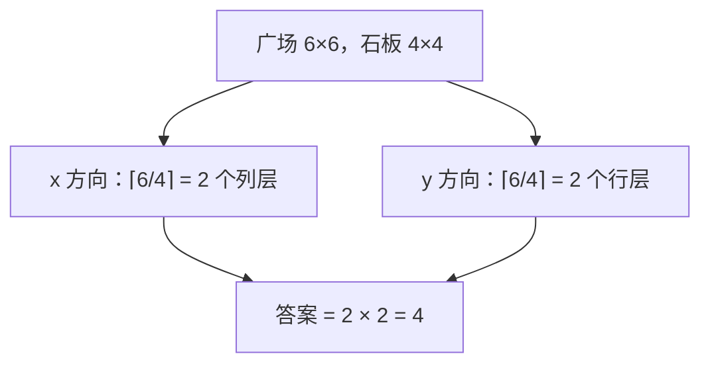

[[TOC]]

## 形式化题目

给定三个正整数 $n, m, a$。用若干块 $a \times a$ 的正方形石板覆盖一个 $n \times m$ 的矩形，满足：

- 石板可以伸出矩形边界（即覆盖面积可以大于广场面积），但必须把广场完全盖住；
- 石板不能切割、不能重叠使用（每块只算一块）；
- 所有石板的边与广场的边**平行**（允许石板边线与广场边线重合，也允许不重合地平移出去）。

求最少需要多少块石板。

数据范围：$1 \le n, m, a \le 10^9$。

## 思路

### 朴素做法的第一反应

最直觉的想法是"从广场左上角开始一块块往右、往下铺"：每铺满一行需要若干块，铺完所有行即可。用模拟或循环去数显然都是这个思路的变体，但 $n, m, a$ 最大到 $10^9$，任何枚举式的模拟都会超时——好在这题根本不需要模拟。

### 关键观察：对齐不是约束，而是下界

石板边必须与广场边平行，但**不要求重合**，即石板可以整体往左、往上平移出去一部分。然而平移任何一块石板都不会让覆盖变得"更划算"：

- **每一列都必须被盖住**。考察一条贴着广场左边缘的竖直细缝（$x$ 坐标取 $(0, \varepsilon)$，$y$ 跑遍 $[0, m]$）：任何覆盖到它的石板，其 $x$ 区间的左端点必须 $\le 0$（若左端点 $> 0$ 就盖不到 $x = 0$ 处）。把广场里所有点按 $x$ 坐标分给盖住它的某块石板，每块石板负责的 $x$ 跨度至多 $a$（它的 $x$ 区间长度恰为 $a$）；于是要把 $x \in [0, n]$ 全部覆盖，至少需要 $\lceil n/a \rceil$ 个不同的 $x$ 区间拼起来。
- 同理，$y$ 方向至少需要 $\lceil m/a \rceil$ 个不同的 $y$ 区间。
- 每块石板的 $x$ 区间长度、$y$ 区间长度都固定是 $a$，属于且仅属于一个（列层，行层）组合，所以总数 $\ge \lceil n/a \rceil \times \lceil m/a \rceil$。

### 这个下界可以取到

构造：把广场左上角对齐到坐标 $(0,0)$，放置所有左上角位于 $(k \cdot a - a, \, t \cdot a - a)$ 的石板（$k = 1..\lceil n/a \rceil$，$t = 1..\lceil m/a \rceil$，允许 $k \cdot a > n$ 或 $t \cdot a > m$ 时伸出边界）。这些石板恰好把 $x \in [0, \lceil n/a \rceil \cdot a]$、$y \in [0, \lceil m/a \rceil \cdot a]$ 的大矩形无缝铺满，而这个大矩形包含了广场 $[0,n] \times [0,m]$。

所以答案就是

$$
\left\lceil \frac{n}{a} \right\rceil \times \left\lceil \frac{m}{a} \right\rceil
$$

样例验证：$n = m = 6$，$a = 4$，$\lceil 6/4 \rceil = 2$，$2 \times 2 = 4$，与样例输出一致。

### 图示解析

以样例 $n = m = 6$，$a = 4$ 为例。$6 = 4 + 2$，第二层的石板各伸出 $2$ 米：

放置方案（虚线框是伸出广场边界的部分，共 $4$ 块石板）：

| | 列层 1（$x\in[0,4]$） | 列层 2（$x\in[4,8]$，伸出 $2$） |
| --- | --- | --- |
| **行层 1**（$y\in[0,4]$） | 石板 ① | 石板 ②（右伸 $2$） |
| **行层 2**（$y\in[4,8]$，伸出 $2$） | 石板 ③（下伸 $2$） | 石板 ④（右、下各伸 $2$） |

即使不伸出（例如 $n = m = 8$，$a = 4$ 时恰好整除），公式 $\lceil n/a\rceil \times \lceil m/a\rceil$ 同样给出 $2 \times 2 = 4$。

### 实现细节

- $\lceil x / a \rceil$ 用整数运算写最稳妥：`(x + a - 1) // a`，避免浮点 `math.ceil(x / a)` 在 $10^9$ 量级的精度隐患（本题 Python 里 `x / a` 是双精度浮点，$10^9$ 以内虽不会出错，但整数写法更通用、更快）。
- $n, m, a \le 10^9$，答案最多约 $10^{18}$，超出 32 位整数——用 Python 原生大整数无压力，C++ 需 `long long`。
- 复杂度 $O(1)$ 时间、$O(1)$ 空间。

## 代码

@include-code(./main.py, python)

## 总结

- 核心结论：允许伸出边界、边平行时，最少石板数 $= \lceil n/a \rceil \times \lceil m/a \rceil$。
- 推理两步走：先证下界（$x$、$y$ 两个方向各自的列/行层数缺一不可），再给构造取到下界。
- 实现只有一行公式，注意用整数上取整写法与大整数范围。
