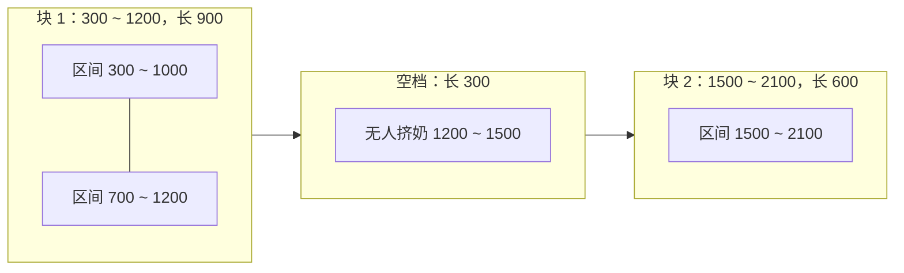

[[TOC]]

## 形式化题目

数轴上有 $N$ 条闭区间 $[s_i, e_i]$，其中 $1 \leqslant N \leqslant 5000$，$0 \leqslant s_i \leqslant e_i < 10^6$。所有坐标单位均为秒。

记这些区间的极大连通块（按左端点递增）为 $B_1, B_2, \dots, B_k$，其中 $B_j = [L_j, R_j]$，满足 $R_j < L_{j+1}$。求：

$$\max_{1 \leqslant j \leqslant k} (R_j - L_j) \qquad \text{与} \qquad \max_{1 \leqslant j < k} (L_{j+1} - R_j)$$

即「至少有一段区间覆盖」的最长连续长度，与「没有任何区间覆盖」的最长连续长度；后者只在第一个连通块开始到最后一个连通块结束之间统计。当 $k = 1$ 时第二个答案为 $0$。

两个答案按此顺序输出。

## 正解

### 思路

#### 1. 朴素做法及其瓶颈

坐标都小于 $10^6$，最直接的想法是开一个长度为 $10^6 + 2$ 的标记数组：把每条区间覆盖到的每个位置都标成「有人」，然后从左到右扫一遍整个时间轴，分别数出最长的连续 `1` 段和最长连续 `0` 段。

这个做法能得到正确答案，但复杂度与**坐标上界**绑定：时间、空间都是 $\mathcal{O}(\max e_i)$。一旦坐标变成 $10^9$ 级别（这在同类题目里很常见），它就无法执行；而且 $10^6$ 个位置里绝大多数都是没有信息的点。

瓶颈在于「逐点扫描」把区间摊平成了点。但题目问的只是**时间段**的长度，答案完全由区间的并的**边界**决定，与区间内部有多少个点毫无关系。所以真正该处理的对象是区间本身。

#### 2. 排序后单趟合并区间

把区间按左端点升序排好后，从左到右扫一遍，把能连在一起的区间并成一个个极大连通块：

- 维护一个块列表 `blocks`，每块记作 `[L, R]`。
- 对于当前区间 $[s, e]$，只看最后一个块 $[L_k, R_k]$：
  - 若 $s \leqslant R_k$，说明这段挤奶和上一段**重叠或首尾相接**，属于同一段连续挤奶时间，于是令 $R_k \leftarrow \max(R_k, e)$；
  - 否则 $s > R_k$，两段之间真的有空白，$[s, e]$ 另起一块。

**为什么只看最后一块就够了？** 因为已经按左端点排好序，新来的 $s$ 一定不小于此前所有区间的左端点。于是它要么接在当前最后一块上，要么和所有更早的块之间都隔着这个最后一块——不可能越过最后一块去和更早的块合并。

注意判据是 $s \leqslant R_k$ 而不是 $s < R_k$：题面中 `300 1000` 之后 `700 1200` 是重叠，而类似 `100 200`、`200 400` 这样右端恰好等于下一段左端的情况属于**首尾相接**，中间没有一秒钟空档，必须并成同一块。

#### 3. 由连通块读出两个答案

- **最长有奶时长**：连通块内部每一秒都至少有一人在挤奶，块与块之间则一定存在无人时刻（否则早就被合并了）。所以块恰好就是「至少一人挤奶」的极大连续段，答案就是 $\max_j (R_j - L_j)$。
- **最长空档时长**：空档只能出现在相邻两块之间，长度是 $L_{j+1} - R_j$（左块右端到右块左端）。第一块之前和最后一块之后的空白按题意不计入。所以答案是 $\max_j (L_{j+1} - R_j)$，$k = 1$ 时没有空档，答案为 $0$（代码里用 `max(..., default=0)` 就是覆盖这一支）。

#### 4. 样例推演

样例输入为三条已排好序的区间：$[300,1000]$、$[700,1200]$、$[1500,2100]$。

| 步骤 | 当前区间 | 最后一个块 | 是否相接 | 块列表 |
| :---: | :---: | :---: | :---: | :--- |
| 1 | $[300,1000]$ | 不存在 | — | $[300,1000]$ |
| 2 | $[700,1200]$ | $[300,1000]$ | $700 \leqslant 1000$，相接 | $[300,1200]$ |
| 3 | $[1500,2100]$ | $[300,1200]$ | $1500 > 1200$，断开 | $[300,1200]$、$[1500,2100]$ |

合并结束后共两块：

| 块编号 | 区间 | 块长（有奶时长候选） | 与下一块的空档 |
| :---: | :---: | :---: | :---: |
| 1 | $[300,1200]$ | $1200-300=900$ | $1500-1200=300$ |
| 2 | $[1500,2100]$ | $2100-1500=600$ | 无 |

取两列的最大值：最长有奶时长 $= \max(900, 600) = 900$，最长空档 $= 300$。输出 `900 300`，与样例一致。

再举一个体现边界的例子：`3 / 100 200 / 200 400 / 400 800` 条条相接，合并成单块 $[100,800]$，有奶时长 $700$，块只有一块故空档为 $0$。

### 代码

@include-code(./main.py, python)

### 复杂度

- **时间复杂度**：$\mathcal{O}(N \log N)$。排序是唯一的超线性步骤，合并与两次求最大值都是单趟 $\mathcal{O}(N)$ 扫描。
- **空间复杂度**：$\mathcal{O}(N)$，用于存放区间列表与合并后的连通块。
- 与坐标上界无关：无论 $e_i$ 是 $10^6$ 还是 $10^9$，复杂度都不变。$N \leqslant 5000$ 时运算量只有几万次，远低于 1000 ms 的时限。

## 总结

本题的核心是把「时间轴逐点扫描」这个与坐标值绑定的模型，换成与 $N$ 绑定的模型：

1. **抽象**：每个农民的一段工作时间就是数轴上的一条闭区间，答案只取决于所有区间的并的边界。
2. **排序**：按左端点升序后，新区间只可能与当前最后一块相关，合并过程退化成一次线性扫描。
3. **细节**：判相接用 $s \leqslant R$（闭区间首尾相接也算连通）；合并时右端取 $\max$ 以处理被包含的区间；空档只在相邻块之间统计，块数为 1 时答案为 0。

这一「排序 + 单趟合并」的模板还可以直接迁移到合并会议时间、统计覆盖长度、求区间并的总长等一系列同类问题上。

## 图示解析

下图展示样例的合并结果：两条区间并成第一块，第三条独立成第二块，两个答案分别来自最长的块与唯一的块间空隙。

观察重点：`[300,1000]` 与 `[700,1200]` 在 $700 \sim 1000$ 上重叠，被并成一块，块长 $900$ 就是第一个答案；两块之间的 $1200 \sim 1500$ 是唯一的无人时段，长度 $300$ 就是第二个答案；第二块自身长 $600$，比第一块短，因此不参与第一个答案。可见「答案来自并集的边界」这一结论：越多的重叠只会让块变长，不会影响计算方式。
