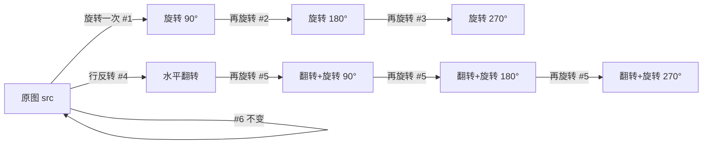
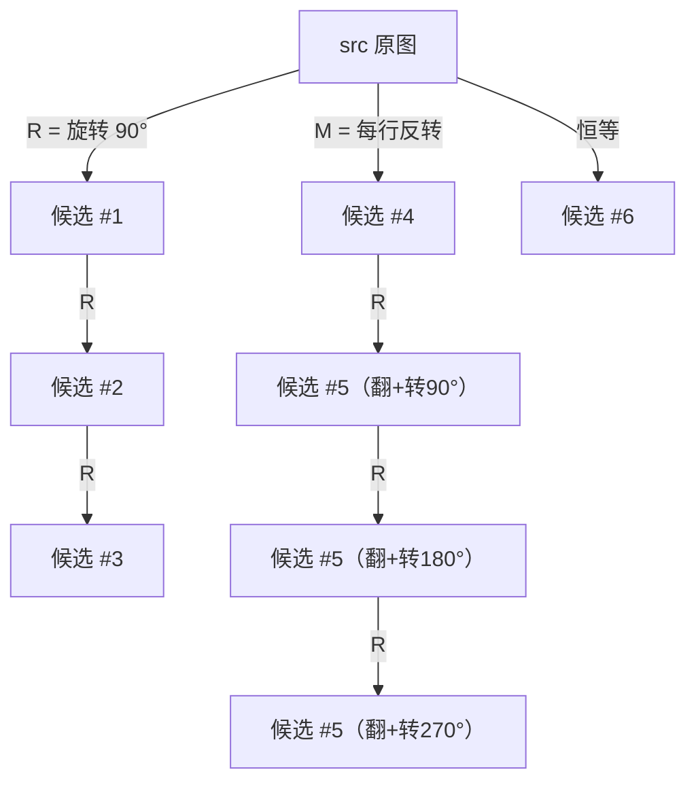

[[TOC]]

## 形式化题目

给定两个 $N \times N$（$1 \leqslant N \leqslant 10$）的黑白方阵 `src`（转换前）与 `dst`（转换后），每个格子是 `@` 或 `-`。判定 `src` 经过下列哪种变换可以变成 `dst`，输出**最小序号**：

- #1：整体顺时针旋转 90°；
- #2：整体顺时针旋转 180°；
- #3：整体顺时针旋转 270°；
- #4：水平翻转（左右镜像）；
- #5：先水平翻转，再做 #1~#3 之一；
- #6：不改变；
- #7：以上变换都无法得到 `dst`。

变换后与 `dst` 完全一致（每个格子都相同）才算匹配；多种变换都能匹配时输出序号最小的那个。

### 样例图示

下表是样例中转换前的图案 `src` 与顺时针旋转 90° 后的图案：

| 原图 src | 顺时针旋转 90° 后 | 目标 dst |
| :--: | :--: | :--: |
| `@ - @` | `@ @ @` | `@ - @` |
| `- - -` | `- - @` | `@ - -` |
| `@ @ -` | `- - -` | `- - @` |

旋转后的中间一列 `@ @ @` 正是原图按列从下往上读出的结果：新图第 $r$ 行恰好是原图第 $r$ 列自下而上排列。把旋转结果与 `dst` 逐格比较，完全一致，所以答案是序号 1。

## 正解

### 思路

最直接的朴素做法是：为 7 种变换各写一段模拟代码，逐一构造变换后的图案与 `dst` 比较。但这样会出现大量重复的"搬格子"代码。

关键观察是：**所有候选图案都能由两个原语复合出来**——

1. `rotate`：顺时针旋转 90°。坐标映射为 $(r, c) \mapsto (c, N-1-r)$，用 Python 写成一行：`zip(*g[::-1])`（先把所有行倒序，再按列拼起来）。
2. `mirror`：水平翻转，即每一行字符串倒序 `row[::-1]`。

于是 8 种候选图案全部可以复合出来：旋转 1/2/3 次是序号 1/2/3；`mirror` 是序号 4；`mirror` 再旋转 1/2/3 次同属序号 5（题面 #5 定义为"翻转后按 #1~#3 之一转换"）；原样是序号 6。

最后按序号从小到大排列这 8 个候选，找第一个等于 `dst` 的序号；一个都没有就是序号 7。这样天然满足"多种方法取最小序号"的要求。下面是各序号与原语复合方式的对应关系：

图中每个箭头都是一次原语操作：从 `src` 出发向右下的链条是纯旋转（序号 1→2→3），向下的链条先翻转（序号 4），再接旋转链条（三个结果都属于序号 5）。判定时把 8 个候选按序号从小到大排成一列，逐个与 `dst` 比较，取第一个匹配即可。

### 代码

@include-code(./main.py, python)

### 复杂度

- 时间复杂度：$O(N^2)$。共 8 个候选图案，每个候选与 `dst` 的比较、以及构造候选本身都是 $O(N^2)$。
- 空间复杂度：$O(N^2)$，存放 `src`、`dst` 与各候选图案。

## 总结

本题的核心是把 7 种变换"去重"成两个原语——顺时针旋转 90° 与水平翻转，其余变换全部由原语复合得到；再按序号从小到大枚举 8 个候选图案，第一个与目标一致的序号即为答案，都不匹配则输出 7。复杂度 $O(N^2)$，实现极短，难点只在于旋转的坐标映射与序号 5 的归并。

## 图示解析

### 两个原语如何复合出全部变换

图中有两棵"原语链"：上面一条从 `src` 连续做三次 `R`（旋转），覆盖序号 1~3；下面一条先做一次 `M`（行反转）得到序号 4，再连续做三次 `R`，三个结果共同对应序号 5。序号 6 就是恒等变换。判定逻辑只在图之外：按 #1→#2→#3→#4→#5→#6 的顺序检查这 8 个候选，第一个等于 `dst` 的序号就是答案，全不匹配输出 #7。
