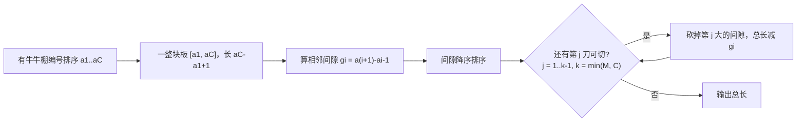

[[TOC]]

## 形式化题目

编号 $1 \sim S$ 的牛棚排成一行，其中 $C$ 个有牛（编号给定，可能相邻）。可以购买至多 $M$ 块木板，每块木板是任意长度的连续区间，一块板覆盖（拦住）区间内所有牛棚。要求每头有牛的牛棚都被至少一块板覆盖，求木板总长度的最小值。

数据范围：$1 \le M \le 50$，$1 \le S \le 200$，$1 \le C \le S$。

样例：$M=4$，有牛牛棚 $\{3,4,6,8,14,15,16,17,21,25,26,27,30,31,40,41,42,43\}$，最优方案为板 $3\text{-}8,14\text{-}21,25\text{-}31,40\text{-}43$，总长 $6+8+7+4=25$。

## 正解

### 思路

**朴素做法**。设一共使用 $k$ 块板，$k$ 最大为 $\min(M, C)$（板数再多也无意义，每头牛单独一块板是上限）。$k$ 块板把有牛牛棚分成 $k$ 个连续段，且相邻两段之间至少隔一个无牛牛棚（否则合并成一块板更短）。对小数据可以直接枚举"在哪些间隙断开"，但那是指数级枚举，需要找规律优化。

**关键观察：最优解的段不会跨越"大间隙"。** 设 $a_1 < a_2 < \cdots < a_C$ 是有牛牛棚编号，相邻间隙 $g_i = a_{i+1} - a_i - 1$（两个牛棚之间的无牛牛棚个数）。若最优方案在某间隙 $g_i$ 处**不**断开，就相当于花钱把 $g_i$ 个空牛棚也盖上；只要还有板数余额，把这里切开总是不亏的——切开省下 $g_i$ 的长度，且两段各自仍是一块连续板。所以：**$k$ 块板的最优解 = 从 $C-1$ 个间隙中挑 $k-1$ 个"最贵"的切开**。

于是答案可以直接算出来：想象先买**一整块**板覆盖 $[a_1, a_C]$，长度为 $a_C - a_1 + 1$；然后允许再切 $k - 1$ 刀，每切一刀就把长度为 $g_i$ 的一段空棚从板上砍掉。要使总长最小，就砍掉**最大的 $k-1$ 个**间隙（可以小于 $k-1$ 刀：长度为 $0$ 的间隙砍不砍无所谓，排序后自然排在最后）。形式化地：

$$\text{ans} = (a_C - a_1 + 1) - \big(\text{最大的 } k-1 \text{ 个 } g_i \text{ 之和}\big), \quad k = \min(M, C)$$

用样例验证：$k=4$，一整块板长 $43-3+1=41$。$17$ 个间隙从小到大为

$$0\times 9,\ 1\times 2,\ 2\times 1,\ 3\times 2,\ 5\times 1,\ 8\times 1$$

取最大的 $3$ 个：$8+5+3=16$，$41-16=25$ ✓，与样例输出一致（$g=3$ 的两个间隙任取其一）。

为什么"挑最大的间隙切"是对的？交换论证：设最优解用了 $k$ 块板、切了某个间隙集合 $T$（$|T| = k-1$），若 $T$ 不是前 $k-1$ 大，则存在间隙 $x \in T$、$y \notin T$ 且 $g_y > g_x$。把 $T$ 中的 $x$ 换成 $y$：段数仍是 $k$（每块板仍是连续区间），且 $y$ 处的空棚不再被覆盖、$x$ 处的空棚改由板覆盖——注意 $x$ 原本被切开，替换后 $x$ 所在的两个子段并回一块板，总长变化恰好是 $g_x - g_y < 0$，方案更优，矛盾。故切前 $k-1$ 大间隙是最优的。

也可以从 DP 角度理解：$f[i][j]$ = 用 $j$ 块板覆盖前 $i$ 头牛的最小总长，转移 $f[i][j] = \min_{t < i} f[t][j-1] + (a_i - a_{t+1} + 1)$。把展开式按 $t$ 拆开后可以看出：转移里最优的 $t$ 总是"在前 $i-1$ 头牛的间隙里挑最大者断开"——DP 的最优决策恰好退化成本题的贪心，所以贪心与 DP 同阶正确，但贪心实现只要一次排序。

下图展示样例的切割过程（从上到下依次砍掉最大的间隙）：

| 步骤 | 操作 | 板覆盖情况 | 当前总长 |
| --- | --- | --- | --- |
| 初始 | 一整块板 | $[3, 43]$ | $41$ |
| 砍最大间隙 $g=8$（牛棚 $32\sim39$） | 切第 $1$ 刀 | $[3,31]$, $[40,43]$ | $33$ |
| 砍次大间隙 $g=5$（牛棚 $9\sim13$） | 切第 $2$ 刀 | $[3,8]$, $[14,31]$, $[40,43]$ | $28$ |
| 砍第三大间隙 $g=3$（牛棚 $18\sim20$ 或 $22\sim24$） | 切第 $3$ 刀 | $[3,8]$, $[14,17]$, $[21,31]$, $[40,43]$ | $25$ |

最终 $4$ 块板总长 $6+4+11+4=25$，与样例最优安排吻合（$g=3$ 的两个间隙任切一个都最优）。

**实现细节**：

- 牛棚编号需要先排序（输入不保证有序）。
- $k = \min(M, C)$：当 $C \le M$ 时每头牛都可以单独盖，但等价地一整块板再砍 $C-1$ 刀会把总长砍成 $C$（每头牛盖 $1$ 个牛棚），公式自动成立，无需特判。
- 间隙长度为 $0$（相邻牛）不影响结果，排序后自然不会被优先砍。
- 边界：$C = 1$ 时没有间隙、$k-1 = 0$ 刀，答案为 $1$，公式同样成立。

### 代码

代码中 `a` 是排序后的有牛牛棚编号，`gaps` 即各相邻间隙 $g_i$，`sum(sorted(gaps, reverse=True)[:m - 1])` 就是"砍掉最大的 $k-1 = m-1$ 个间隙"。当 $C \le M$ 时 $m - 1 \ge C - 1$ 等于间隙总数，切片把所有间隙全砍掉，答案自动化为 $C$。

@include-code(./main.py, python)

### 复杂度

- 时间复杂度：$O(C \log C)$，瓶颈在牛棚编号排序与间隙排序（可合并为一次排序），$C \le 200$ 规模下远低于 $1000\,\text{ms}$ 限制。
- 空间复杂度：$O(C)$，保存牛棚编号与间隙数组。

## 总结

本题的贪心关键在于换一个计数视角：答案 = "一整块板的长度"减去"被切掉的空棚总长"，而切 $k-1$ 刀的最优策略就是**挑最大的 $k-1$ 个间隙**——交换论证保证任何不切最大间隙的方案都能被改进。注意三个实现点：输入编号要先排序；板数上限取 $k=\min(M, C)$；$C \le M$ 与 $C=1$ 的边界由公式自动覆盖，无需特判。实测 19 个评测点输出全部一致，单点约 0.016 s、峰值内存约 14 MB，远低于 $1000\,\text{ms}/128\,\text{MB}$ 限制。
