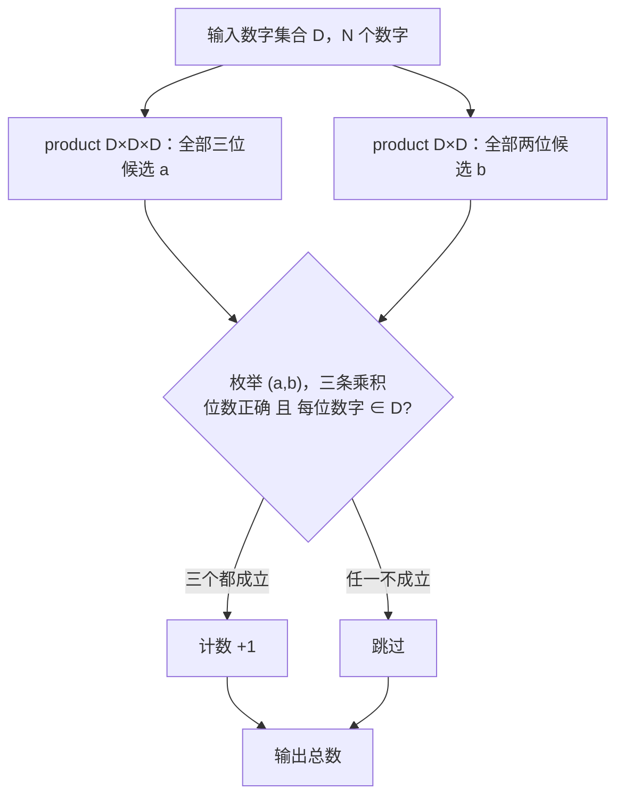

[[TOC]]

## 形式化题目

给定数字集合 $D \subseteq \{1,2,3,4,5,6,7,8,9\}$（$|D| = N \leqslant 9$，允许重复使用同一数字）。统计满足下面竖式要求的有序对 $(a,b)$ 的个数：

```
      A1 A2 A3        a：三位被乘数
   ×     B1 B2        b：两位乘数
   -----------
      P1 P2 P3        a × B2，三位
   Q1 Q2 Q3           a × B1，三位
   -----------
  R1 R2 R3 R4         a × b，四位
```

其中每个字母位置的值都必须属于 $D$，且 $a,b$ 由 $D$ 中的数字拼成（$D$ 不含 $0$，所以首位非 $0$ 自动满足）。等价于要求：$a$ 是三位、$b$ 是两位且每位数字都在 $D$ 中，并且

$$a\cdot(b \bmod 10) \in [100,999],\quad a\cdot\lfloor b/10 \rfloor \in [100,999],\quad a\cdot b \in [1000,9999],$$

且这四个乘积的每一位十进制数字都属于 $D$。

## 正解

### 思路

竖式里一共有 9 个 `*`，但真正独立的只有 5 个：被乘数 $a$ 的 3 位和乘数 $b$ 的 2 位。两条部分积行和最后一行都不是自由变量——它们由 $a,b$ 算出来。如果按最朴素的"枚举 9 个位置各自取哪个数字"来做，$|D|=9$ 时是 $9^9 \approx 3.9\times 10^8$ 种填法，其中绝大多数连"部分积等于 $a\times b_2$"都做不到，属于纯浪费。

把 5 个自由度和 4 个算出来的位置对上之后，搜索空间立刻降到 $|D|^3 \cdot |D|^2 \leqslant 9^5 = 59049$ 个二元组。做法就是：

1. 用 $D$ 的数字（可重复）拼出所有三位数，得到候选集合 $A$，大小为 $N^3$；
2. 同样拼出所有两位数，得到候选集合 $B$，大小为 $N^2$；
3. 枚举 $(a,b) \in A \times B$，检查三条乘积 $a(b \bmod 10)$、$a\lfloor b/10\rfloor$、$ab$。

因为 $a,b$ 是"拼"出来的，它们的位数和数字合法性天然成立，剩下的检查只落在三个乘积上。又因为 $D$ 里的数字都在 $1\sim 9$，所以 $a \geqslant 111$、$b \geqslant 11$：三条乘积的位数只会"恰好"或"偏多"，不会偏少。每个乘积要同时通过两项：**十进制长度恰好等于竖式给定的位数**（部分积 3 位、最终积 4 位），以及**每一位都属于 $D$**。

| 竖式位置 | 表达式 | 长度要求 | 只查长度会漏掉 | 只查数字会漏掉 |
| --- | --- | --- | --- | --- |
| 第一行部分积 | $a \cdot (b \bmod 10)$ | 3 | 结果里出现集合外数字（$496$ 里的 $9$） | 结果是 4 位（$1344$） |
| 第二行部分积 | $a \cdot \lfloor b/10 \rfloor$ | 3 | 同上 | 同上 |
| 最后一行 | $a \cdot b$ | 4 | 结果里出现集合外数字（$5106$ 里的 $5,1,0$） | 结果是 5 位（$10304$） |

用样例 $D = \{2,3,4,6,8\}$ 看这三条乘积的检查是怎么工作的（$0,1,5,7,9$ 都在集合外）：

| 算式 | 部分积一 | 部分积二 | 最终积 | 判定 |
| --- | --- | --- | --- | --- |
| $222 \times 22$ | $444$ ✅3 位、数字合法 | $444$ ✅ | $4884$ ✅4 位、数字合法 | **计入** |
| $222 \times 23$ | $666$ ✅ | $444$ ✅ | $5106$ ❌含 $5,1,0$ | 否决 |
| $222 \times 24$ | $888$ ✅ | $444$ ✅ | $5328$ ❌含 $5$ | 否决 |
| $248 \times 22$ | $496$ ❌含 $9$ | $496$ ❌ | $5456$ ❌含 $5$ | 否决 |
| $224 \times 46$ | $1344$ ❌4 位 | $896$ ❌含 $9$ | $10304$ ❌5 位 | 否决 |

可见"长度"和"数字集合"两项缺一不可：$222\times23$ 是位数全对但数字越界，$224\times46$ 则是部分积一超出位数（$1344$ 是 4 位）、部分积二数字越界（$896$ 含 $9$）。整个样例只有 $222\times22$ 一组合格，输出为 $1$。

下面这张流程图就是主流程的全部内容：



### 代码

`build_numbers` 用 `itertools.product` 直接生成候选整数：`int(''.join(map(str, combo)))` 把"位数"这件事交给构造过程，所以 `is_cow_number` 只需要检查乘积。`allowed.issuperset(map(int, text))` 把拆位和成员判定合成一次遍历；三个条件用 `and` 短路串起来，`sum` 把 `True/False` 当 1/0 累加，就得到了满足条件的二元组个数。

@include-code(./main.py, python)

### 复杂度

设 $N = |D| \leqslant 9$。

- 时间复杂度：$O(N^5)$。候选 $a$ 有 $N^3$ 个、$b$ 有 $N^2$ 个，共 $N^5 \leqslant 59049$ 个二元组；每个二元组做 3 次位数至多 4 位的拆位检查，是 $O(1)$。
- 空间复杂度：$O(N^3 + N^2)$。保存两个候选列表（$729 + 81$ 个整数）与数字集合。

实测最慢评测点 0.023 s、峰值内存约 15 MB，限制为 1000 ms / 128 MB。

## 总结

- 这道题的竖式有 9 个 `*`，但只有被乘数 3 位与乘数 2 位是自由变量，其余 4 行由它们算出；抓住这点就能把搜索空间从 $9^9$ 降到 $N^5$。
- 候选数用 `itertools.product` 直接拼出来，位数与首位非 0 由构造保证，检查只需落在三条乘积上。
- 每个乘积的合法性是**两项**：长度等于竖式给定的位数，且每一位数字都属于输入集合。少任何一项都会算错。
- 输出是计数，用 `sum(谓词 and 谓词 and 谓词 ...)` 直接表达，无需手工维护累加变量。
