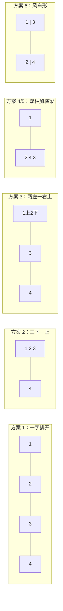

[[TOC]]

## 形式化题目

给定 4 个矩形块，第 $i$ 块的两条边长为 $a_i, b_i$（每块可以任意旋转 90°，即横放或竖放）。要求选一个封闭矩形，把这 4 块互不重叠地放进里面，且每块的边都与封闭矩形的边平行，使封闭矩形面积最小。

输出两样东西：

1. 最小面积；
2. 取得该面积的所有**不同**封闭矩形边长组合 $p \leqslant q$，按 $p$ 升序一行一个输出。

样例中四块为 $1\times2,\ 2\times3,\ 3\times4,\ 4\times5$，最优面积 40，两组边长 `4 10` 与 `5 8`——`4 10` 来自方案 4/5 的双柱加横梁结构（宽 $3+\max(2,2)+5=10$、高 $\max(4,4,1+3)=4$），`5 8` 则可以由方案 3（也可以由方案 6）得到：同一个面积来自完全不同的铺法，这正是题目要求输出**所有**解的原因。

## 正解

### 思路

**第一步：把"任意放"压缩成 6 种基本方案。** 连续平面上放 4 个矩形看似有无穷多种放法，但题目在图 1 中直接给出结论：任何铺放都可以通过旋转、镜像归约成 6 种基本方案之一。旋转、镜像得到的封闭矩形边长集合相同，所以只需对 6 种拓扑分别算出最紧包围盒。

**第二步：枚举指派与方向。** 6 种拓扑只是"骨架"，还差两件事：哪块放哪个位置（$4! = 24$ 种排列）、每块横放还是竖放（$2^4 = 16$ 种方向）。总枚举量 $24 \times 16 \times 6 = 2304$，每种情形用 $O(1)$ 公式算出封闭矩形边长，纯常数级。

**第三步：每个方案写出包围盒公式。** 设某图位上矩形的宽为 $w_i$、高为 $h_i$（已包含横竖放的选择），六种方案的最紧包围盒如下。其中方案 4 和方案 5 其实是**同一拓扑**（两根柱子上架一根横梁），横梁选谁、贴柱选谁由排列枚举吸收，合并成一个公式：

$$
\begin{aligned}
\text{方案 1（一字排开）：}&\quad w = \textstyle\sum w_i,\quad h = \max_i h_i \\
\text{方案 2（三下一上）：}&\quad w = \max(w_1+w_2+w_3,\ w_4),\quad h = \max(h_1,h_2,h_3) + h_4 \\
\text{方案 3（两左一右上）：}&\quad w = \max(w_1+w_2,\ w_3) + w_4,\quad h = \max(h_1+h_3,\ h_2+h_3,\ h_4) \\
\text{方案 4/5（双柱加横梁）：}&\quad w = w_1 + \max(w_2, w_4) + w_3,\quad h = \max(h_1,\ h_3,\ h_2 + h_4)
\end{aligned}
$$

下面用结构图对照这六种方案（方案 4/5 画成一种，最右侧是方案 6 的风车形）：

图中能看到方案 2、3 里都有"突出的矩形比下方总宽更宽就滑下去"的嵌套自由度——这个自由度不需要单独分类，因为全排列枚举已经覆盖了"谁当突出的那块"。

**第四步：方案 6（风车形）按高度关系分五类求宽。** 这是唯一麻烦的方案：矩形 3 横跨左右、压在左柱矩形 1 之上，同时矩形 2、4 叠在右柱。哪一侧更高，高出的部分就"横跨"到另一柱上方压住它一段；**没被压住的矩形可以滑进这个缺口**，让总宽变小。所以宽度必须按 $h_1, h_2, h_3, h_4$ 的相对关系分情况：

$$
h = \max(h_1 + h_3,\ h_2 + h_4),\qquad
w = \begin{cases}
\max(w_1,\ w_2+w_3,\ w_3+w_4) & h_3 \geqslant h_2 + h_4 \\
\max(w_1+w_2,\ w_2+w_3,\ w_3+w_4) & h_3 > h_4 \\
\max(w_1+w_2,\ w_1+w_4,\ w_3+w_4) & h_4 > h_3 \\
\max(w_2,\ w_1+w_4,\ w_3+w_4) & h_4 \geqslant h_1 + h_3 \\
\max(w_1+w_2,\ w_3+w_4) & h_3 = h_4
\end{cases}
$$

以第二行为例：$h_3 > h_4$ 时矩形 3 比矩形 4 伸出得更高，它跨在右柱上方的部分迫使矩形 4 缩到右侧、让出宽度 $w_1 + w_2$，于是总宽要在 $w_1+w_2$、$w_2+w_3$、$w_3+w_4$ 中取最大。其余各行同理，分别对应"矩形 3 盖满右柱（矩形 4 完全缩进缺口）""矩形 4 盖满左柱（矩形 3 完全缩进缺口）"与"两柱顶平齐、谁也不盖谁"。这些分支**恰好划分了所有可能**，因此每行都是一个紧包围盒。

**第五步：收集答案。** 每个候选 $(w, h)$ 算面积：更小则重置答案集合，相等则把规范化后的 $(\min(w,h), \max(w,h))$ 加入集合——集合自动完成去重，最后按 $p$ 升序排序输出即可。

用样例验证：$1\times2, 2\times3, 3\times4, 4\times5$ 的最优面积 40 可以由方案 4/5 的双柱加横梁结构得到（宽 10、高 4，即解 `4 10`），也可以由方案 3 的结构得到（宽 8、高 5，即解 `5 8`），所以输出同时含 `4 10` 和 `5 8`。

### 代码

@include-code(./main.py, python)

### 复杂度

- 时间：$4! \times 2^4 \times 5 = 1920$ 次常数运算，与边长大小无关，远低于 1 s 限制。
- 空间：答案集合大小有限，$O(1)$。

## 总结

这是一道"枚举型几何题"的范本：看似连续的放置问题，靠题面给定的 6 种拓扑结论压缩成有限枚举，再用闭式公式（复杂点全在方案 6 的缺口嵌套分类）$O(1)$ 求包围盒。三个值得带走的经验：

1. **拓扑枚举 + 指派枚举 + 方向枚举**三套循环互不干扰，可以分别用排列、笛卡尔积组织，自由度（横梁选谁、谁凸出）交给全排列吸收，而不是为每种自由度单独写分支。
2. 同一拓扑（方案 4/5）只写一次公式；整体旋转对称用 $(\min,\max)$ 规范化 + 集合去重处理，避免在枚举端展开。
3. 分情况公式必须**恰好划分**参数空间，否则会漏掉某些紧包围盒——方案 6 的五个分支按 $h_3, h_4$ 与 $h_1+h_3, h_2+h_4$ 的大小关系划分，写题解或代码时都应逐一核对边界（$\geqslant$ 归哪一支）。

## 图示解析

### 方案 6 的缺口嵌套

下图放大方案 6 的两种典型情形，说明为什么宽度公式要分情况。左图：矩形 3 足够高（$h_3 \geqslant h_2+h_4$），它横跨整个右柱高度，矩形 4 完全缩进 3 的"影子"里，总宽只需 $\max(w_1,\ w_2+w_3,\ w_3+w_4)$；右图：矩形 3 只比矩形 4 高一点（$h_3 > h_4$），它压不满右柱，矩形 4 必须让出左柱加矩形 3 的宽度 $w_1 + w_2$。

| 情形 | 条件 | 右柱矩形的位置 | 总宽候选 |
| --- | --- | --- | --- |
| 完全嵌套 | $h_3 \geqslant h_2+h_4$ | 矩形 4 缩进 3 的正下方缺口 | $\max(w_1,\ w_2+w_3,\ w_3+w_4)$ |
| 部分凸出 | $h_3 > h_4$ | 矩形 4 让出宽 $w_1+w_2$ | $\max(w_1+w_2,\ w_2+w_3,\ w_3+w_4)$ |
| 对称凸出 | $h_4 > h_3$ | 矩形 3 让出宽 $w_1+w_2$ | $\max(w_1+w_2,\ w_1+w_4,\ w_3+w_4)$ |
| 反向嵌套 | $h_4 \geqslant h_1+h_3$ | 矩形 3 缩进 4 的正下方缺口 | $\max(w_2,\ w_1+w_4,\ w_3+w_4)$ |
| 两柱平齐 | $h_3 = h_4$ | 谁也不盖谁 | $\max(w_1+w_2,\ w_3+w_4)$ |

读表时注意两点：一是"让出宽度"的来源——凸出的矩形下方必须留出对面柱子的通道；二是 $h_3 = h_4$ 的情形在题图里没有画出，但它是分支链上必须补上的最后一种划分，漏掉它会在两柱恰好等高时算出过宽的包围盒。
