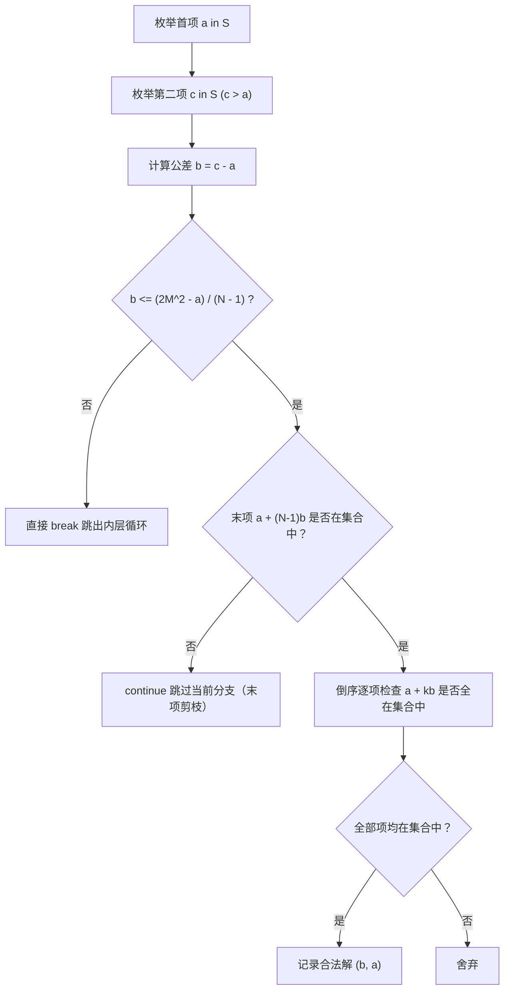

[[TOC]]

## 形式化题目

给定正整数 $N$ 与非负整数 $M$，定义双平方数集合 $S$ 为所有满足 $x = p^2 + q^2$ ($0 \leqslant p, q \leqslant M$) 的整数组成的集合。

求所有由集合 $S$ 中元素构成的、长度为 $N$ 的严格递增等差数列 $(a, a+b, a+2b, \dots, a+(N-1)b)$，其中首项 $a \geqslant 0$，公差 $b > 0$ 且均为整数。

输出所有满足条件的数列对应的数对 $(a, b)$。排序规则为：优先按公差 $b$ 升序排列；若公差 $b$ 相同，则按首项 $a$ 升序排列。若不存在任何满足条件的等差数列，则输出 `NONE`。

## 正解

### 思路

#### 1. 双平方数集合预处理

双平方数的值域上限为 $2M^2$。当 $M \leqslant 250$ 时，最大数值为 $2 \times 250^2 = 125000$。
我们可以通过枚举 $0 \leqslant p \leqslant q \leqslant M$，计算所有的 $p^2 + q^2$，并在一个大小为 $2M^2 + 1$ 的布尔查找表（如 Python 中的 `bytearray`）中标记其存在性。
随后将所有为真的数值提取为一个升序排列的列表。在 $M=250$ 时，不同的双平方数个数至多为 $21047$ 个。

#### 2. 枚举策略选择与公差确定

一个等差数列完全由首项 $a$ 和公差 $b$ 确定。数列中所有项都必须属于集合 $S$：
- 若直接枚举公差 $b$ 和首项 $a$，由于大部分 $(a, b)$ 的前两项甚至都不在集合中，会产生大量无效判断。
- 因而更高效的策略是：**直接在双平方数列表中枚举前两项**。
  - 外层循环枚举数列首项 $a$（位于列表第 $i$ 项）；
  - 内层循环枚举数列第二项 $c = a + b$（位于列表第 $j$ 项，$j > i$）；
  - 公差天然确定为 $b = c - a > 0$。

#### 3. 剪枝策略

为了避免枚举过多元组，可进行以下几层剪枝：

1. **公差上界剪枝**：整个数列最大项为 $a + (N-1)b$。由于该项不能超过值域上界 $2M^2$，公差必须满足：
   $$b \leqslant \left\lfloor \frac{2M^2 - a}{N - 1} \right\rfloor$$
   由于列表是单调递增的，一旦枚举到的第二项导致 $b$ 超出该上限，内层循环可直接 `break` 终止。
2. **末项前置剪枝**：等差数列中间项能否全部合法，末项 $a + (N-1)b$ 是最严苛的关卡。先利用布尔查找表在 $O(1)$ 时间内检查末项是否在集合中；若末项不在集合中，直接跳过当前公差，避免逐项遍历中间项。
3. **中间项倒序检验**：当末项合法后，从 $k = N-2$ 向下倒序检查各项 $a + kb$ 是否在集合中，只要发现一项不符即立刻停止。

收集全部合法数对后，按 $(b, a)$ 进行排序输出即可。

### 代码

@include-code(./main.py, python)

### 复杂度

- **时间复杂度**：
  - 预处理双平方数集合需枚举 $0 \leqslant p \leqslant q \leqslant M$，时间复杂度为 $O(M^2)$，当 $M=250$ 时循环约 $3.1 \times 10^4$ 次。
  - 搜索等差数列时，虽然双平方数个数 $|S| \leqslant 21047$，但严格的公差上限约束 $b \leqslant \frac{2M^2 - a}{N-1}$ 配合末项 $O(1)$ 前置剪枝，过滤掉了绝大多数无效状态。整个搜索过程在 $1$ 秒内即可完成。
  - 结果排序至多 $10000$ 个元素，耗时 $O(K \log K)$，可忽略不计。
- **空间复杂度**：
  - 布尔数组占用 $2M^2 + 1 \leqslant 125001$ 字节（约 $122\text{ KB}$）。
  - 双平方数列表与答案列表占用空间均为 $O(|S|)$ 级别，峰值内存不足 $16\text{ MB}$，远低于 $128\text{ MB}$ 限制。

## 总结

本题的关键在于利用双平方数的值域范围较小（$\leqslant 125000$）这一特征，通过布尔查找表将集合归属判定优化至 $O(1)$。同时，放弃盲目枚举公差，转为直接枚举集合内的前两项作为候选，配合公差值域边界与末项前置检查，成功将原本庞大的搜索树大幅裁剪。

## 图示解析

以样例 $N=5, M=7$ 为例，双平方数上界为 $2 \times 7^2 = 98$。

### 状态判定流程

### 样例搜索过程推演（部分）

对于数列长度 $N=5$，找到的第一个合法等差数列为 $a=1, b=4$：

| 项数 $k$ | 表达式 $a + k \cdot b$ | 数值 | 对应的 $p^2 + q^2$ 分解 | 是否在集合中 |
| :--- | :--- | :--- | :--- | :--- |
| 第 1 项 ($k=0$) | $1 + 0 \times 4$ | $1$ | $0^2 + 1^2$ | 是 |
| 第 2 项 ($k=1$) | $1 + 1 \times 4$ | $5$ | $1^2 + 2^2$ | 是 |
| 第 3 项 ($k=2$) | $1 + 2 \times 4$ | $9$ | $0^2 + 3^2$ | 是 |
| 第 4 项 ($k=3$) | $1 + 3 \times 4$ | $13$ | $2^2 + 3^2$ | 是 |
| 第 5 项 ($k=4$) | $1 + 4 \times 4$ | $17$ | $1^2 + 4^2$ | 是 |

全部 5 项均能在 $p, q \leqslant 7$ 的范围内表示为两平方和，因此 $(a=1, b=4)$ 是一个合法等差数列。
