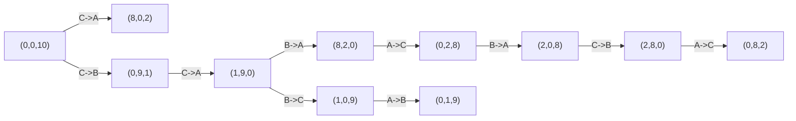

[[TOC]]

## 形式化题目

有三个容量分别为 $A, B, C$ 的桶，$1 \leqslant A, B, C \leqslant 20$。初始时 A 桶和 B 桶是空的，C 桶装满，即状态为 $(0, 0, C)$。

一次操作选定两个不同的桶 $(src, dst)$，把 $src$ 中的牛奶倒向 $dst$，直到**被灌的桶装满**或**源桶为空**为止，不许中途停止。设两桶当前牛奶量为 $m_{src}, m_{dst}$，容量为 $c_{src}, c_{dst}$，则倒出的量为

$$\Delta = \min(m_{src},\ c_{dst} - m_{dst})$$

一只桶在一次操作后变为 $m_{src} - \Delta$，另一只变为 $m_{dst} + \Delta$，牛奶总量恒为 $C$。

求经过任意多次（含零次）操作后，**所有使 A 桶为空的可能状态 $(0, b, c)$ 中 $c$ 的全体取值**，按升序输出。

样例：$A=8, B=9, C=10$ 时答案为 `1 2 8 9 10`；$A=2, B=5, C=10$ 时答案为 `5 6 7 8 9 10`。

## 正解

### 思路

#### 1. 朴素的「枚举操作序列」为什么不可行

最直接的想法是枚举操作序列：试长度为 1 的所有序列，再试长度为 2 的，看最终能不能让 A 桶空。

这个做法立刻撞上两堵墙：

- **序列长度没有上界**。题目说"有时，约翰把牛奶从一个桶倒到另一个桶中"，没有限定次数，理论上可以来回倒无限次，枚举无法终止。
- **信息大量冗余**。比如从 $(0,0,10)$ 做 `C->B` 得到 $(0,9,1)$，再做 `B->C` 又回到 $(0,0,10)$。这样"绕圈"的序列有无穷多条，但它们最终停靠的**状态**其实完全一样。

换句话说，搜索树上绝大多数节点是重复的；真正有价值的只是"走到了哪些状态"，而不是"怎么走到的"。

#### 2. 把搜索对象从「序列」换成「状态」

于是换一个建模方式：

- **节点**：一个三元组 $(a, b, c)$，表示三个桶当前的牛奶量；
- **边**：一次合法的完全灌注，从 $(a,b,c)$ 连到它的后继状态；
- **起点**：$(0, 0, C)$。

由于总量守恒 $a + b + c = C$，$c$ 由 $(a, b)$ 唯一确定，所以节点数不超过

$$V = (A+1)(B+1) \leqslant 21 \times 21 = 441$$

节点有限、每个节点的出度恰好是 6（三种有序倒法对）——这是一张**有限隐式图**。题目要求的"所有可能性"，正是这张图上从起点可达的全部状态，于是一次图遍历就能算出答案。用 `seen` 集合判重，绕圈的路径被自然切断，遍历必然终止。

#### 3. 状态与转移

样例 $A=8, B=9, C=10$ 从起点出发，6 种倒法中只有 `C->A` 和 `C->B` 会改变状态，得到 $(8, 0, 2)$ 和 $(0, 9, 1)$：

| 倒法 | 倒出量 $\Delta$ | 后继状态 |
| --- | --- | --- |
| `C->A` | $\min(10, 8-0)=8$ | $(8, 0, 2)$ |
| `C->B` | $\min(10, 9-0)=9$ | $(0, 9, 1)$ |
| `C->C` 等同桶 | 非法，跳过 | — |
| `A->x`、`B->x` | $\min(0,\cdot)=0$ | 状态不变（被 `seen` 吸收） |

下图展示从起点到样例答案中全部 5 个 $a=0$ 状态的转移路径，箭头上的标注是这一步使用的倒法。

观察重点：节点就是三元组状态，边标注的是这一步用了哪种倒法。图中 $c = 1, 2, 8, 9, 10$ 的节点（`(0,9,1)`、`(0,8,2)`、`(0,2,8)`、`(0,1,9)`、`(0,0,10)`）全都满足 $a=0$，恰好就是答案 `1 2 8 9 10`。注意这张图只有 12 个节点，远小于上界 441，说明可达状态通常很稀疏。

#### 4. 单步转移的公式化

把"倒到被灌桶满或源桶空"写成一个函数即可：

$$\Delta = \min(m_{src},\ c_{dst} - m_{dst})$$

两项分别对应"源桶被倒空"和"目标桶被灌满"两种停止条件，取较小者就是先发生的那个。这一步保证结果永远落在合法区间内：由 $0 \leqslant m_{src}$ 且 $m_{dst} \leqslant c_{dst}$ 得 $0 \leqslant \Delta \leqslant m_{src}$，两边都不会越界。

#### 5. 算法流程

1. `seen = {start}`，`stack = [start]`，起点是 $(0,0,C)$；
2. 弹出栈顶状态，对它尝试全部 6 种有序倒法；
3. 若后继状态不在 `seen` 中，则加入 `seen` 并压栈；
4. 栈空后，`seen` 就是可达状态全集，取其中 $a = 0$ 的状态的 $c$，`sorted` 升序输出（集合语义已天然去重）。

这里用 DFS 还是 BFS 都可以：本题只问"哪些状态可达"，不问"最少几步可达"，两种遍历得到的 `seen` 完全相同。

### 代码

@include-code(./main.py, python)

### 复杂度

设状态数 $V = (A+1)(B+1) \leqslant 441$。每个状态只出栈一次，每次尝试 6 种倒法，每种倒法是常数时间的算术运算加一次集合查询，因此

$$\text{时间} = O(6V) = O(AB), \qquad \text{空间} = O(V) = O(AB)$$

$A, B \leqslant 20$ 时总运算量约 $2.6 \times 10^3$ 次，实测 10 组官方数据均在 0.02s 左右、峰值内存约 14.7MB，远低于 1000ms / 128MB 的限制。

需要强调的是：本题**必须用显式栈迭代**而不是递归写法。DFS 的递归深度会达到 $O(V)$（最坏 441 层），虽在理论上界内，但 Python 默认递归深度约 1000 且每层还嵌套生成器表达式，实测会直接抛出 `RecursionError`。改成显式栈后复杂度完全不变，且没有任何深度风险。

## 总结

本题的关键是把"枚举操作序列"转化为"枚举状态"：

- 操作序列有无穷多条且大量重复，而**不同状态至多 $(A+1)(B+1) \leqslant 441$ 个**，这是问题规模的真正来源；
- 状态 $(a,b,c)$ 满足总量守恒 $a+b+c = C$，所以状态空间封闭、有限，遍历必然终止；
- 一次完全灌注的倒出量是 $\Delta = \min(m_{src},\ c_{dst} - m_{dst})$，先满足的条件决定停止时刻；
- 用 `seen` 判重后每个状态只扩展一次，一次遍历得到全部可达状态，收集 $a=0$ 时的 $c$ 即为答案。

这个"隐式图 + 判重遍历"的套路可以套到所有"状态数远小于路径数"的倒水 / 倒罐类问题上：先数清状态规模，再决定是否值得开 `seen`。
