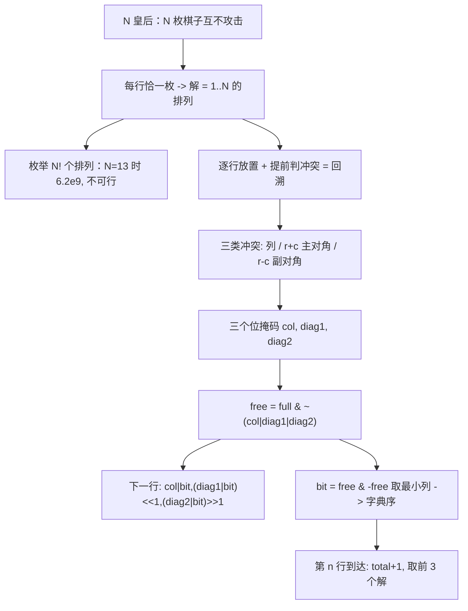

[[TOC]]

## 形式化题目

在 $N \times N$ 的棋盘上放入 $N$ 个棋子，要求：

- 每行、每列至多一个棋子；
- 每条对角线（两条主对角线方向上的所有对角线）上至多一个棋子。

用序列 $c_1 c_2 \dots c_N$ 描述一个解，其中 $c_i$ 表示第 $i$ 行棋子所在的列号。要求按字典序输出最小的 $3$ 个解，并输出解的总数。约束为 $6 \leqslant N \leqslant 13$。

以样例 $N = 6$ 为例，第一个解 $2\ 4\ 6\ 1\ 3\ 5$ 的摆法如下（列在下标上标出）：

| 行 \ 列 | 1 | 2 | 3 | 4 | 5 | 6 |
| --- | :-: | :-: | :-: | :-: | :-: | :-: |
| 1 | | ♛ | | | | |
| 2 | | | | ♛ | | |
| 3 | | | | | | ♛ |
| 4 | ♛ | | | | | |
| 5 | | | ♛ | | | |
| 6 | | | | | ♛ | |

可以看到任意两枚棋子既不同行、不同列，也不在同一条斜线上：例如 $(1,2)$ 与 $(2,4)$ 的行列差都是 $1$，但它们的 $r+c$ 分别是 $3$ 与 $6$，并不共斜线。

## 正解

### 思路

**朴素想法：枚举排列。** 因为每行恰好一枚棋子，一个解等价于一个 $1 \dots N$ 的排列。枚举全部 $N!$ 个排列逐个判冲突，$N = 13$ 时有 $6.2 \times 10^9$ 个排列，完全不可行——大量分支在放完第一行之前就已经注定冲突。

**改进的落点：逐行放置 + 提前判冲突。** 把"先排好再检查"改成"边放边检查"：第 $1$ 行选一列，第 $2$ 行只在剩下的合法列里选……一旦某一行没有任何合法列，立刻回退。这就是回溯（深度优先搜索），搜索树只包含"前缀合法"的序列，比 $N!$ 小几个数量级。

冲突只有三类，且都与"行"的推进方式有关：

- **列冲突**：两枚棋子同列；
- **主对角线冲突**：两枚棋子的 $r + c$ 相同（左上—右下方向）；
- **副对角线冲突**：两枚棋子的 $r - c$ 相同（右上—左下方向）。

**再用位掩码把三类冲突压成三个整数。** 第 $c$ 列用第 $c-1$ 位表示（下面记作 `bit = 1 << (c-1)`）：

- `col`：第 $c$ 位为 1 表示第 $c$ 列已被占用；
- `diag1`：第 $k$ 位为 1 表示 $r + c = k + 1$ 的主对角线已被占用；
- `diag2`：第 $k$ 位为 1 表示 $r - c = k$ 的副对角线已被占用。

关键观察是两条对角线在换行时的平移方向相反。若在 $(r, c)$ 放了棋子，那么下一行中受影响的格子满足 $r' = r+1$：

- 主对角线：$r' + c' = r + c$，即 $c' - 1 = (c - 1) - 1$——位下标减一，所以掩码 **左移** 一位：`(diag1 | bit) << 1`；
- 副对角线：$r' - c' = r - c$，即 $c' - 1 = (c - 1) + 1$——位下标加一，所以掩码 **右移** 一位：`(diag2 | bit) >> 1`。

于是第 `row` 行所有合法列就是 `free = full & ~(col | diag1 | diag2)`，其中 `full = (1 << n) - 1` 用来把移出棋盘的高位截掉。用 `bit = free & -free` 取出最低位的 1，就等价于"选当前列号最小的合法列"；`free ^= bit` 之后继续取，就自动按列号升序枚举完这一行的所有选择。

**字典序为什么不需要额外排序。** 所有解按"第 1 行的列号从小到大、同层内再从第 2 行的列号从小到大……"的顺序被访问，而 DFS 是"一条分支走到底再走兄弟"，先被计数（先被到达）的解一定字典序更小。所以按访问顺序取前 $3$ 个保存即可；`head` 满 3 个之后仍需继续搜索，因为还要统计总数。

以 $N = 6$ 时前两行的探索为例，`free` 的展开顺序（只画第 1 行选列的分支）：

```text
第1行 free = 111111
├── 选列1 bit=000001 → 第2行 free = 111111 & ~(000001 | 000010 | 000000) = 111100
│                          → 第2行只能选列 3..6
└── 选列2 bit=000010 → 第2行 free = 111111 & ~(000010 | 000100 | 000001) = 111000
                           → 第2行只能选列 4..6（列1、列2、列3 被判为冲突）
```

按"列号升序"访问，第一个走通的分支正是 $2\ 4\ 6\ 1\ 3\ 5$，与样例一致。

### 代码

@include-code(./main.py, python)

### 复杂度

- 时间复杂度：$O(S(N))$，其中 $S(N)$ 是剪枝后搜索树的节点数（每个合法前缀对应一个节点），每个节点只做 $O(1)$ 次位运算。$N=13$ 时 $S(N) \approx 1.3 \times 10^6$，实测约 $0.7$ 秒。
- 空间复杂度：$O(N)$，递归栈深度不超过 $N$，另有长度为 $N$ 的 `pos` 数组；保存答案只留 3 份棋盘。

## 图示解析

下图给出从"排列模型"到"位掩码搜索"的完整推导主线：



图中每个方框对应正文里的一步推导：从"排列模型"到"剪枝"再到"位掩码"。最需要注意的是第六、七行——两条对角线在换行时一个左移、一个右移，这是位运算写法的核心；而"取最低位 1"既是加速手段，也恰好保证了字典序输出。
