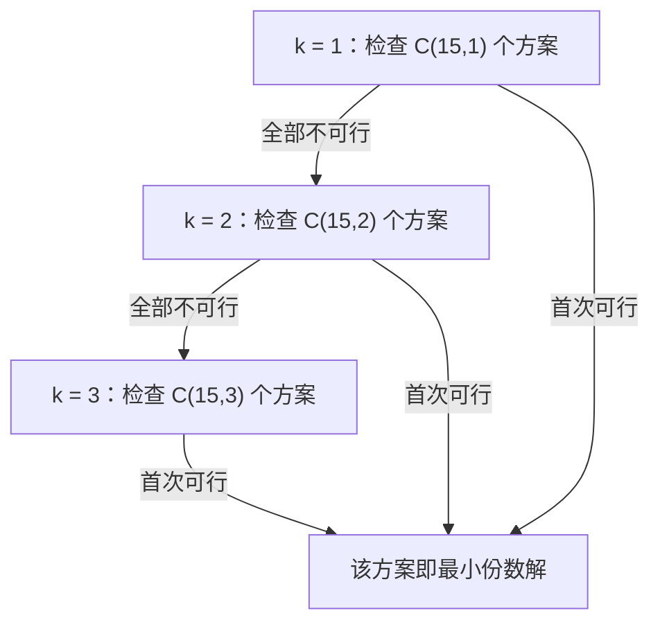

[[TOC]]

## 形式化题目

给定 $V$ 种维生素的需求下界 $need_1, \dots, need_V$，以及 $G$ 种饲料；第 $g$ 号饲料每份
含维生素 $v$ 的量为 $a_{g,v}$（$a_{g,v} \geqslant 0$，$g$ 从 $1$ 开始编号）。

选出一个饲料编号集合 $S \subseteq \{1, \dots, G\}$，使它**对每一种**维生素的**总贡献**都不低于需求：

$$\forall v \in [1, V]: \quad \sum_{g \in S} a_{g,v} \;\geqslant\; need_v$$

在所有满足条件的 $S$ 中，求 $|S|$ 最小者，并按升序输出其中的饲料编号。

约束：$1 \leqslant V \leqslant 25$，$1 \leqslant need_v \leqslant 1000$，$1 \leqslant G \leqslant 15$。

**注意"总量"而不是"最大值"**：同一维生素的贡献来自所有被选饲料的**相加**，
而不是取某一份饲料的最大值。样例 3 正是在这一点上区分对错：

| 饲料 \ 维生素 | 1 | 2 | 3 | 4 | 5 |
| --- | --- | --- | --- | --- | --- |
| 1 | 10 | 10 | 10 | 10 | 10 |
| 2 | 0 | 10 | 10 | 10 | 10 |
| 3 | 0 | 0 | 10 | 10 | 10 |
| 4 | 0 | 0 | 0 | 10 | 10 |
| 5 | 0 | 0 | 0 | 0 | 10 |
| **需求** | **10** | **20** | **30** | **40** | **50** |
| **全部 5 份之和** | 10 | 20 | 30 | 40 | 50 |

这张表的每一列是"某种维生素在各饲料中的含量"，最后一行是**全选时该列的横向求和**。
可以看到全选 5 份后每一列都**恰好**等于需求，一分不多也不少；而任何 4 份的方案，
第 5 列之和最多只有 $10 + 10 + 10 + 10 = 40 < 50$。所以答案是 `5 1 2 3 4 5`。
如果误按"每列取最大值"建模，就会得出"第 5 号饲料一份就够"的错误结论。

## 正解

### 思路

**先看规模**：$G \leqslant 15$ 意味着饲料子集总共只有 $2^{15} = 32768$ 种。
这个数字小到足以**把每种组合都检查一遍**，"最少份数"于是退化成"在有限集合里找第一个
满足条件的组合"。所以本题不需要建模技巧，要解决的是"怎样枚举得又快又直白"。

**朴素做法**：把 $S$ 从 $0$ 枚举到 $2^G - 1$，对每个 $S$ 逐种维生素求和判定，可行就记下来
并比较份数取最小。它完全正确，但有两处可以做得更干净：

1. **重复求和**。每个 $S$ 判定时都要把 $S$ 里所有饲料的每一列重新加一遍；
   而 $S$ 去掉某个元素后的子集，在之前的枚举里已经算过了。
2. **还要单独维护最优解**。因为按 $S$ 的数值升序枚举时，可行方案的份数是杂乱出现的
   （$S=1$ 有 1 份，$S=3$ 有 2 份，$S=7$ 有 3 份……），必须额外记一个"当前最小"。

**第一步优化：把"最小"编码进枚举顺序。**

既然目标是份数最小，就让外层循环直接按份数 $k$ 从 $1$ 递增：

- 先检查所有**恰好 1 份**的方案，再检查所有**恰好 2 份**的方案，依此类推。

位集里 1 的个数就是份数，`choice.bit_count() == k` 是一次 $O(1)$ 过滤。
第一个通过可行性判定的方案，份数必然是全局最小——因为份数比它小的方案，
在更早的 $k$ 层里已经被全部检查过且都不可行。于是**"比较最优值"这段逻辑整个消失了**，
函数只要"找到即可返回"。



图中每一层是同一份数的所有方案，箭头只在"本层全军覆没"时才往下走。
读者应注意到：算法**不需要知道答案有几份**，它只是从少往多试，
试到哪一层成功，答案就是哪一层——"最小"由层次顺序保证，而不是由比较保证。

**第二步优化：子集求和只算一次。**

把 $f(S, v)$ 记作"方案 $S$ 在维生素 $v$ 上的总含量"。取 $low = S \& (-S)$（最低位的 1），
设它对应的饲料是 $g$，则 $S$ 一定可以拆成 $\{g\}$ 和 $S \setminus \{g\}$ 两部分的**不交并**：

$$f(S, v) = a_{g, v} + f\bigl(S \setminus \{g\},\, v\bigr), \qquad f(\varnothing, v) = 0$$

这个拆分的关键在于 $low$ 是**唯一确定**的：每个非空 $S$ 都恰好绑定到一个"最低位饲料 $g$"，
$S \setminus \{g\}$ 一定比 $S$ 小、一定已经被算过。于是 $2^G \times V$ 个 $f$ 值
每个只用一次加法，统一记忆化即可；判定时只需按列读取缓存值再和 $need_v$ 比大小。
相比朴素做法，每个子集的代价从 $O(G \cdot V)$ 降到 $O(V)$。

**边界**：全选一定可行（每列之和只会更大），所以 $k$ 最多走到 $G$，函数一定有返回值。

### 代码

@include-code(./main.py, python)

### 复杂度

- 时间复杂度：$O(2^G \cdot V)$。`subset_sum` 共 $2^G \cdot V$ 个状态，每个均摊一次加法；
  枚举阶段最多 $2^G$ 次判定，每次 $O(V)$。代入 $G \leqslant 15, V \leqslant 25$，
  约为 $8 \times 10^5$ 次基本运算。朴素写法是 $O(2^G \cdot G \cdot V)$，本实现省掉了因子 $G$。
- 空间复杂度：$O(2^G \cdot V)$，全部来自 `@cache` 的记忆化表（约 $8.2 \times 10^5$ 个整数），
  实测峰值内存约 26 MB，低于 128 MB 限制。

## 总结

- 本题的"算法"就是把 $G \leqslant 15$ 读成信号：$2^G = 32768$ 个方案全部枚举得起，
  于是问题从"如何优化"变成"如何枚举得干净"。
- 两个观察撑起全部代码：**按份数递增枚举**让"第一个可行解就是最优解"，
  省掉最优值维护；**按最低位拆分**让每个子集的总含量复用已算过的更小子集，
  省掉重复求和。
- 判定语义必须看清是**逐种维生素求和**（加性覆盖），不是取最大值、也不是位掩码或运算。
  样例 3 的表格是最直接的验证。
- 验证：真实测试数据 10/10 全部 PASS（最慢 0.044 s、峰值 26.2 MB，限时 1000 ms / 128 MB）；
  另外自造了"答案必须选满 15 份"的理论最坏情形，实测 0.06 s。

## 图示解析

下面用样例 3 展示"按最低位拆分"是如何省掉重复求和的。设
$S = \{1,2,3,4,5\}$（位集 `0b11111`），看第 5 列（维生素 5，需求 50）：

```text
S = 1 1 1 1 1   (选了 1,2,3,4,5 号)
     │
     └─ low = 最低位的 1  →  饲料 1 号，它的第 5 列 = 10
        S ^ low = 1 1 1 1 0   (只剩 2,3,4,5 号)

        10  +  f(1 1 1 1 0, 第5列)
                 │
                 └─ low → 饲料 2 号，第 5 列 = 10
                    余下 1 1 1 0 0

                    10 + 10 + f(1 1 1 0 0, 第5列)
                              │
                              └─ ... 10 + 10 + 10 + 10 + f(0, ·) = 50
```

链条上出现的每个位集都比前一个小，而且**都已被缓存**：算 `1 1 1 1 1` 时，
`1 1 1 1 0` 一定早就算好了。所以展开这一整条链只付出 5 次加法，
而不是朴素做法里"对 5 份饲料重新扫一遍"的 5 次加法再乘上重复次数。

读者应重点观察两点：**最低位给出唯一确定的划分依据**（不会出现一个子集从两个不同方向被展开），
以及**递推方向严格从大位集指向小位集**（保证无环、可记忆化）。
顺带一提，这条链也解释了为什么全选方案的总含量恰好是 $10+10+10+10+10 = 50$，
与前面表格的最后一行一致。
