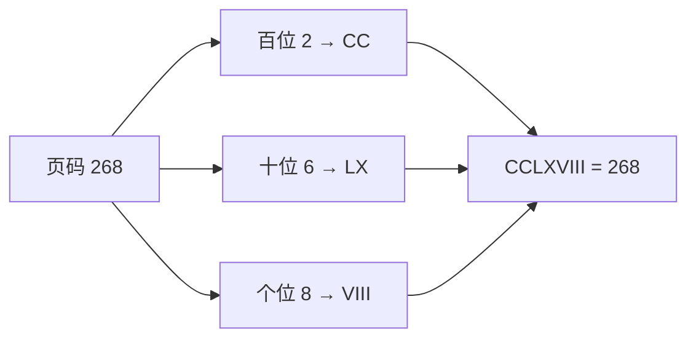

[[TOC]]

## 形式化题目

给定整数 $N$（$1 \leqslant N < 3500$）。按标准罗马数字记数法把 $1,2,\dots,N$ 每个页码写成罗马数字，统计字符 `I`、`V`、`X`、`L`、`C`、`D`、`M` 各自在这 $N$ 个表示中出现的总次数，按 `I V X L C D M` 的顺序输出 `字符 次数`，未出现过的字符不输出。

标准罗马数字规则：`I V X L C D M` 依次表示 $1,5,10,50,100,500,1000$；一般从大到小排列相加（如 `CCLXVIII = 268`）；`10^n` 字符可放在更大的字符前构成减法（`IV=4`、`IX=9`、`XL=40`、`XC=90`、`CD=400`、`CM=900`），且只允许这六种组合（`XD`、`IC`、`XM` 等非法）。

样例：$N=5$ 时页码为 `I, II, III, IV, V`，共出现 7 个 `I`、2 个 `V`，输出 `I 7` 与 `V 2` 两行。

## 正解

### 思路

先把"合法的罗马数字长什么样"看清楚。三条限制（`10^n` 字符至多连写 3 个、`5×10^n` 字符不连写、减法只允许 `IV IX XL XC CD CM` 六种）合起来的效果是：**每个十进制数位的写法是唯一且固定的**。个位 $1\sim 9$ 依次是 `I II III IV V VI VII VIII IX`，十位把 `I/V` 换成 `X/L`，百位换成 `C/D`，千位由于 $N<3500$ 只有 `M MM MMM`。因此任意一页的罗马表示都可以按十进制数位逐位查表拼接得到，绝不会出现 `XD`、`IC` 这类非法表达——减法组合被封装在表内。

有了唯一表示，统计就退化为最直接的模拟：对 $i=1,2,\dots,N$ 各转换一次，把表示中的每个字符计入对应计数器。这里没有任何需要优化的瓶颈——$N<3500$，每个表示长度至多 15（`MMMDCCCLXXXVIII`），总字符量约 $5\times10^4$，逐页转换就是正解本身的复杂度阶，USACO 官方解法同样是逐页统计。

实现上用 4 行查表（千/百/十/个位各一张 0..9 的表）完成转换，再用 `Counter` 生成器一次遍历累加所有字符，最后按 `IVXLCDM` 固定顺序过滤输出非零项。

以样例 $N=5$ 为例，逐页转换与计数过程如下（累计值表示处理完该页后 `I/V` 的总数）：

| 页码 | 罗马表示 | 本页新增 I | 本页新增 V | I 累计 | V 累计 |
|:---:|:---:|:---:|:---:|:---:|:---:|
| 1 | I | 1 | 0 | 1 | 0 |
| 2 | II | 2 | 0 | 3 | 0 |
| 3 | III | 3 | 0 | 6 | 0 |
| 4 | IV | 1 | 1 | 7 | 1 |
| 5 | V | 0 | 1 | 7 | 2 |

观察重点：第 4 页的 `IV` 只贡献 1 个 `I`（它是减法前缀，不是独立字符），而 `V` 计 1 次——查表法天然保证这一点，因为 `IV` 是表里的整体片段。最终第 5 页后 `I=7`、`V=2`，与样例输出一致。

数位片段表本身就是本模型的"状态转移图"——低位到高位只是字符集合的平移：

| 数位 | 0 | 1 | 2 | 3 | 4 | 5 | 6 | 7 | 8 | 9 |
|:---:|:---:|:---:|:---:|:---:|:---:|:---:|:---:|:---:|:---:|:---:|
| 个位 | | I | II | III | IV | V | VI | VII | VIII | IX |
| 十位 | | X | XX | XXX | XL | L | LX | LXX | LXXX | XC |
| 百位 | | C | CC | CCC | CD | D | DC | DCC | DCCC | CM |
| 千位 | | M | MM | MMM | | | | | | |

观察重点：三行个/十/百位结构完全同构，只是字符按 `I V` → `X L` → `C D` 整体替换；减法组合恰好落在 4 和 9 两列。千位没有 5 字符（罗马人没有更大的 `5×10^3` 记号），$N<3500$ 使千位最多 `MMM`。

### 代码

@include-code(./main.py, python)

### 复杂度

- 时间复杂度 $O(N \times L)$，其中 $L \leqslant 15$ 是罗马表示的最大长度，$N < 3500$ 时约 $5\times10^4$ 次字符操作。
- 空间复杂度 $O(1)$：4 张固定查表加 7 个计数器，与 $N$ 无关。

## 总结

本题的核心是**把"罗马数字合法性规则"翻译成"逐数位唯一查表"**：三条书写限制共同保证了每个十进制数位只有一种标准写法，于是 $1\sim N$ 的罗马表示可以逐页查表拼接，再对 7 个字符做简单计数。模拟总代价约 $5\times10^4$ 字符操作，远在限制之内；正确性由查表法"片段即合法单元"的结构保证，不会产生非法减法组合。这是一道考察规则建模与基础模拟的入门题。

## 图示解析

### 一页罗马数字的数位分解

上图展示一页（如 268）如何按十进制数位拆成三个片段再拼接成合法罗马数字。观察重点：每个片段只依赖该数位的数字与所在位的字符对（`C/D`、`X/L`、`I/V`），片段之间互不影响，这正是"逐位查表 + 拼接"正确性的来源；把每一页都这样拆开并把所有字符丢进计数器，就完成了整个统计。
