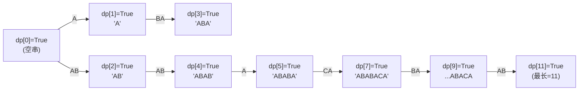

[[TOC]]

## 形式化题目

给定一个字符串集合 $P = \{p_1, p_2, \dots, p_m\}$，其中每个元素的长度满足 $1 \le |p_j| \le 10$。同时给定一个长字符串 $S$（$|S| \le 200,000$）。

定义一个字符串可分解，当且仅当它可以表示为集合 $P$ 中若干元素的串联（元素可重复使用）。求最大的整数 $K \in [0, |S|]$，使得前缀子串 $S[0:K]$ 可以由 $P$ 中的元素分解。

## 样例解释与图示

以样例为例：
- 基本元素集合 $P = \{\text{"A"}, \text{"AB"}, \text{"BA"}, \text{"CA"}, \text{"BBC"}\}$
- 目标字符串 $S = \text{"ABABACABAABC"}$（长度为 12）

我们观察前缀的分解过程：
- 长度 0：空串，显然可分解。
- 长度 1：`"A"`，匹配元素 `"A"`，可分解。
- 长度 2：`"AB"`，匹配元素 `"AB"`，可分解。
- 长度 3：`"ABA"`，由 `"AB"` + `"A"` 拼接，可分解。
- 长度 4：`"ABAB"`，由 `"AB"` + `"AB"` 拼接，可分解。
- 长度 5：`"ABABA"`，由 `"ABAB"` + `"A"` 拼接，可分解。
- 长度 6：`"ABABAC"`，末尾两字符为 `"AC"`，不在集合中；末尾单字符 `"C"` 也不在集合中。此时前缀 6 不可由前缀 5 或 4 拼接得出。
- 长度 7：`"ABABACA"`，由可分解的前缀 5（`"ABABA"`）+ `"CA"` 拼接，因此前缀 7 可分解！
- ...以此类推，最终前缀 11 为 `"ABABACABAAB"`，可分解；而前缀 12 `"ABABACABAABC"` 无法被分解。

因此最长前缀长度为 $11$。

## 思路

### 1. 朴素方法与状态定义
如果采用回溯搜索（DFS），从前缀 0 开始尝试枚举每一个集合元素进行拼接，在包含重复前后缀字符的序列中会产生大量重复分支，时间复杂度在最坏情况下为指数级，会超时。

注意到当前前缀 $S[:i]$ 是否能被拼接，仅取决于是否存在一个分割点 $i-L$，满足：
1. 前缀 $S[:i-L]$ 本身是可分解的；
2. 剩余的后缀子串 $S[i-L:i]$ 属于集合 $P$。

这具备显然的最优子结构与无后效性，因此可以使用**动态规划**求解。

定义布尔数组 $dp[i]$ 表示前缀 $S[0:i]$（长度为 $i$）是否可以由集合 $P$ 拼接而成。
- **初始状态**：$dp[0] = \text{True}$（空串由 0 个元素拼接而成）。

### 2. 优化状态转移
集合中每个元素的长度非常短（$1 \le |p| \le 10$）。这意味着转移步长 $L$ 只能在 $1$ 到 $10$ 之间取值。

我们将集合 $P$ 中的元素按长度分组存入哈希集合 `by_len[L]`。对于前缀长度 $i$ 从 $1$ 到 $|S|$：
1. 枚举可能存在的元素长度 $L \in \text{lens}$ 且 $L \le i$；
2. 优先检查 $dp[i-L]$ 是否为 $\text{True}$。若为 $\text{False}$ 则无需进行子串截取与集合查询；
3. 若 $dp[i-L] = \text{True}$ 且子串 $S[i-L:i] \in \text{by\_len}[L]$，则说明 $dp[i] = \text{True}$。
4. 一旦 $dp[i]$ 被置为 $\text{True}$，更新最远长度记录 $ans = i$，并直接 `break` 结束内层枚举。

## 代码

@include-code(./main.py, python)

## 复杂度分析

- **时间复杂度**：预处理集合元素耗时 $O(\sum |p|) \le O(200 \times 10) = O(2000)$；DP 外层循环运行 $|S|$ 次，内层至多遍历 $10$ 个不同的长度并做一次 $O(L)$ 的哈希查找，总时间复杂度为 $O(10 \cdot |S|)$。对于 $|S| \le 200,000$，操作次数约 $2 \times 10^6$，在 Python 3 中仅需约 0.03 秒。
- **空间复杂度**：存储字符串 $S$ 与 DP 数组占用 $O(|S|)$ 空间，集合存储占用常数空间，空间复杂度为 $O(|S|)$。

## 总结

本题利用了“基本元素长度极短（$\le 10$）”这一关键约束，将字符串匹配问题转化为有限步长的布尔型线性 DP。在状态转移时通过“优先判定前驱状态合法性”以及“命中即 `break`”进行剪枝，使算法运行效率极高。
