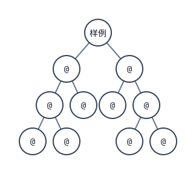

[[TOC]]

## 形式化题目

统计**有序满二叉树**的形状数：每个结点的孩子数只能是 $0$ 或 $2$，左右孩子有区别
（左右互换算两棵不同的树）。要求结点数恰为 $N$、高度恰为 $K$。

这里的**高度**按题面定义，是根到叶子的最长路径上的**结点数**：单结点树高度为 $1$，
$7$ 个结点的完全满二叉树高度为 $3$。注意不是边数。

下图画出一组答案的两个家谱，帮助确认上面这两条约定。

输入 $N=5,K=3$ 时答案为 $2$，就是这两棵（图顶那一个标着"样例"的结点只是把它们挂在一起的虚拟根，
本身不是家谱的一部分）。左边那棵的第三层挂在左子树上，
右边那棵挂在右子树上——两棵子树同构，只要挂在了不同的一侧就是**两个**不同的家谱，
这正是"左右孩子有区别"的含义。两棵树从根到最深叶子的路径都经过 $3$ 个结点，
所以高度都是 $3$，换成"边数"就会数成 $2$。

再补一条后面反复用到的换算：满二叉树中每个内部结点恰好有 $2$ 个孩子，
孩子总数 = 边数 = 结点数 $-1$。设内部结点数为 $m$，则叶子数为 $m+1$，于是

$$N = m + (m+1) = 2m+1 \quad\Longrightarrow\quad m = \frac{N-1}{2}$$

$N$ 为偶数时答案直接是 $0$；下面只需考虑 $m = (N-1)/2$ 的情况。

## 正解

### 思路

**朴素做法为什么不行。** 最直接的想法是枚举所有满二叉树形状、按高度筛选。
`m` 个内部结点的满二叉树有 Catalan 数 $C_m = \frac{1}{m+1}\binom{2m}{m}$ 棵，
$m=99$ 时这是一个天文数字，枚举永远跑不完。真正的问题不在于常数，
而在于**我们只需要"有多少棵"，却去构造了每一棵**——应该在计数层面递归，
而不是在形状层面枚举。

**只按规模计数还不够。** 设 $f(m)$ 为内部结点数为 $m$ 的满二叉树棵数。
去掉根后是两棵子满二叉树，内部结点数分别 $a$ 与 $m-1-a$，于是

$$f(0) = 1,\qquad f(m)=\sum_{a=0}^{m-1} f(a)\,f(m-1-a)$$

算出来正是 Catalan 数：$f(2)=2$ 就是样例 `5 3` 的全部家谱数，$f(4)=14$ 则是样例 `9 4` 的全部家谱数。
但题目要的是**高度恰好为 $K$** 的那一部分：`9 4` 的答案是 $14$ 中的 $6$，
$f(m)$ 把各种高度的树混在了一起，必须再加一维高度。

**关键观察：把"高度恰好"换成"高度不超过"。** 加高度维度的直觉写法是
"高度恰好为 $h$"加上枚举左右子树高度搭配，状态会变成二维再套一层枚举。
换成**上界**则完全不同：设

$$L_h[m] = \#\{\text{内部结点数恰为 } m,\ \text{高度}\leqslant h\ \text{的满二叉树}\}$$

先看边界：内部结点数为 $0$ 的树就是那片叶子，它的高度是 $1$，所以

$$L_1 = [1, 0, 0, \dots]$$

高度不超过 $1$ 的树只有这一棵。高度不超过 $h+1$ 的树，去掉根以后左右子树的高度都
**不超过 $h$**——上界被所有子树共享，
不需要区分是哪一侧达到了这个高度。反过来，任取两棵高度不超过 $h$ 的子树，
拼起来一定是高度不超过 $h+1$ 的树。两个方向互为逆，所以这是一个双射，得到纯卷积：

$$L_{h+1}[m] = \sum_{a=0}^{m-1} L_h[a]\,L_h[m-1-a]\qquad (h \geqslant 1)$$

边界 `L_1` 之外不需要 $h=0$ 那一层：高度不超过 $0$ 的树根本不存在，
所以递推从 $h \geqslant 1$ 起用，`L_1` 单独给定。

**相减得到"恰好为 $K$"。** "高度不超过 $K$"比"高度不超过 $K-1$"多出来的，
恰好就是高度**正好等于** $K$ 的那些树，所以（$K \geqslant 2$）

$$\text{答案} = L_K[m] - L_{K-1}[m]$$

真实计数满足 $L_K[m] \geqslant L_{K-1}[m]$，减完是非负整数，
取模后再相减仍然正确（全程只有加法与乘法，模数 $9901$ 是不是质数都无所谓）。

下面是小规模的真实数值表，行是高度上界、列是内部结点数，可以直接核对上面的推导。

| $m$ | 0 | 1 | 2 | 3 | 4 | 5 |
| --- | ---: | ---: | ---: | ---: | ---: | ---: |
| $L_1$（上界 1） | 1 | 0 | 0 | 0 | 0 | 0 |
| $L_2$ | 1 | 1 | 0 | 0 | 0 | 0 |
| $L_3$ | 1 | 1 | 2 | 1 | 0 | 0 |
| $L_4$ | 1 | 1 | 2 | 5 | 6 | 6 |
| $L_5$ | 1 | 1 | 2 | 5 | 14 | 26 |
| $L_5 - L_4$（高度恰为 5） | 0 | 0 | 0 | 0 | 8 | 20 |
| $L_4 - L_3$（高度恰为 4） | 0 | 0 | 0 | 4 | **6** | 6 |

读表方式：单元格 $L_h[m]$ 是"内部结点数 $m$、高度不超过 $h$"的棵数，
每一行都是把上一行按 $L_{h+1}[m]=\sum_{a+b=m-1}L_h[a]L_h[b]$ 算出来的（从 $L_2$ 开始）。
表中最后两行是相邻两行相减，得到的才是"高度恰好为某个值"的棵数。
两个样例都能直接读出来：`5 3` 对应 $m=2$，$L_3[2]-L_2[2]=2-0=2$；
`9 4` 对应 $m=4$，$L_4[4]-L_3[4]=6-0=6$。
同一列上 $L_5[4]-L_4[4]=14-6=8$，说明这 $14$ 棵树里还有 $8$ 棵高度为 $5$。

两件事可以互相印证：同一列的数值随着高度上界升高而不减，到 $h=m+1$ 时达到
Catalan 数 $C_m$ 就不再变化（最长的一条链恰好有 $m+1$ 的高度），
所以 $L_5[4]=C_4=14$；而 $m=4$ 的树高度只能取 $4$ 或 $5$，
两行相减把这两种情况分开了。注意**高度可以超过内部结点数 $m$**：一条链上 $m$ 个内部结点
能拉到 $m+1$ 的高度，所以只看上界等于内部结点数的那一行（表里 $L_4$ 行的 $m=4$ 格只有 $6$）
会漏掉另一半高度为 $5$ 的树。只算"不超过 $m$ 层"是不够的。

**实现上只需要滚动两个向量。** 第 $h$ 层只依赖第 $h-1$ 层，所以不用开 $K \times m$ 的二维表：
让 `below` 和 `upto` 分别指向 $L_{h-1}$ 与 $L_h$，初始都是 $L_1$，
每轮把 `upto` 卷积一次抬高一层（代码里这一次卷积就是函数 `lift`），
执行 $K-1$ 轮后两者就正好是 $L_{K-1}$ 和 $L_K$。空间从 $O(Km)$ 降到 $O(m)$；
最后 `upto[m] - below[m]` 就是答案。

### 代码

Python 版：

@include-code(./main.py, python)

C++ 版（同一算法）：

@include-code(./main.cpp, cpp)

### 复杂度

- 时间复杂度：每层做一次长度 $m$ 的卷积，共 $O(m^2)$ 次乘法，抬高 $K-1$ 层，
  总计 $O(K \cdot m^2)$，其中 $m = (N-1)/2$。
  代入最大数据 $N=199, K=99$，约 $5 \times 10^5$ 次乘法，本机实测不到 0.04 秒。
- 空间复杂度：只保存相邻两层的计数向量，$O(m)$ 个计数器。

## 总结

- **换算**：满二叉树满足 $N = 2m+1$（$m$ 是内部结点数），所以 $N$ 为偶数时答案为 $0$。
- **建模**：不要枚举形状，而是在"规模 + 高度上界"这两个维度上计数。
- **关键一步**：用"高度不超过 $h$"而不是"高度恰好为 $h$"作状态，
  去掉根的左右子树就共享同一个上界 $h-1$，约束退化成一次纯卷积
  $L_{h+1}[m]=\sum_{a+b=m-1} L_h[a]L_h[b]$，而不是"枚举左右子树高度搭配"。
  递推从 $L_1=[1,0,\dots]$（只有那片叶子）起用。
- **收尾**："高度恰好为 $K$" $=$ $L_K[m]-L_{K-1}[m]$，两个上界层相减即可，
  模意义下同样成立，因为真实计数单调不减。
- **易错点**：高度按**结点数**计（单结点树高度为 $1$），且左右孩子**有区别**；
  上界层数从 $1$ 开始（$L_1$ 是只有叶子的那层），高度还能超过内部结点数 $m$
  （链有 $m+1$）。这些都能在样例 `5 3 → 2`、`9 4 → 6` 上验证。
