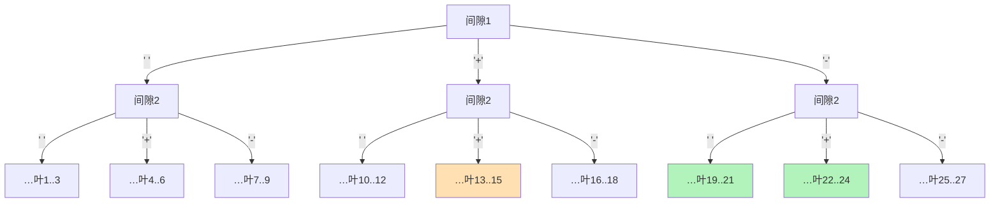

[[TOC]]

## 形式化题目

给定 $N$（$3 \leqslant N \leqslant 9$），把递增数列 $1, 2, \ldots, N$ 的每相邻两个数字之间依次填入一个符号：`+`、`-` 或空格。符号不改变数字本身的写法——填了空格的两个数字**拼接**成同一个多位数（如 `2 3` 表示 $23$，`1 2 3` 表示 $123$）。

按从左到右的顺序把整个式子求和（式子由若干带符号的项组成，第一项恒为 $+1$ 的前缀），要求找出**所有**求和结果为 $0$ 的式子，并按 ASCII 码顺序输出。

样例（$N=7$）里的一条解 `1-2 3+4+5+6+7` 对应算式 $1 - 23 + 4 + 5 + 6 + 7 = 0$。

## 正解

### 思路

**第 1 步：符号串只有 $3^{N-1}$ 种，全部枚举就是正解。**

每相邻两数之间恰好要填 1 个符号，$N$ 个数之间共有 $N-1$ 个位置，每个位置有 `+`、`-`、空格 3 种选择，方案总数为

$$3^{N-1} \leqslant 3^8 = 6561.$$

对每个方案只需 $O(N)$ 时间求值。总数不过六千多，任何一档 $O(3^{N-1} \cdot N)$ 的枚举都能轻松通过，所以本题的"正解"就是把搜索空间完整枚举，不需要任何剪枝或更聪明的算法。

**第 2 步：每个方案生成一个表达式字符串。**

把数字 $1 \ldots N$ 写成字符串，第 $i$ 个数字后面接上第 $i$ 个符号再接第 $i+1$ 个数字。例如 $N=4$、符号串 `+- `（第三个是空格）得到 `1+2-3 4`。

**第 3 步：把"拼接"变成一次普通求值。**

空格的含义是把两数连成一个多位数。与其在枚举时手工维护"当前项的数值"，不如在求值时统一处理：把表达式按 `+` / `-` 切成若干项，**每一项内部先把空格去掉再转成整数**。例如 `-2 3` 这一项去掉空格后是 `-23`，即 $-23$。

一个细节：第一项没有前导符号。用支持可选前导符号的切分方式（如正则 `[+-]?[^+-]+`），第一项 `1` 会被匹配为不带符号的 `1`，与"第一项为正"的题意一致。

**第 4 步：ASCII 序由枚举顺序免费得到。**

题目要求按 ASCII 码顺序输出。字符的 ASCII 大小关系为：空格（32）$<$ `+`（43）$<$ `-`（45）。只要把三种符号按 `' '`、`'+'`、`'-'` 的顺序排好，再做**字典序乘积枚举**（`itertools.product` 正是按这一顺序、从最后一个位置开始进位的顺序产出所有符号串），产出的表达式天然就是题目要的顺序，无需再排序。

以 $N=3$ 为例，枚举顺序与表达式：

| 枚举序 | 符号串 | 表达式 | 值 |
| --- | --- | --- | --- |
| 1 | `（空）（空）` | `1 2 3` | $123$ |
| 2 | `（空）+` | `1 2+3` | $125$ |
| 3 | `（空）-` | `1 2-3` | $119$ |
| 4 | `+（空）` | `1+2 3` | $125$ |
| 5 | `++` | `1+2+3` | $6$ |
| 6 | `+-` | `1+2-3` | $\mathbf{0}$ ✓ |
| 7 | `-（空）` | `1-2 3` | $-19$ |
| 8 | `-+` | `1-2+3` | $2$ |
| 9 | `--` | `1-2-3` | $-4$ |

$N=3$ 的唯一解恰好是第 6 行 `1+2-3`，与真实数据 `zerosum0.out` 一致；且表的顺序就是 ASCII 序（位置 2 的符号变化快于位置 1，同位置内 `空 < + < -`），可以直接输出。

### 代码

@include-code(./main.py, python)

### 复杂度

- 时间：$O(3^{N-1} \cdot N)$。枚举 $3^{N-1}$ 个符号串，每个表达式求值 $O(N)$（正则切分 + 逐项去空格转整数）。$N=9$ 时约 $6 \times 10^4$ 次字符操作，远在限时之内。
- 空间：$O(N)$ 的临时表达式字符串，输出前最多缓存 $O(3^{N-1} \cdot N)$ 的答案行。

## 总结

- 本题的本质是**在乘积空间 $3^{N-1}$ 上做完整枚举**：位置少、分支少，搜索空间小到不需要任何优化。
- 两个关键实现点：① 用"按 +− 切项、项内去空格"把拼接语义统一进普通求值；② 按 `' ' < '+' < '-'` 的顺序做字典序枚举，使输出顺序免排序。
- 同样的算法在 C++ 里就是三重递归/递推枚举符号、手写扫描求值，复杂度完全相同；Python 版用 `itertools.product` + 正则求值把代码压到最短。

## 图示解析

### 搜索树的形状（N = 4）

下图展示 $N=4$ 时符号枚举树的左侧两层：每个节点表示"已确定到第几个间隙"，边上的标签是填入的符号（按 `空 < + < -` 排列）。叶子的编号就是 `product` 产出该符号串的全局顺序，加粗的叶子是值为 0 的解。

观察重点：

- 枚举按"最后一个间隙变化最快"的字典序进行，所以叶子顺序就是 ASCII 输出顺序。
- 高亮的三片叶子对应解 `1+2-3 4`（$1+2-34$）、`1-2 3+4`（$1-23+4$）、`1-2+3-4`（$1-2+3-4$），恰好覆盖 $N=4$ 的全部解。
- 树的每层分 3 叉、共 $N-1$ 层，叶子总数 $3^{N-1}$——这就是"为什么不用剪枝"的直观依据。
