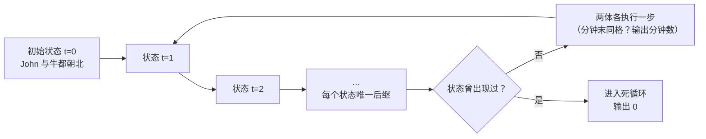

[[TOC]]

## 形式化题目

给定一个 $10 \times 10$ 的网格，每个格子是空地或障碍，其中恰有一个格子标 `F`（John），一个格子标 `C`（两头牛）。每个个体有一个朝向，初始都朝北。每一分钟两个个体**同时**行动，规则相同：

- 若按当前朝向前方的格子既不出界也不是障碍，则前进一步，朝向不变；
- 否则原地不动，朝向顺时针旋转 $90°$。

若某一分钟结束时两者位于同一格子，追捕结束，输出经过的分钟数；若永远不会相遇，输出 $0$。

::: note 样例与判定样例
题面样例（即测试数据 `ttwo0`）的答案是 `49`。

```text
*...*.....
......*...
...*...*..
..........
...*.F....
*.....*...
...*......
..C......*
...*.*....
.*.*......
```
:::

## 正解

### 思路

**第一步：朴素做法。** 最直接的想法是"每分钟模拟一次行动，看看多久相遇"。但"多久"没有一个天然上限：如果永远遇不到，程序会死循环。所以朴素做法必须先回答一个问题——**最多模拟多少分钟就可以断定"永远遇不到"？**

**第二步：把两个个体看成一个整体。** 关键观察是：虽然 John 和牛是两个东西，但它们的运动都是**完全确定**的——某一分钟末，只要知道 John 的 (位置, 朝向) 和牛的 (位置, 朝向)，下一分钟它们在哪、朝哪，就唯一确定了，与历史无关。因此可以把系统压缩成一个状态：

$$
(\text{John 行, John 列, John 朝向, 牛行, 牛列, 牛朝向})
$$

整个系统就是一个在状态之间跳转的确定性有限自动机：每个状态有唯一的后继。

**第三步：状态空间有限 ⇒ 模拟上限。** 网格 $10 \times 10$，每个个体的状态数是 $10 \times 10 \times 4 = 400$（位置 100 种 × 朝向 4 种），联合状态最多 $400 \times 400 = 16000$ 种。抽屉原理保证：模拟到第 $16001$ 步之前，某个状态必然重复出现。而确定性自动机一旦回到走过的状态，之后就会**一帧不差地循环**（John 走的路线和牛走的路线都各自进入循环）。既然上次到这个状态时还没相遇，这个循环里也永远不会有相遇，此时输出 $0$。

于是算法是：

1. 每分钟开始前记录当前联合状态；
2. 若分钟末两者同格，输出已过分钟数；
3. 若记录过的状态再次出现，输出 $0$；
4. 否则两体同时执行一步（规则完全相同，可以共用同一个移动函数）。

状态最多被访问一次，总步数上界就是 $16000$，远小于任何时限。

::: note 两个实现细节
- **"穿过对方不算相遇"自动被正确处理**：我们只在"分钟末"检查同格，分钟中途的交错路径根本不会被检查。
- **计数方式**：循环每一轮代表"新的一分钟"，用"已登记状态的个数"作为答案最省事——每过一分钟恰好登记一个新状态，抓住时登记数就是分钟数（第 1 分钟末抓住时恰好登记了 1 个状态）。
:::

### 代码

@include-code(./main.py, python)

### 复杂度

状态总数 $400^2 = 16000$，每个状态只访问一次，每步移动 $O(1)$。

- 时间复杂度：$O(400^2) = O(16000)$，上界常数极小；
- 空间复杂度：$O(16000)$ 个状态记录（哈希集合）。

实际运行中所有测试数据都在 200 分钟内出结果，Python 远不需要担心时限。

## 图示解析

### 样例前 10 分钟的推演

下表逐分钟展示测试数据 `ttwo0` 中 John 和牛的移动。每一行是"分钟开始时的状态 → 分钟末的状态"，"进"表示前进一步，"转"表示原地顺时针转 $90°$；行列均从 0 数起，N/E/S/W 表示北/东/南/西。John 从 (6, 0) 出发，牛从 (8, 1) 出发。

| 分钟 | John（位置+朝向） | 牛（位置+朝向） | 动作 |
| ---: | :--- | :--- | :--- |
| 1 | (6, 0)N → (6, 0)E | (8, 1)N → (8, 1)E | John:转 牛:转 |
| 2 | (6, 0)E → (6, 1)E | (8, 1)E → (8, 2)E | John:进 牛:进 |
| 3 | (6, 1)E → (6, 2)E | (8, 2)E → (8, 3)E | John:进 牛:进 |
| 4 | (6, 2)E → (6, 2)S | (8, 3)E → (8, 4)E | John:转 牛:进 |
| 5 | (6, 2)S → (6, 2)W | (8, 4)E → (8, 5)E | John:进 牛:进 |
| 6 | (6, 2)W → (6, 1)W | (8, 5)E → (8, 6)E | John:进 牛:进 |
| 7 | (6, 1)W → (6, 0)W | (8, 6)E → (8, 7)E | John:进 牛:进 |
| 8 | (6, 0)W → (6, 0)N | (8, 7)E → (8, 8)E | John:转 牛:进 |
| 9 | (6, 0)N → (6, 0)E | (8, 8)E → (8, 8)S | John:转 牛:转 |
| 10 | (6, 0)E → (6, 1)E | (8, 8)S → (9, 8)S | John:进 牛:进 |

（为便于展示只截取前 10 分钟；实际样例在第 49 分钟末相遇。）

观察重点：

- 第 1 分钟两者同时"卡住转身"——John 上方 (5, 0) 是障碍，牛上方 (7, 1) 是障碍，这体现了**同时行动**：谁也不必等谁；
- 第 4、5 分钟 John 在 (6, 2) 连续转身两次（东侧 (6, 3) 是障碍，转向南后南方 (7, 2) 仍是障碍），说明"转完的朝向"要立刻用于下一步判断；
- 第 8、9 分钟 John 绕回 (6, 0) 后再次转身，但注意第 9 分钟末的 John 朝向（E）与第 1 分钟末（E）相同——**只有位置和朝向都相同才算状态重现**；
- 牛一路向东，第 8 分钟末到达 (8, 8)：东侧 (8, 9) 是障碍，第 9 分钟原地转成朝南，随后往地图右下角一带走，逐渐进入自己的循环路线。

### 状态重现判无解

用 Mermaid 展示系统的确定性状态转移结构：



图中唯一的分岔就是"状态是否重现"：确定性自动机一旦回到走过的状态，之后必然一帧不差地重演，相遇永远不再发生。这条判定规则把"会不会永远走不到"从无限问题压缩成 16000 步以内的有限检查。

## 总结

把 John 和牛的运动合成一个 $400^2 = 16000$ 状态的确定性有限自动机：逐分钟模拟，分钟末同格即抓住并输出时间；用集合记录访问过的状态，状态重现说明系统已进入死循环，输出 $0$。时间与空间复杂度均为 $O(16000)$，实现上两体共用同一个移动函数，核心代码只有十几行。
