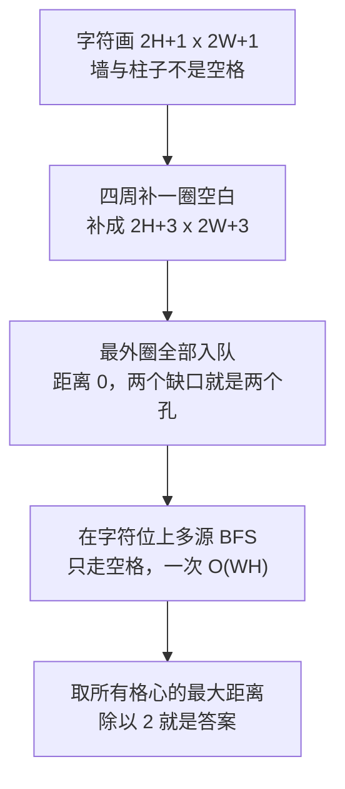

[[TOC]]

## 形式化题目

给定迷宫字符画：$2H+1$ 行、每行 $2W+1$ 个字符（$1 \leqslant W \leqslant 38$，$1 \leqslant H \leqslant 100$）。
字符只有四种：

- 空格：格子、格间通道、迷宫外的区域；
- `-`、`|`：栅栏；
- `+`：栅栏柱子，只出现在偶数行与偶数列。

迷宫边界上恰有**两段栅栏缺失**（两个出口，按"格子 + 方向"计），且迷宫连通。
牛只能在上下左右方向移动，每移动到一个新的方格算一步，**从出口迈出迷宫的那一步也算一步**。

求

$$\max_{\text{所有格子 } v}\ \big(\text{从 } v \text{ 走出迷宫的最少步数}\big),$$

即从最"糟糕"的那一点出发、即使走最优路线也需要的最大步数。

样例（$W=5,\ H=3$）的两个出口分别是格子 $(2,1)$ 的南边与格子 $(2,4)$ 的东边，
最坏点是左下角格子 $(2,0)$，需要 9 步，输出 `9`。

## 正解

### 思路

**第一步：朴素做法。** 把迷宫读成"格子图"：格子与上下左右四个邻居有边，当且仅当两者之间的
那个字符是空格；若这条边落在迷宫边界上，则这条边直接通向出口之外。然后对**每个格子**各做一次
单源 BFS，求出它到最近出口的最少步数，最后取最大值。

这个做法正确，但把同一份信息算了 $WH$ 遍：一次 BFS 是 $O(WH)$，$\Theta(WH)$ 个源点就是
$O((WH)^2)$。$W=38, H=100$ 时约 $1.4 \times 10^7$ 次状态扩展——瓶颈不在图本身，而在
**重复求解**：所有格子共享同一张图、共享同一批出口。

**第二步：倒过来看。** 两个出口只是迷宫边界上的两个"孔"，孔外面是同一片自由空间。
把整片自由空间当作超级源点（距离 0），让水从两个孔同时灌进迷宫：
**每个格子在第几层被淹到，就是它到最近出口的步数。** 一次多源 BFS 同时算出所有格子的答案，
复杂度回到 $O(WH)$。

**第三步：直接在字符画上灌水，而不是在格子图上。** 把字符画的每个字符位当作节点，
上下左右相邻且目标字符是空格就连一条边。这样：

- **墙的判定消失了**：`-`、`|`、`+` 都不是空格，水自然过不去；
- **出口判定消失了**：缺口本身是空格，水自然流得出去；
- **撞墙检测消失了**：补边之后 BFS 永远不会越界。

**第四步：补一圈空白。** 把 $2H+1$ 行字符画补成 $(2H+3) \times (2W+3)$，四周各加一圈空格。
这一圈空白就是"迷宫外"，它自己连通，两段出口是它仅有的两个孔，于是**最外圈全体入队**就是
合法的多源起点。补边还顺带解决了 USACO 原数据会去掉行尾空格的问题：先把每行 `ljust` 到
$2W+1$ 再补。

**第五步：把字符距离折半。** 牛走一格 = 从格心跨过通道到相邻格心 = 2 个字符位；
从格心迈出迷宫也是 2 个字符位（格心 → 缺口 → 迷宫外的空格位）。反过来看，
空白位只有三种：格心（偶、偶）、格间中点（奇、偶 或 偶、奇）、最外圈
（奇、奇 一定是柱子 `+`）。按 $(r+c)$ 的奇偶二部着色后相邻必异类，而最外圈里
那些奇类位置（如顶边 $(0,c)$、$c$ 为奇数）四周的空格全在最外圈，
不可能作为进入迷宫内部的入口，因此从格心出发的最短路必然成对地经历
"中点 → 格心"，并在偶数步处恰好停在某个出口缺口外侧。于是

$$d(\text{格心}) = 2 \times (\text{该格到最近出口的步数}).$$

所以只要对**所有格心**的距离取最大值再整除 2，就是题目要的答案。
整除这一步同时也把"源点距离是 0 而走出第一步算 1 步"的偏移一并消掉。

下面是样例补边后的样子：`*` 是最坏点 $(2,0)$ 走到迷宫外的一条最短路，`@` 是两段出口栅栏缺口。

```text
    0 1 2 3 4 5 6 7 8 9 0 1 2
 0  |             |
 1  | +-+-+-+-+-+ |
 2  | |  *******| |
 3  | +-+*+-+ +*+ |
 4  | |***  | |*| |
 5  | +*+-+-+ +*+ |
 6  | |*|     |*@*|
 7  | +-+@+-+-+-+ |
 8  |             |
```

可以看到第 0 行与第 8 行、第 0 列与第 12 列整圈都是新补的空白，两个 `@` 正是迷宫的
两段出口栅栏缺口：一个在底边（格子 $(2,1)$ 的南侧），一个在右边（格子 $(2,4)$ 的东侧）。
最短路从格子 $(2,0)$ 的格心出发（图中第 6 行第 2 列），先向右上以楼梯状绕到第 0 排格子，
沿第 0 排向右横穿到第 4 列，再向下回到格子 $(2,4)$，
最后从它东侧的缺口迈出迷宫，共 18 个字符位，恰好是 9 步。

### 代码

@include-code(./main.py, python)

### 复杂度

补边后网格有 $(2H+3)(2W+3) \leqslant 79 \times 203 = 16037$ 个字符位。

- 时间复杂度：$O((2H+3)(2W+3)) = O(WH)$，每个空白位入队一次、检查 4 个邻居。
  对比逐格子单源 BFS 的 $O((WH)^2)$。
- 空间复杂度：$O(WH)$，`grid` 约 $16\text{KB}$，`dist` 至多 16037 个整数。

## 总结

把迷宫字符画补上一圈空白，让"迷宫外"成为网格里真实存在的一整片连通区域，
再把最外圈整体当作多源 BFS 的源点：每个格心的字符距离折半就是它到最近出口的步数，
取所有格子的最大值即为答案。这次转换去掉了墙判定、出口判定和越界检测三类边界代码，
并把逐格子单源 BFS 的 $O((WH)^2)$ 降为一次 $O(WH)$ 的洪水填充。

## 图示解析

### 每个格子的层数

下表给出样例中每个格子的 BFS 结果，单元格写作"字符距离 / 牛的步数"。
字符距离是对补边网格全局做一次多源 BFS 得到的；折半就是答案，加粗的是最大值。

| 方格行 \ 列 | c0 | c1 | c2 | c3 | c4 |
| --- | --- | --- | --- | --- | --- |
| r0 | 14 / 7 | 12 / 6 | 10 / 5 | 8 / 4 | 6 / 3 |
| r1 | 16 / 8 | 14 / 7 | 16 / 8 | 8 / 4 | 4 / 2 |
| r2 | 18 / **9** | 2 / 1 | 4 / 2 | 6 / 3 | 2 / 1 |

三个观察点：

- 所有字符距离都是**偶数**，所以折半不丢精度；
- 最小值 2 出现在两个出口所在的格子 $(2,1)$ 与 $(2,4)$ 上，对应"从缺口迈出迷宫算 1 步"；
- 最大值 18 在左下角 $(2,0)$，折半得 9，与样例输出一致。

### 模型转换路线



整条路线的关键是第二步：把"迷宫外"变成网格里真实存在的一圈节点，出口就不需要任何特殊判定；
第四步则保证一次 BFS 同时解决所有格子的询问，把平方复杂度降回线性。
