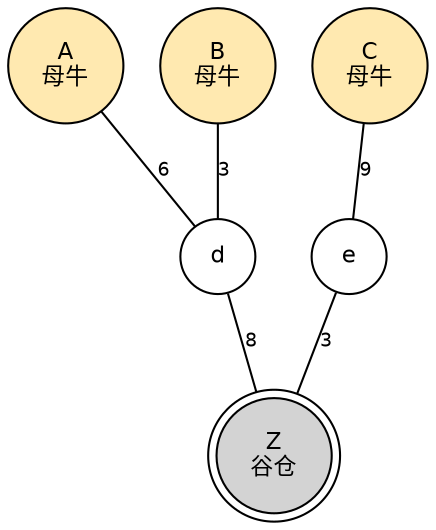
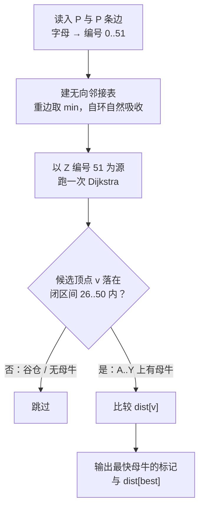

[[TOC]]

## 形式化题目

给定一张无向带权图 $G = (V, E)$：

- 顶点集 $V$ 是 52 个牧场标记 $\{\texttt{a},\dots,\texttt{z},\texttt{A},\dots,\texttt{Z}\}$，其中 $\texttt{Z}$ 称为**谷仓**；
- 每个标记为 $\texttt{A},\dots,\texttt{Y}$ 的顶点上有一只母牛，$\texttt{a},\dots,\texttt{z}$ 上没有母牛，谷仓 $\texttt{Z}$ 上也没有母牛；
- 边集 $E$ 有 $|E| = P$ 条边，每条边是无向边、正整数权（道路长度）；允许两个顶点之间有多条边，也允许自环。

所有母牛以相同速度沿最短路走向谷仓，求最先到达谷仓的母牛所在的牧场标记，以及这只母牛走过的路径长度。即求

$$\operatorname*{arg\,min}_{v \in \{\texttt{A},\dots,\texttt{Y}\}} \operatorname{dist}(v, \texttt{Z}), \qquad \min_{v \in \{\texttt{A},\dots,\texttt{Y}\}} \operatorname{dist}(v, \texttt{Z})$$

其中 $\operatorname{dist}$ 是无向图上的最短路长度。题面保证最优解唯一（"总会有且只有一只速度最快的母牛"），且至少有一个牧场与谷仓连通。

为了在代码里操作顶点，把标记映射成编号：$\texttt{a}..\texttt{z} \to 0..25$，$\texttt{A}..\texttt{Z} \to 26..51$。这样有母牛的牧场恰好是连续区间 $[26, 50]$，谷仓 $\texttt{Z}$ 是 $51$。

下面这张图是题面样例的图结构（边上数字是道路长度），用于固定"标记 → 位置"的心理模型：



图中只有 $\texttt{A}$、$\texttt{B}$、$\texttt{C}$ 三只母牛，另外 3 个出现在图中的牧场是 $\texttt{d}$、$\texttt{e}$ 和谷仓，其余 46 个牧场不与谷仓连通（题面只保证"至少有一个牧场和谷仓之间有道路连接"）。三只母牛到 $\texttt{Z}$ 的唯一路径分别是 $6+8=14$、$3+8=11$、$9+3=12$，因此 $\texttt{B}$ 最快，输出 `B 11`。

## 正解

### 思路

**第一步：朴素做法。** 题面的说法是"每只母牛各自走最短路，比谁先到"，于是最直接的做法是：对每一个有母牛的牧场 $v \in \{\texttt{A},\dots,\texttt{Y}\}$（最多 25 个），以 $v$ 为源点跑一次单源最短路，算出 $\operatorname{dist}(v, \texttt{Z})$，最后在 25 个结果里取最小值。

这个做法**完全正确**，但它做了两件浪费事。

**第二步：看清浪费在哪里。** 第一处浪费是重复计算：25 个量共享同一张图、同一个终点，每一轮最短路却都从零开始展开，绝大部分顶点的距离被反复确定。第二处浪费更隐蔽：**源点的方向选反了**。

母牛是"走向谷仓"，看起来该以母牛为源点；但图是**无向**的——题面明确说"母牛能向着任意一方向前进"。无向图满足

$$\operatorname{dist}(v, \texttt{Z}) = \operatorname{dist}(\texttt{Z}, v),$$

因为把 $v \to \texttt{Z}$ 的任一路径的边序反转，就得到一条等长的 $\texttt{Z} \to v$ 路径，反之亦然。

**第三步：交换源点。** 把源点换成谷仓 $\texttt{Z}$，跑**一次**单源最短路，就同时得到全部 52 个顶点到 $\texttt{Z}$ 的距离。语义上也更好理解：谷仓向四面八方派出一支探路队，哪个牧场上的母牛被最先碰到，答案就是它。

剩下的事只有在 $[26, 50]$（即 `A`..`Y`）上取最小值。**这一步要特别小心**：$[26, 51]$ 里的 $51$ 就是谷仓自己，$\operatorname{dist}(\texttt{Z}, \texttt{Z}) = 0$ 恒为最小，所以候选区间必须写成 `range(26, 51)` 而不是 `range(26, 52)`，否则会输出 `Z 0`。

**第四步：建图的两个化简。** 在跑最短路之前，题面还给了两个便利条件，都可以等价消掉：

- **重边**（"两个牧场之间会有超过一条道路相连"）：到同一个邻居的多条边里，只有最短的那条可能出现在任何最短路上，所以保留最小值即可，`adj[u][v] = min(adj[u][v], w)`；
- **自环**（"可能包括自己"）：正权自环 $u \to u$ 只会让已经到达 $u$ 的路径变长，删掉不影响任何最短路。

代码里用一个 `dict[int, int]` 邻接表把这两件事一次做完：字典天然合并重边（配合 `min`），而自环 `u == v` 写成 `adj[u][u] = min(adj[u].get(u, INF), w)` 只会把 $u$ 到自己的距离记为正数，Dijkstra 永远不会用它改进 `dist[u] = 0`。

算法至此定型：

```text
1. 读入 P 条边，字母 → 编号 0..51
2. 建无向邻接表，重边取 min（自环被自然吸收）
3. 从编号 51（Z）跑一次 Dijkstra → dist[0..51]
4. best = argmin{ dist[v] : v ∈ [26, 50] }      # 只有 A..Y 上有母牛
5. 输出 chr(编号还原) 与 dist[best]
```

以题面样例验证一遍。顶点编号 `d = 3`、`e = 4`、`A = 26`、`B = 27`、`C = 28`、`Z = 51`，从 `Z` 出发的 Dijkstra 出堆顺序如下：

| 出堆顶点 | 出堆距离 | 松弛动作 | dist 变化 |
| --- | ---: | --- | --- |
| `Z` (51) | 0 | `Z–d` 8、`Z–e` 3 | `dist[d] = 8`、`dist[e] = 3` |
| `e` (4) | 3 | `e–C` 9 | `dist[C] = 12` |
| `d` (3) | 8 | `d–A` 6、`d–B` 3 | `dist[A] = 14`、`dist[B] = 11` |
| `B` (27) | 11 | 无更短边 | — |
| `C` (28) | 12 | 无更短边 | — |
| `A` (26) | 14 | 无更短边 | — |

表中每一行表示"一个顶点带着它的最终距离从堆中弹出，并用它松弛所有邻居"。候选集合 $\{\texttt{A},\texttt{B},\texttt{C}\}$ 里 `dist[B] = 11` 最小，输出 `B 11`，与题面样例一致。其余 46 个牧场与 `Z` 不连通，保持 `INF`，不参与比较。

顺带说明表里为什么可能看到"同一个顶点入堆两次"：顶点第一次入堆的距离是**临时**的，之后可能被更短的路径改写。所以代码里必须有 `if d > dist[u]: continue`——堆中弹出的距离是否等于 `dist[u]`，才是"这条记录是否过期"的判据，只有不过期的弹出才代表该顶点的距离最终确定。

### 代码

@include-code(./main.py, python)

### 复杂度

设顶点数 $V = 52$，边数 $P \leqslant 10^4$。

- **朴素做法**：对 25 个母牛牧场各跑一次 Dijkstra，$O(25 \cdot P \log V)$。
- **正解**：读入建图 $O(P)$，一次 Dijkstra $O((P + V)\log V)$，取最小值 $O(V)$。合计

$$O(P \log V) \approx 10^4 \times 6 = 6 \times 10^4$$

次堆操作，比朴素做法快 25 倍。由于任何正确解法都至少要把 $P$ 条边读完，$\Omega(P)$ 是本题的下界，$O(P \log V)$ 与正解同阶。

- **空间复杂度**：$O(P + V)$——邻接表最多存 $2P$ 条 `(邻居, 权重)` 记录，距离数组只有 52 个元素。

在题目仓库的真实数据上实测：满规模组（$P = 10^4$）耗时约 0.02s、峰值内存约 16MB，相对 1000ms / 128MB 的限制有约 50 倍的时间余量。

## 总结

- **核心变换**：图是无向的，所以 $\operatorname{dist}(v, \texttt{Z}) = \operatorname{dist}(\texttt{Z}, v)$。把 25 次"从母牛到谷仓"的最短路合并成一次"从谷仓出发"的单源最短路，$O(25P\log V) \to O(P\log V)$。
- **易错点**：候选区间是 `range(26, 51)` 而不是 `range(26, 52)`——编号 51 是谷仓自己，距离恒为 0，把它放进候选集合会直接输出 `Z 0`。
- **建图细节**：重边用字典 `min` 合并、正权自环可忽略，两者都是不改变最短路的等价变换；`INF` 这一个哨兵同时充当距离初值和 `dict.get` 的默认值。这两条不是凑数：满规模组 $P = 10^4$ 里真正不同的边只有 1325 条，还包含 198 条自环，不化简就去跑最短路会白做大部分工作。
- **算法适用性**：边权全为正（$1 \leqslant w \leqslant 1000$），Dijkstra 的前提成立；顶点只有 52 个，堆规模恒为 $O(P)$，不存在退化情形。

## 图示解析

### 解题路线

下图把整条解法路线串起来，重点是两处：源点被换成谷仓，以及“候选顶点必须落在 $[26, 50]$”这个分支（它是整条流程中唯一的判断）：



图中唯一的分岔就是"候选顶点是否落在 $[26, 50]$"。这个区间的右端点是开区间，正对应题面两句话："在用大写字母表示的牧场中有一只母牛"（`A`..`Y`）与"谷仓的标记是 `Z`，注意没有母牛在谷仓中"。把它写成 `range(26, 51)` 后，谷仓被排除这件事不需要任何额外 `if`，区间边界本身就是约束。

### 顶点编号与三类角色

编号方案让"哪些顶点有母牛"变成一个连续区间，下表是三个区段的对照：

| 区段 | 编号 | 数量 | 是否有母牛 | 在算法中的角色 |
| --- | --- | ---: | --- | --- |
| `a`..`z` | 0..25 | 26 | 无 | 只是路径的中转站，可以出现在最短路上 |
| `A`..`Y` | 26..50 | 25 | **每格一只** | 答案的候选集合，`min` 只在这些顶点上取 |
| `Z` | 51 | 1 | 无 | Dijkstra 的**源点**，同时是要到达的终点 |

这张表解释了代码里两个常量的来历：`COW_FIRST, BARN = 26, 51` 同时给出了候选区间的**左闭**起点和**右开**终点，而 `BARN` 又反过来当作 `dijkstra(adj, BARN)` 的源点。一个常量承担两个角色不是巧合：`A`..`Y` 之后紧挨着的就是 `Z`，编号的连续性让"谷仓没有母牛"这条约束变成 `range(COW_FIRST, BARN)` 的自然边界。
