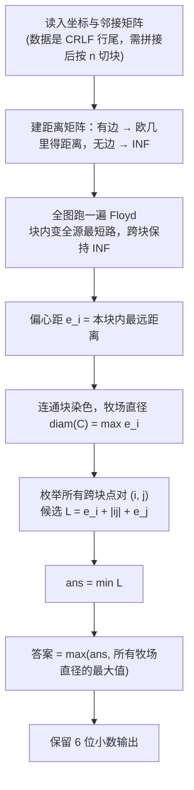

[[TOC]]

## 形式化题目

平面上有 $1 \leqslant N \leqslant 150$ 个互不重合的点，第 $i$ 个点坐标 $(x_i, y_i)$，$0 \leqslant x_i, y_i \leqslant 100000$。给定一个对称的 0/1 邻接矩阵，值为 1 表示两点直接相连，边权为两点间的欧几里得距离。相连关系把点分成若干个**连通块**（题目保证至少两个）。

一个连通块的**直径**定义为块内最远两点的最短路长度。现在必须恰好添加一条边，连接两个**不同**连通块中的各一个点，使添加后新连通块的直径最小。输出这个最小直径，保留 6 位小数。

## 正解

### 思路

**朴素做法为什么不行**：按定义，枚举每个跨块点对 $(a, b)$、连边后重算一遍直径。单次 Floyd 是 $O(N^3)$，点对最多 $O(N^2)$ 个，总共 $O(N^5) \approx 7.6 \times 10^{10}$，不可行。问题在于"每次连边都从头算"——而连边根本不会改变任何块内部的最短路。

**第 1 步：一次性算全块内最短路。** 把"无边"用 $\text{INF}$ 哨兵填进距离矩阵，直接对全图跑一遍 Floyd。跨块点对之间没有路径，距离保持 INF；每个块内部自动变成全源最短路。$O(N^3)$，$N \leqslant 150$ 时约 $3.4 \times 10^6$ 次松弛。

**第 2 步：偏心距与直径。** 定义点 $i$ 的**偏心距**为它到本块内最远点的距离：

$$e_i = \max_{j \in \mathrm{comp}(i)} d[i][j],$$

块 $C$ 的直径为 $\operatorname{diam}(C) = \max_{i \in C} e_i$。有了全源最短路，这两步都只是过滤掉 INF 后取 max，$O(N^2)$。

**第 3 步：枚举新边。** 设新边连接分属两块的 $a, b$，新牧场中任意一条跨块路径都长成"$a$ 块内的某条路 + 新边 + $b$ 块内的某条路"，其中最长的为

$$L(a, b) = e_a + |ab| + e_b,$$

$|ab|$ 是两点的**欧几里得距离**（注意不是 $d[a][b]$——跨块时它是 INF，这是实现时最容易写错的一处）。而块内原有的点对距离一个都不会变小，所以新直径是

$$\max\big(\operatorname{diam}(A),\ \operatorname{diam}(B),\ L(a, b)\big).$$

max 里必须保留两个原直径：新边只增不减，如果两个牧场本来就是很"粗"的团，瓶颈就不是新边（这是本题最经典的错误来源）。对所有跨块点对取上式的最小值即为答案，$O(N^2)$。

总复杂度 $O(N^3)$。

求解流程如下：

**样例演算**。题面样例有 8 个点，两个牧场 $\{A,B,C,D,E\}$ 与 $\{F,G,H\}$：

| 牧区 | A | B | C | D | E | F | G | H |
| --- | --- | --- | --- | --- | --- | --- | --- | --- |
| 偏心距 $e_i$ | 12.071 | 7.071 | 10.000 | 10.000 | 12.071 | 12.071 | 7.071 | 12.071 |

两个牧场的直径都是 $\sqrt{146} \approx 12.071$（分别由 A↔E 与 F↔H 取到）。三个较优的连接方案：

| 新边 | $e_a$ | $\|ab\|$ | $e_b$ | 跨边方案 $L$ | 新直径 $=\max(12.071, 12.071, L)$ |
| --- | --- | --- | --- | --- | --- |
| C↔G | 10.000 | 5.000 | 7.071 | **22.071** | 22.071 |
| B↔G | 7.071 | 7.071 | 7.071 | 24.142 | 24.142 |
| E↔G | 12.071 | 7.071 | 7.071 | 26.213 | 26.213 |

最优方案是 C↔G，答案 $10 + 5 + 5\sqrt{2} \approx 22.071068$，与样例输出一致。

### 代码

@include-code(./main.py, python)

### 复杂度

- 时间：Floyd 占 $O(N^3)$，$N = 150$ 时约 $3.4 \times 10^6$ 次松弛；偏心距、染色、枚举点对都是 $O(N^2)$。本地实测 9 组官方数据每组 0.02–0.06s，远低于 1000ms 限制。
- 空间：距离矩阵与邻接矩阵各 $N^2$，$O(N^2)$，峰值约 16MB。

## 总结

- 本题是"图的直径 + 连接两个连通块"的经典模型，核心链条是：**Floyd 全源最短路 → 偏心距/直径 → 枚举跨块点对**。
- 两个易错点：新边权是两点的欧几里得距离而不是 $d[a][b]$（跨块时它是 INF）；新直径必须与两个原牧场的直径取 max，只算 $e_a + |ab| + e_b$ 在"两个团块"型数据上会偏小。
- 实现层面的小坑：真实数据的邻接矩阵带 CRLF 行尾（个别行还有行内空格），逐 token 读数字会粘行，应把矩阵部分的字符拼接成 0/1 串后按每行 $N$ 个切块。
