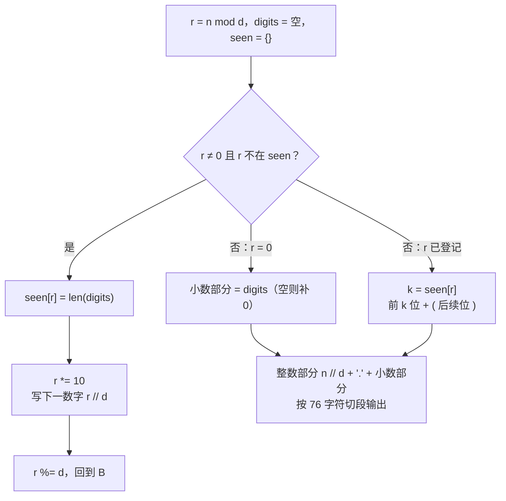

[[TOC]]

## 形式化题目

给定分数 $\dfrac{n}{d}$（$1 \leqslant n, d \leqslant 100000$），输出它的小数表示：

- 有限小数把所有位写完，整数写成 `x.0`；
- 无限循环小数把循环节放进一对圆括号，如 $45/56 = 0.803(571428)$；
- 若输出串长度超过 76 个字符，每 76 个字符换一行（最后一行可以不足 76）。

## 正解

### 思路

朴素想法是"除到某一位时，看看后面是不是开始重复了"——但"重复"没法直接看出来，
逐位往后比对更是无穷无尽。换一个角度：**竖式长除法里，每一步产出的数字完全由当前余数决定**。

这一句话就是整道题的钥匙。回忆竖式除法的过程：

1. 当前余数 $r$ 乘 10；
2. 商位就是 $r \times 10 \div d$ 的整数部分；
3. 新余数是 $r \times 10 \bmod d$。

所以只要余数相同，之后的整个数字串就一模一样。而余数只有 $d$ 种取值（$0 \leqslant r < d$），
由鸽笼原理：**要么在 $d$ 步内余数变成 0（有限小数），要么在 $d$ 步内某个余数重复出现（循环小数）**。
不需要任何猜测，$O(d)$ 步之内必然终结。

剩下的问题只是"循环节从哪里开始"。设余数 $r$ 第二次出现时已经写出了 $m$ 位小数，
那么顺着上面的论证，从 $r$ **第一次出现**（设为第 $k$ 位末尾）之后的数字串会无限重复：
第 $k+1 \ldots m$ 位就是循环节，前 $k$ 位是不循环部分。于是只需要一张登记表：

$$\text{seen}[r] = \text{余数 } r \text{ 出现时已写出的小数位数}$$

每一步先把当前余数 $r$ 和已写位数登记进 `seen`，再产出一位数字。循环终止后：

- 若 $r = 0$：小数部分就是已写出的数字（一位都没写就补 `0`，即整数情形）；
- 若 $r$ 已在 `seen` 中：设 $k = \text{seen}[r]$，输出 `前 k 位 + ( + 其余位 + )`。

用 $45/56$ 走一遍完整过程（整数部分 $45 \div 56 = 0$，初始余数 45）：

| 轮 | 开始时余数 $r$ | 登记 `seen[r]` = 已写位数 | 商位 $r \times 10 \div 56$ | 新余数 |
| --- | --- | --- | --- | --- |
| 1 | 45 | 0 | 8 | 2 |
| 2 | 2 | 1 | 0 | 20 |
| 3 | 20 | 2 | 3 | 32 |
| 4 | 32 | 3 | 5 | 40 |
| 5 | 40 | 4 | 7 | 8 |
| 6 | 8 | 5 | 1 | 24 |
| 7 | 24 | 6 | 4 | 16 |
| 8 | 16 | 7 | 2 | 48 |
| 9 | 32 | **已在第 4 轮登记过（k = 3）→ 停止** | — | — |

依次写出的数字是 `8 0 3 5 7 1 4 2`，重复的余数 32 首次出现在第 4 轮开始时（已写 3 位），
所以前 3 位 `803` 是不循环部分，后 6 位 `571428` 是循环节，输出 `0.803(571428)`——与样例一致。

最后是两个容易漏的输出细节：

- **整数情形**：$2/2$ 必须输出 `1.0`，也就是"一位小数都没写"时补一个 `0`；
- **76 字符换行**：分母为接近 $10^5$ 的素数时循环节可长达 $d - 1$ 位，输出串远超一行，
  需按 76 字符切段（换行符本身不占 76 个字符的名额）。

### 代码

@include-code(./main.py, python)

### 复杂度

- 时间复杂度：$O(d)$。余数只被登记一次，主循环至多进行 $d + 1$ 轮（$d \leqslant 10^5$），
  之后按 76 字符切段输出是 $O(d)$ 的。
- 空间复杂度：$O(d)$。`seen` 最多 $d$ 项，`digits` 最多 $d$ 个字符位。

Python 的字典操作和字符串拼接在这个规模下远低于 1s 限时；C++ 中对应实现是
`unordered_map<int,int>`（或长度为 $d$ 的数组）+ `string` 拼接，同样是 $O(d)$。

## 总结

- **余数决定一切**：长除法每一步的输出位由当前余数唯一确定，因此"循环节"问题转化为
  "余数第一次重复出现的位置"问题。
- 登记表 `余数 -> 出现时的位数` 让找循环节只需一遍扫描：重复的余数回查即可得到
  循环节起点，无须逐位比对。
- 终止性由鸽笼原理保证（余数只有 $d$ 种取值），这同时给出了 $O(d)$ 的复杂度上界。
- 两个实现细节：整除时补 `.0`；输出超过 76 字符要切行。
