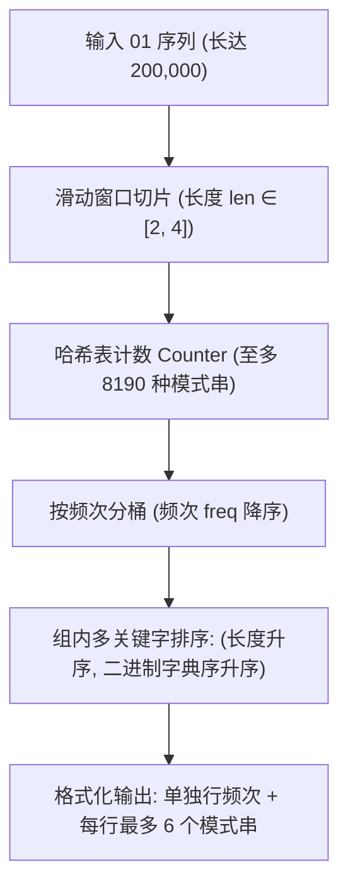

[[TOC]]

## 形式化题目

给定一个长度为 $L$ 的 01 序列 $S$ 以及整数参数 $A, B, N$（满足 $1 \le A \le B \le 12$，$1 \le N < 50$）。

定义合法子串为长度 $k \in [A, B]$ 的连续子串。统计所有至少出现一次的合法子串在 $S$ 中的出现频次（重叠子串均计入）。

选出出现频次最高的前 $N$ 种频次（若存在的频次种类不足 $N$，则选出所有存在的频次），按频次降序排列。对于每个频次：
1. 先输出该频次数值；
2. 再输出拥有该频次的所有子串，子串先按长度升序排序，长度相同时按二进制字典序升序排序；每行最多输出 6 个子串，空格分隔。

## 正解：滑动窗口统计与多级排序

### 思路

本题参数规模具有显著特征：子串长度上限 $B \le 12$ 非常小，但 01 序列长度 $L$ 可达 $200,000$。

1. **状态空间与规模分析**：
   - 长度在 $[A, B]$ 之间的二进制模式串总数上限为 $\sum_{k=A}^B 2^k \le 2^1 + 2^2 + \dots + 2^{12} = 8190$ 种。
   - 这意味着无论原序列多长，互不相同的模式串最多只有 8190 种，完全可以直接用哈希表/字典统计频次。

2. **滑动窗口计数**：
   - 外层遍历所有待统计的目标长度 $len \in [A, B]$；
   - 内层遍历起始位置 $i \in [0, L - len]$，截取子串 $S[i : i+len]$ 并在计数器中累加频次。
   - 总截取与哈希插入操作次数约为 $(B - A + 1) \cdot L \le 12 \times 200,000 = 2.4 \times 10^6$，在常数极小的字符串切片操作下可瞬时完成。

3. **分桶与排序规则**：
   - 将所有出现过的模式串按出现频次归类到一个以频次为键的桶中。
   - 频次按从大到小降序排序，取前 $N$ 个频次。
   - 相同频次内的模式串按 `(len(s), s)` 排序：由于 Python 字符串比较按字符 ASCII 字典序进行，而 `'0' < '1'`，因此直接比较字符串天然等价于二进制字典序。

4. **格式化输出**：
   - 遍历前 $N$ 个频次及其对应的排序后列表；
   - 先单独输出频次数值；
   - 模式串列表按步长 6 切块并用空格连接，每行最多输出 6 个。

### 图示解析

以样例 `A=2, B=4, N=10`，输入片段 `01010010...` 为例：

| 频次 | 包含的模式串（排序后） | 行格式化效果 |
| :--- | :--- | :--- |
| **23** | `00` | `23` `00` |
| **15** | `01`, `10` | `15` `01 10` |
| **12** | `100` | `12` `100` |
| **11** | `11`, `000`, `001` | `11` `11 000 001` |
| **5** | `011`, `110`, `1000` | `5` `011 110 1000` |

### 代码

@include-code(./main.py, python)

### 复杂度

- **时间复杂度**：$\mathcal{O}((B - A + 1) \cdot L + M \log M)$，其中 $L \le 200,000$，$B \le 12$，$M \le 8190$ 为不同模式串的种类上限。字符串滑动窗口切片和哈希计数开销约为 $12 \times 200,000 = 2.4 \times 10^6$ 次操作，耗时约 $0.05\text{s}$，排序与输出开销微秒级，远低于时限 1.0s。
- **空间复杂度**：$\mathcal{O}(L + 2^B)$。存储输入序列需要约 $200\text{KB}$，哈希表与分桶列表最多存储 $8190$ 个小字符串，内存占用 $\le 1\text{MB}$，远低于 128MB 限制。

## 总结

- 核心突破口在于注意到模式串的最大长度 $B \le 12$ 极小，二进制模式串的总数被限制在 8190 之内。
- 借助滑动窗口与哈希表直接统计连续子串频次，再结合 Python 的多关键字排序 `(len(s), s)` 和步长切片 `patterns[i:i+6]`，能够简洁而严谨地满足复杂的排版要求。
