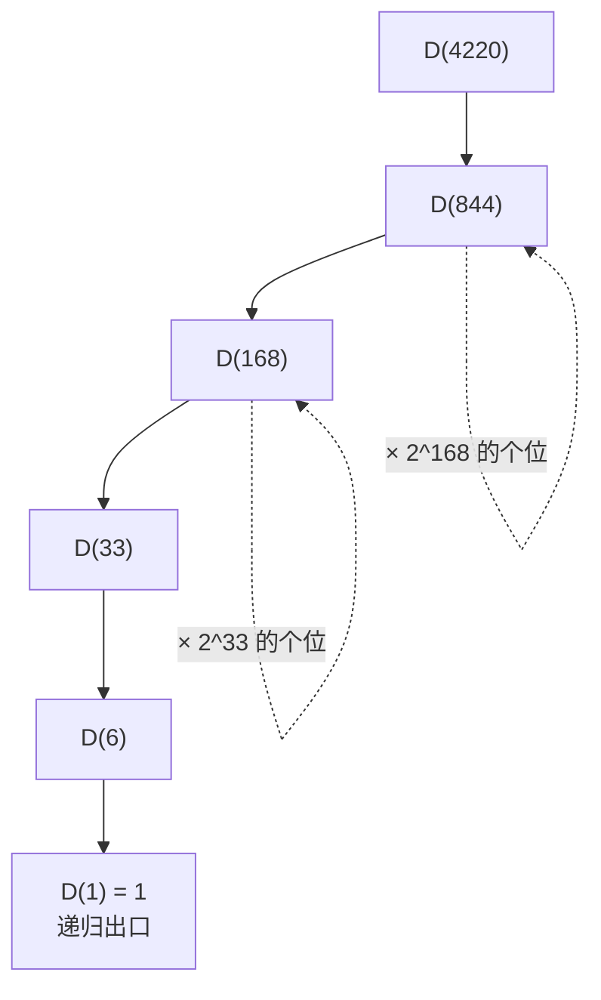

[[TOC]]

## 形式化题目

给定整数 $N$（$1 \leqslant N \leqslant 4220$），求 $N! = 1 \times 2 \times \cdots \times N$ 的十进制表示中**最后一位非零数字**。

样例：$5! = 120$，去掉末尾的 $0$ 后是 $12$，答案为 $2$；$7! = 5040$，去掉末尾的 $0$ 后是 $504$，答案为 $4$。

## 正解

### 思路

**朴素做法**：用大整数直接算出 $N!$，一边乘一边去掉末尾的 $0$（保留若干位就够判断个位）。$4220!$ 大约有一万多字节，Python 的大整数可以轻松算出来，但在 C++ 里需要手写高精度，且每次乘法都是高精度乘小数，效率不高。

**优化的关键在于消去因子 10**。末尾的 $0$ 全部来自因子对 $2 \times 5$，而 $N!$ 中因子 2 的个数远多于因子 5，所以：

1. 把 $1 \sim N$ 中每个 5 的倍数提出一个因子 5，与某个偶数配成一个 10 消掉——这样 $N!$ 中所有的 5 都被消灭，末尾的 0 也就全部去掉了；
2. 考察这一轮剩下的数。以 $N=23$ 为例，每 5 个数一组：

| 分组 | 提出 5 后剩下的数 | 对 2 的乘积的贡献 |
| --- | --- | --- |
| $1,2,3,4,5$ | $1,2,3,4$ | $2 \times 4 = 8 \equiv 2^3 \pmod{10}$，留下一个 2 |
| $6,7,8,9,10$ | $6,7,8,9$ | $6 \times 8 = 48 \equiv 2^3$，留下一个 2 |
| $11,12,13,14,15$ | $11,12,13,14$ | 同上，留下一个 2 |
| $16,17,18,19,20$ | $16,17,18,19$ | 同上，留下一个 2 |
| $21,22,23$ | $21,22,23$ | $22$ 留下一个 2 |

   每个完整的组 $5k+1 \dots 5k+5$ 提出 5 之后剩下 $\{5k{+}1,\,5k{+}2,\,5k{+}3,\,5k{+}4\}$，其中 $5k{+}2,\ 5k{+}4$ 提供 $2(2k{+}1) \times 4(2k{+}2) = 8(2k{+}1)(k{+}1)$，$5k{+}3 \equiv 3$，四个数乘积的个位恰好是 $1 \times 2 \times 3 \times 4 = 24$ 的个位（**与 $k$ 无关**）。于是每完整一组对个位的贡献就是乘上一个 $1,2,3,4$ 的排列，只由组内位置决定。

3. 走完一轮后，剩下的「5 的倍数部分」是 $1 \times 2 \times \cdots \times \lfloor N/5 \rfloor = \lfloor N/5 \rfloor !$，它里面**还有** 5 的倍数，需要继续同样的消去过程——这正是递归结构。额外要注意：递归里每消掉一个 5，就少了一个用来配对的偶数，等价于从个位乘积里除掉一个 2，即再乘上 $2^{-\lfloor N/5 \rfloor} \equiv 2^{3\lfloor N/5 \rfloor} \pmod{10}$（由 $2 \times 2^3 \equiv 1$，$6 \times 6 \equiv 1 \pmod{10}$，个位意义下除以 2 等于乘 2 的逆元 $6$ 或乘 $2^3$）。

把上面三步合并成一条递推式。记 $D(n)$ 为 $n!$ 去掉全部末尾 0 后的个位，则：

$$
D(n) = D\!\left(\left\lfloor \tfrac{n}{5} \right\rfloor\right) \times D(n \bmod 5) \times 2^{\lfloor n/5 \rfloor} \bmod 10,\qquad n < 5 \text{ 时 } D(n) = (1,1,2,6,4)_n
$$

其中 $D(n \bmod 5)$ 是最后一组不足 5 个数的残段贡献，$2^{\lfloor n/5 \rfloor}$ 来自递归中因子 2 的扣除。$2^k$ 的个位随 $k \bmod 4$ 按 $(1,2,4,8)$ 循环。

用 $N = 7$ 验证：$D(7) = D(1) \times D(2) \times 2^1 \bmod 10 = 1 \times 2 \times 2 = 4$，与样例输出一致；再用 $N = 10$：$D(10) = D(2) \times D(0) \times 2^2 = 2 \times 1 \times 4 = 8$，而 $10! = 3628800$，末尾非零位正是 $8$。

上图展示 $N = 4220$（数据范围上界）的递归链：每次把规模除以 5，从 4220 一路缩到出口 $D(1)$，深度只有 $\log_5 N \approx 6$ 层；每一层只需再乘一个 $2^q$ 的个位（虚线），整条链的乘法总量是常数级的。

**为什么直接乘会错**：如果只「每 5 个数乘上 $1 \times 2 \times 3 \times 4$ 的个位」而不做递归，会漏掉 $5, 10, 15, \dots$ 这些数本身剩余部分的贡献（提出因子 5 后它们各留下 $1, 2, 3, \dots$ 的乘积，即 $\lfloor N/5 \rfloor !$），也漏掉了配对时被消耗的偶数——这就是必须递归 $D(\lfloor n/5 \rfloor)$ 并补 $2^{\lfloor n/5 \rfloor}$ 的原因。

### 代码

@include-code(./main.py, python)

### 复杂度

设 $T(n)$ 为递归深度，$n \to \lfloor n/5 \rfloor$，故递归深度为 $O(\log_5 n)$，每层常数次乘法，总时间复杂度 $O(\log N)$，空间复杂度同为 $O(\log N)$（递归栈）。对 $N \leqslant 4220$，递归深度不超过 6 层，远优于朴素大整数乘法的 $O(N \log(N!))$。

## 总结

- **核心模型**：末尾 0 的个数由 $\min(v_2, v_5) = v_5$ 决定；去掉末尾 0 等价于把每个 5 与偶数配对消去。
- **关键观察**：消 5 的余项按 5 个数一组，每组的个位贡献固定为 $1,2,3,4$ 的排列，只与组内位置有关；剩余部分恰好是 $\lfloor N/5 \rfloor !$，形成自相似的递归，并需补上被配对消耗的偶数因子 $2^{\lfloor N/5 \rfloor}$。
- **递推式**：$D(n) = D(\lfloor n/5 \rfloor) \times D(n \bmod 5) \times 2^{\lfloor n/5 \rfloor} \bmod 10$，$O(\log N)$ 完成，比高精度直接乘快若干个数量级。
- 这个「数因子个数 + 分组递归」的思想是阶乘数论问题的通用套路，同类题还有「$N!$ 末尾 0 的个数」「$N!$ 二进制表示末尾 0 的个数」等。

## 图示解析

### 递归展开示例

以 $N = 42$ 为例，展示递归每层如何合并三层贡献（残段 $D(r)$、下层结果 $D(q)$、因子补偿 $2^q$）：

| 层 | $n$ | $q = \lfloor n/5 \rfloor$ | $r = n \bmod 5$ | 本层公式 | 个位结果 |
| --- | --- | --- | --- | --- | --- |
| 1 | 42 | 8 | 2 | $D(8) \times D(2) \times 2^8$ | $D(8) \times 2 \times 6$ |
| 2 | 8 | 1 | 3 | $D(1) \times D(3) \times 2^1$ | $1 \times 6 \times 2 = 2$ |
| 3 | 1 | 0 | 1 | 出口 $(1,1,2,6,4)_1$ | $1$ |

回代：第 2 层得 $D(8) = 2$；第 1 层得 $D(42) = 2 \times 2 \times 6 \bmod 10 = 4$。可以直接验证：$42!$ 的末尾有 9 个 0，去掉后末位是 4。

观察重点：每层只做「查表 + 一次 $2^q$ 个位」两种操作，42 的答案由 3 层常数运算合并而成；$N$ 再大也只是多几层，这正是 $O(\log_5 N)$ 的直观含义。
