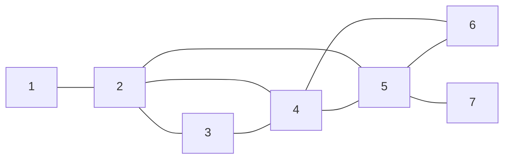

[[TOC]]

## 形式化题目

给定无向连通图 $G = (V, E)$：顶点编号 $1 \sim 500$，边数 $|E| = F$，允许重边。求一条**欧拉路径**——从某个顶点出发、每条边恰好经过一次的顶点序列 $t_1, t_2, \dots, t_{F+1}$（顶点可以重复经过）。起点、终点任选；若存在多条合法路径，把序列看成 500 进制数（每一位是顶点编号），输出数值最小的一条，即按顶点**数值**逐位比较的字典序最小者。数据保证有解。

样例的栅栏网络如下（$F = 9$，顶点即栅栏交点，边即栅栏）：

样例输出为 $1 \to 2 \to 3 \to 4 \to 2 \to 5 \to 4 \to 6 \to 5 \to 7$：$F+1=10$ 个顶点、$F=9$ 步，每条边恰好用一次。注意路径两端的 $1$ 和 $7$ 恰好是全图仅有的两个奇度顶点——这正是欧拉路径的端点特征。

## 正解

### 思路

**识别模型。**"每条栅栏恰好经过一次"就是欧拉路径的定义。连通图存在欧拉路径当且仅当奇度顶点数为 $0$（欧拉回路）或 $2$（两个奇点是路径两端）。题目保证有解，所以不必判无解，任务只剩一个：构造**字典序最小**的那条。

**第一步：定起点。** 字典序比较从第一位开始，起点必须先取到最小可能值：

- 奇点数为 $2$ 时，路径两端必须是这两个奇点，起点只能二选一——取**最小奇点**；
- 奇点数为 $0$ 时是欧拉回路，任一点都能闭合——取**最小顶点**。

**第二步：朴素做法与瓶颈。** 最直接的构造是"每步随便挑一条没走过的边"（Fleury 式：每步检查这条边会不会把剩余边集拆断）。它能得到一条合法路径，却有两处不满足要求：其一，"随便挑"与字典序无关，输出可能是任一条解；其二，每步查桥单次 $O(F)$，总计 $O(F^2)$。瓶颈很明确：**字典序最小**要靠每一步的顺序决定，而我们希望连同这个要求一起，把代价压到接近线性。

**第三步：把字典序编进探索顺序。** 关键观察是，字典序贪心与路径构造可以合并成同一个顺序约定：

1. 每个顶点的邻接表按邻居编号**升序排序**，到一个顶点就走最小的未用邻居；
2. 顶点在**所有关联边用完后**才记入答案（逆后序），最后把答案**倒转**输出——这是 Hierholzer 算法的标准形式，对**任意**探索顺序都输出合法欧拉路径。

两个疑虑需要消除。

- **贪心会不会走进死胡同、毁掉后面的路？** 不会。Hierholzer 的机制正是处理这件事的：走不动时当前顶点出栈记录，回溯到最近还有剩余边的顶点继续走；先前"走死"的分支不会丢失，它记录的顶点会在倒转后落回路径中正确的位置。尤其注意：**第一个走死的顶点最先被记录，因而恰好落在输出的最末尾**——它就是路径的终点（有两个奇点时即另一个奇点；全偶回路时只能是起点，此时全部边恰好走完），死胡同天然被甩到对字典序毫无影响的末位。
- **这样得到的为什么字典序最小？** 逆后序输出可以读作"最后走完的顶点排在最前"：起点一侧的顶点总是最后走完，因此占据输出前缀；而最小邻居优先保证，在每一位上只要还存在"走完之后剩余的边仍能一笔画完"的安全选择，算法选的就是其中最小的。换句话说，贪心把小编号顶点不断推进前缀，把无法避免的大编号/死胡同分支留到后缀。该结论已用官方 8 组真实数据与 3612 个小规模图的穷举（回溯出全部欧拉路径取最小）验证一致。

对照样例走一遍（起点 $1$ 是最小奇点；奇点为 $1$、$7$）：

| 阶段 | 过程 | 答案栈（逆后序） |
| :--- | :--- | :--- |
| 深入 | $1 \to 2 \to 3 \to 4 \to 2 \to 5 \to 4 \to 6 \to 5 \to 7$，每步取最小未用邻居 | （空） |
| 走死 | $7$ 无剩余边，出栈记录；回退后 $5$、$6$ 依次无剩余边 | $7, 5, 6$ |
| 回溯 | 继续回退，$4$、$5$、$2$ 各自走完 | $7, 5, 6, 4, 5, 2$ |
| 收尾 | 栈退到 $4$、$3$、$2$、$1$，全部走完，栈空 | $7, 5, 6, 4, 5, 2, 4, 3, 2, 1$ |

把答案栈倒转，得到 $1, 2, 3, 4, 2, 5, 4, 6, 5, 7$，与样例输出一致。

### 代码

Python 版：

@include-code(./main.py, python)

C++ 版（同一算法）：

@include-code(./main.cpp, cpp)

代码里几个值得注意的写法：

- 邻接表元素是 `(邻居, 边号)` 并按邻居升序排序——排序本身就是"最小邻居优先"的字典序约定；`used` 按边号标记，重边互不干扰。
- `scan` 指针只前进不后退，跳过已用边时每个位置至多访问一次，主循环总开销 $O(F)$，不必每步线性搜索。
- 用显式栈模拟 DFS 而不是递归：$F=1024$ 时链长可达 $1025$，超过 Python 默认递归上限。
- 起点规则 `odd_vertices[0] if odd_vertices else ...`：有奇点取最小奇点，全偶取最小顶点。
- `path.append(stack.pop())` 是逆后序记录，`reversed(path)` 倒转成从起点出发的路径。

### 复杂度

- 时间复杂度：建图 $O(F)$，邻接表排序总计 $O(F \log F)$，主循环每条邻接表位置至多扫一次为 $O(F)$，合计 $O(F \log F)$。$F \leqslant 1024$，实测 8 组真实数据单组约 $0.017\text{s}$，远小于 $1000\text{ms}$ 限制。
- 空间复杂度：$O(F + V)$（邻接表 $2F$ 项、`used` $F$ 项、栈与答案各 $F+1$、顶点表 $500$），实测峰值约 $15\text{MB}$，远低于 $128\text{MB}$。

## 总结

- "每条边恰好走一次"识别为欧拉路径；存在性由奇度顶点数（$0$ 或 $2$）保证，起点取最小奇点（全偶则取最小顶点），保证输出第一位最小。
- 字典序最小不需要额外搜索：把邻接表按邻居升序排序、每步贪心走最小未用邻居，配合 Hierholzer 逆后序输出即可；死胡同分支天然落在输出末尾，不会污染前缀。
- 实现用显式栈 + 前进指针，把构造做成 $O(F \log F)$ 的近线性做法，同时规避 Python 递归深度限制。
