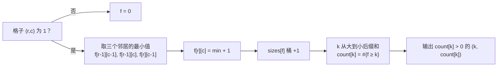

[[TOC]]

## 形式化题目

给定一个 $N \times N$（$2 \leqslant N \leqslant 250$）的 0/1 字符矩阵，`1` 表示完好、`0` 表示被毁坏。

求所有边长 $k \geqslant 2$ 的、内部不含任何 `0` 的正方形子区域的个数，正方形之间允许重叠。输出每个**确实存在**的尺寸 $k$ 及对应个数，各占一行，按 $k$ 从小到大。

### 样例

输入（$N=6$）：

|   | 1 | 2 | 3 | 4 | 5 | 6 |
|---|---|---|---|---|---|---|
| **1** | 1 | 0 | 1 | 1 | 1 | 1 |
| **2** | 0 | 0 | 1 | 1 | 1 | 1 |
| **3** | 1 | 1 | 1 | 1 | 1 | 1 |
| **4** | 0 | 0 | 1 | 1 | 1 | 1 |
| **5** | 1 | 0 | 1 | 1 | 0 | 1 |
| **6** | 1 | 1 | 1 | 0 | 0 | 1 |

输出：

```
2 10
3 4
4 1
```

样例表即原始网格（左上角为第 1 行第 1 列）。观察重点：右上区域 $3 \times 3$ 的连续 `1` 块里同时嵌着多个 $2\times 2$——合法正方形大量重叠，逐个枚举会重复计数又难去重，这正是需要 DP 计数的原因。另外第 3 行是全 1，配合第 2、4 行使右上角形成一个 $4\times 4$，与输出中的 `4 1` 对应。

## 正解

### 思路

**朴素做法及其瓶颈。** 最直接的做法是枚举右下角 $(r,c)$ 和边长 $k$，再逐格检查这个 $k\times k$ 是否全为 `1`：单次检查 $O(k^2)$，总复杂度 $O(N^5)$。$N=250$ 时约为 $10^{12}$，完全不可行。瓶颈在于：检查大正方形时，把小正方形已经验证过的信息全部丢掉重算了一遍。

**关键观察：大正方形由小正方形拼成。** 一个以 $(r,c)$ 为右下角、边长为 $k$ 的全 1 正方形，恰好被三个 $(k-1)\times(k-1)$ 的正方形覆盖：右下角分别为 $(r-1,c)$（去掉最左列）、$(r,c-1)$（去掉最上行）、$(r-1,c-1)$（去掉最下行和最右列）。反过来，这三个小正方形都存在，再加上格子 $(r,c)$ 本身是 `1`，大正方形就存在。于是"最大的合法正方形有多大"这个信息可以一格一格递推出来。

**定义状态。** 设

$$f[r][c] = \text{以 } (r,c) \text{ 为右下角的全 1 正方形的最大边长}$$

（格子为 `0` 时 $f[r][c]=0$。）转移就是上面观察的直接翻译：

$$f[r][c] = \min\bigl(f[r-1][c-1],\; f[r-1][c],\; f[r][c-1]\bigr) + 1$$

边界：第一行或第一列的格子最多构成 $1\times 1$，即越界项按 $0$ 处理。这个转移就是经典的"最大全 1 正方形"DP，只是本题还要在它之上**计数**。

**从"最大值"到"每个尺寸的个数"。** 若 $f[r][c]=L$，则以 $(r,c)$ 为右下角、边长 $1,2,\dots,L$ 的正方形全部合法，且没有任何更大的合法——所以以 $(r,c)$ 结尾恰好贡献 $L$ 个正方形。先按"恰好以 $k$ 结尾"分桶：$\text{sizes}[k] = \#\{(r,c) : f[r][c]=k\}$。

注意一个边长为 $L$ 的正方形内部嵌着 $L-1$ 个与它同右下角的更小正方形，所以"边长恰好为 $k$ 的正方形总数"是所有 $f \geqslant k$ 的格子数：

$$\text{count}[k] = \sum_{j \geqslant k} \text{sizes}[j]$$

从 $k=N$ 到 $2$ 做一遍后缀和即可，最后输出所有 $\text{count}[k] > 0$ 的尺寸。

**样例推演。** 对样例网格逐格算 $f$（右下角坐标系，行 $1\sim6$、列 $1\sim6$）：

| $f[r][c]$ | 1 | 2 | 3 | 4 | 5 | 6 |
|---|---|---|---|---|---|---|
| **1** | 1 | 0 | 1 | 1 | 1 | 1 |
| **2** | 0 | 0 | 1 | 2 | 2 | 2 |
| **3** | 1 | 1 | 1 | 2 | 3 | 3 |
| **4** | 0 | 0 | 1 | 2 | 3 | 4 |
| **5** | 1 | 0 | 1 | 2 | 0 | 1 |
| **6** | 1 | 1 | 1 | 0 | 0 | 1 |

观察重点：右上角 $(4,6)$ 的 $f=4$，正是那个 $4\times 4$；它由 $\min(f[3][5],f[3][6],f[4][5])+1=\min(3,3,3)+1$ 顶出来。$(3,6)$ 的 $f=3$ 而不是 2，说明以它为右下角同时存在一个 $2\times2$ 和一个 $3\times3$——这正是"一个格子贡献多个尺寸"的体现。统计分桶：$f=2$ 的格子有 6 个、$f=3$ 的 3 个、$f=4$ 的 1 个；后缀和得 $\text{count}[2]=6+3+1=10$、$\text{count}[3]=3+1=4$、$\text{count}[4]=1$，与样例输出 `2 10 / 3 4 / 4 1` 完全一致。

### 代码

@include-code(./main.py, python)

### 复杂度

- 时间复杂度：DP 逐格转移 $O(N^2)$，分桶与后缀和 $O(N)$，总计 $O(N^2)$。$N=250$ 时约 $6\times 10^4$ 次状态转移。
- 空间复杂度：$f$ 表 $O(N^2)$；由于转移只用到上一行和当前行左侧，可用滚动数组降到 $O(N)$，但 $N \leqslant 250$ 时没有必要。

## 总结

- 本题是"最大全 1 正方形"DP（$f[r][c]=\min$ 上/左/左上 $+1$）的直接应用，新增的考点是把"最大值"翻译成"每个尺寸的计数"：按 $f$ 值分桶再后缀和，利用"大正方形嵌套小正方形"的重叠结构避免重复与遗漏。
- 朴素 $O(N^5)$ 到 $O(N^2)$ 的跨越，来自"检查大正方形时复用小正方形的结论"这一最优子结构观察，也是几乎所有网格统计 DP 的通用套路。
- 陷阱：答案按"存在的尺寸"输出而不是输出全部 $2\sim N$；边长恰好为 $k$ 与 $f[r][c] \geqslant k$ 是两个不同的统计口径，混用会像样例那样多算。

## 图示解析



上图是整个算法的数据流：每个格子一次 $\min$ 转移产生 $f$ 值，$f$ 值进入分桶，后缀和把"以 $k$ 结尾"换算成"边长为 $k$"的全局计数。重点看分桶到后缀和这一步：它利用嵌套结构，把逐格的局部答案在 $O(N)$ 内累加成每个尺寸的全局答案，不需要对任何正方形做显式枚举。
