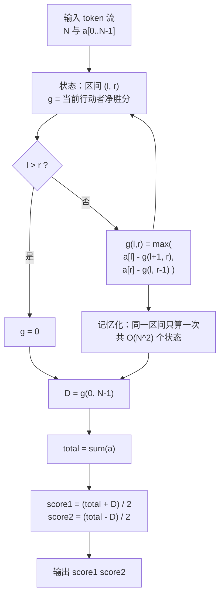

[[TOC]]

## 形式化题目

给定长度为 $N$（$2 \leqslant N \leqslant 100$）、元素在 $[1, 200]$ 内的正整数序列 $a_1, \dots, a_N$。

两名玩家交替行动。每一回合，当前行动者取走**当前剩余区间的左端或右端**的那个数，
并把它加入自己的得分；剩余区间随之缩短一格。当所有数被取尽时游戏结束。

两名玩家都采用最优策略（每一步都使自己最终总分最大，等价于使「自己得分 − 对手得分」最大）。
求游戏结束时玩家一（先手）与玩家二（后手）各自的得分。

### 样例

输入：

```
6
4 7 2 9
5 2
```

输出：

```
18 11
```

样例观察重点有两个。

其一是**输入换行位置不可信**：样例把 6 个数折成了两行，真实数据 `game110.in` 更是把 6 个数
竖着写成 6 行。因此必须按空白切分的 token 流读入，第一个 token 是 $N$，其后 $N$ 个 token 是序列。

其二是**先手不一定赢**：本样例两个得分之和 $18 + 11 = 29$ 恰为序列总和，先手领先 7 分；
但真实数据中存在先手得分**低于**后手的测例（如 $N=99$ 的 `game17`，输出 `5091 5293`），
这说明输出顺序固定是「先手 后手」，而不是「大数 小数」。

## 正解

### 思路

**朴素做法及其瓶颈。** 最直接的做法是模拟博弈：每一步枚举取左端或取右端，递归到底后
回溯比较两种选择的最终得分。决策层数为 $N$，每层 2 种选择，叶子数 $2^N$。$N = 100$ 时
约 $10^{30}$，完全不可行。瓶颈在于：**不同分支会到达同一个剩余区间**，却各自把它后面的
最优值重算了一遍。

**关键观察一：局面就是一段区间。** 每一步取走的数都来自两端，所以任意时刻剩下的数
一定是原序列的一段连续区间 $[l, r]$。区间之外拿了哪些数只影响累计得分，不影响后续可选动作。
于是局面的全部信息就是 $(l, r)$ 加上「轮到谁」。

**关键观察二：两人得分之和固定。** 每个数最终恰好被一个人取走一次，所以无论怎么玩都有

$$\text{score}_1 + \text{score}_2 = \text{total} = \sum_{i=1}^{N} a_i$$

于是只要算出**差值** $D = \text{score}_1 - \text{score}_2$，两个人各自的得分就能反解出来。
难点从「维护两个分数」降为「维护一个差值」。

**关键观察三：用「净胜分」表示状态，可以省掉轮次维度。** 定义

$$g(l, r) = \text{剩余区间为 } [l, r] \text{、轮到当前行动者时，当前行动者最终的得分} - \text{对手最终的得分}$$

（双方此后都最优。）当前行动者若取左端 $a_l$，自己先入账 $a_l$，随后角色互换：
对手成为 $[l+1, r]$ 上的行动者，由定义他将净胜 $g(l+1, r)$，即当前行动者相对对手净胜
$-g(l+1, r)$。合起来是 $a_l - g(l+1, r)$。取右端同理。两种选择取优：

$$g(l, r) = \max\bigl(a_l - g(l+1, r),\; a_r - g(l, r-1)\bigr)$$

边界 $l > r$ 表示无剩余，$g = 0$。

这一步是**整个做法的核心**：因为角色的互换被「整个表达式取负」表达了，
状态里就不需要再记「轮到谁」，二维就够，不必写 `dp[l][r][player]` 三维数组。

**关键观察四：状态数只有 $O(N^2)$。** $l \leqslant r$ 的区间共 $\frac{N(N+1)}{2}$ 个，
每个 $O(1)$ 转移。$N = 100$ 时 5050 个状态，与 $2^{100}$ 的游戏树相比是压倒性的化简。

**还原答案。** 令 $D = g(0, N-1)$，解二元一次方程组

$$\begin{cases} \text{score}_1 + \text{score}_2 = \text{total} \\ \text{score}_1 - \text{score}_2 = D \end{cases}
\;\Longrightarrow\;
\text{score}_1 = \frac{\text{total} + D}{2},\quad \text{score}_2 = \frac{\text{total} - D}{2}$$

$D$ 与 $\text{total}$ 奇偶性相同（两者都是被取走数的带符号和模 2 的结果），所以整除精确。

**样例推演。** 对 $a = [4, 7, 2, 9, 5, 2]$（$\text{total} = 29$）按区间长度从 1 到 6 逐层
填表，表中数值是 $g(l, r)$：

| 区间长度 | 各区间 $g$ 值 |
|---|---|
| 1 | $[0,0]=4$，$[1,1]=7$，$[2,2]=2$，$[3,3]=9$，$[4,4]=5$，$[5,5]=2$ |
| 2 | $[0,1]=3$，$[1,2]=5$，$[2,3]=7$，$[3,4]=4$，$[4,5]=3$ |
| 3 | $[0,2]=-1$，$[1,3]=4$，$[2,4]=-2$，$[3,5]=6$ |
| 4 | $[0,3]=10$，$[1,4]=9$，$[2,5]=4$ |
| 5 | $[0,4]=-5$，$[1,5]=3$ |
| 6 | $[0,5]=7$ |

表的读法：长度 1 的格子只有一个数，$g$ 就是那个数本身，这是递推的起点；
每一格由它**去掉左端**和**去掉右端**得到的两个更短区间推出，例如
$[1,4] = \max(7 - g(2,4),\ 5 - g(1,3)) = \max(7-(-2),\ 5-4) = 9$。

观察重点有两个。① $[0,4] = -5$ 是**负数**——面对这段区间时当前行动者反而会吃亏，
这正是「先手也可能输」的来源。② 最终 $D = g(0,5) = 7$，
$\text{score}_1 = (29+7)/2 = 18$、$\text{score}_2 = (29-7)/2 = 11$，与样例输出一致。

### 代码

@include-code(./main.py, python)

### 复杂度

- 时间复杂度：区间状态共 $O(N^2)$ 个，每个状态 $O(1)$ 转移，总计 $O(N^2)$。
  $N = 100$ 时约 $5 \times 10^3$ 次状态计算，远低于 1000 ms 限制。
- 空间复杂度：记忆化表 $O(N^2)$，递归栈深度 $O(N)$。$N \leqslant 100$ 时无需滚动数组
  （转移同时依赖 $g(l+1,r)$ 与 $g(l,r-1)$，一维滚动装不下）。

## 总结

- 本题是**区间 DP + 零和博弈**的标准模型。核心有三步：局面被压缩成区间 $[l,r]$（消除游戏树的
  重复子问题，$2^N \to N^2$）；状态定义为「当前行动者净胜分」并用整式取负表达角色互换
  （省掉「轮到谁」这一维）；再用「两人得分之和恒为 total」把差值还原成两个分数。
- 转移式 $g(l,r)=\max(a_l-g(l+1,r),\ a_r-g(l,r-1))$ 值得记牢，它同时是「两端取数的最大值问题」
  这一类题目的通式，只是把求和换成求净胜。
- 陷阱有三：输入换行位置不可信（样例本身就是折行的），必须按 token 流读；
  先手得分不保证大于后手（`game17` 就是反例），输出顺序固定为「先手 后手」；
  只用「玩家二最优」去理解会与真实数据不符，实际上双方都按最优策略行动。

## 图示解析



上图是算法的数据流：递归在区间上展开，每层只做「取左端 / 取右端」的两种分支比较，
分支返回的是对手的净胜分，取负再加自己的收益。图中自环 `E --> B` 表示递归继续缩小区间，
而 `记忆化` 节点切断了重复计算：不同取数顺序只要落到同一个 $(l, r)$，就复用同一个结果。
最后由 $D$ 与 $\text{total}$ 两步算术还原出两个分数，这一步之所以成立，靠的是「每个数恰好被取一次」
这个总和恒等式。
