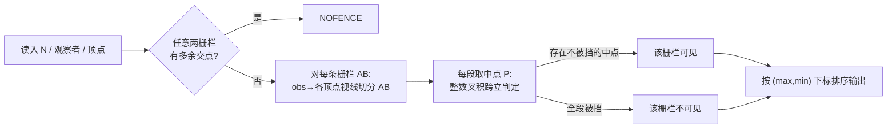

[[TOC]]

## 形式化题目

给定平面上 $N$ 个互不重合的顶点 $v_0, v_1, \dots, v_{N-1}$（按逆时针顺序）以及相邻顶点连成的 $N$ 条闭合栅栏（线段 $v_i v_{i+1}$，下标取模 $N$），和一个观察者坐标 $(x, y)$。

1. 判断这 $N$ 条线段是否构成一个合法的闭合栅栏：任意两条栅栏除公共顶点外不得有其他交点（不允许自交、不允许相邻栅栏共线重叠）。不合法时输出 `NOFENCE`。
2. 若合法，找出所有能被观察者看到的栅栏：存在一条从 $(x, y)$ 发出的射线，其**第一个**穿过的栅栏就是它。与目光平行（观察者与该栅栏共线）的栅栏不计入可见。
3. 每条可见栅栏用两端点输出，顶点按输入顺序（序号小的在前）书写；所有栅栏按"最后一个点"的输入序号排序，序号相同时按"第一个点"的序号排序，第一行输出可见栅栏数。

数据范围：$3 < N < 200$，顶点坐标绝对值不超过 $1000$，观察者坐标为 16 位整数。

## 正解

### 思路

**朴素做法。** 在每条栅栏 $AB$ 上撒一批采样点，对每个采样点 $P$ 检查线段 $obs \to P$ 是否与其他栅栏相交，只要有一个点不被挡住就算可见。问题是采样点再多也只是近似：漏掉的细小可见区间会导致误判，无法保证正确性。

**瓶颈在哪里。** 对固定的栅栏 $AB$ 和固定的另一条栅栏 $CD$，"$obs \to P$ 被 $CD$ 挡住"这件事随着 $P$ 在 $AB$ 上移动只会在两种位置发生改变：

- 视线恰好擦过 $CD$ 的端点，即 $P$ 位于直线 $obs \to C$ 或 $obs \to D$ 与 $AB$ 的交点上；
- $P$ 恰好越过线段 $CD$ 本身。由于栅栏合法（简单多边形、顶点互不重合），非相邻栅栏不相交，相邻栅栏只交于公共顶点——而公共顶点的视线分界已经被上一条覆盖。

所以遮挡状态的全部分界点就是"观察者到各顶点的视线与 $AB$ 的交点"。

**优化后的做法。** 用这 $O(N)$ 条视线把 $AB$ 分成 $O(N)$ 个开段，**段内每一个点的可见性完全相同**，于是每段取一个中点测试即可——有限个候选点从"近似"变成"完备"。中点用 `Fraction` 精确表示，所有跨立判定化成整数叉积，不引入浮点误差。

单个候选点 $P$ 是否被栅栏 $CD$ 挡住，用严格跨立判据：$obs、P$ 在直线 $CD$ 两侧**且** $C、D$ 在直线 $obsP$ 两侧，即视线严格穿过 $CD$ 的内部（擦过顶点不算穿过）。

**输出排序。** 边 $i$ 连接顶点 $i$ 与 $(i+1) \bmod N$，"最后一个点"即两者中输入序号大者。排序关键字取 $(\max(i, i+1), \min(i, i+1))$；末尾闭合边 $N-1 \to 0$ 的关键字是 $(N-1, 0)$，正好排在 $(N-1, N-2)$ 之前，与样例一致。

**样例对照**（观察者 $(5,5)$，样例输出 7 条）：$(0,0)-(7,0)$、$(5,2)-(7,5)$ 等外侧栅栏直接可见；$(7,0)-(5,2)$、$(3,5)-(4,9)$ 等则被更近的栅栏整段遮挡，所有分段中点都被挡住，因此不可见。

### 代码

@include-code(./main.py, python)

### 复杂度

- 合法性检查：两两枚举栅栏对，$O(N^2)$。
- 可见性判定：每条栅栏切出 $O(N)$ 段，段中点对 $O(N)$ 条其余栅栏做跨立试验；找得到可见中点会立即退出，最坏（整条被挡）为 $O(N^3)$，$N < 200$ 时约 $8 \times 10^6$ 次叉积。
- 空间 $O(N)$。本仓库 11 组真实数据实测单组不超过 0.1s、内存约 16MB。

## 总结

合法性用线段两两求交在 $O(N^2)$ 内完成；可见性的核心观察是"遮挡状态只在观察者到顶点的视线处分界"，它把无限的连续采样压缩成每条栅栏 $O(N)$ 个精确候选点，配合整数叉积跨立判定得到与标准解同阶的最坏 $O(N^3)$ 算法，且无浮点误差。
