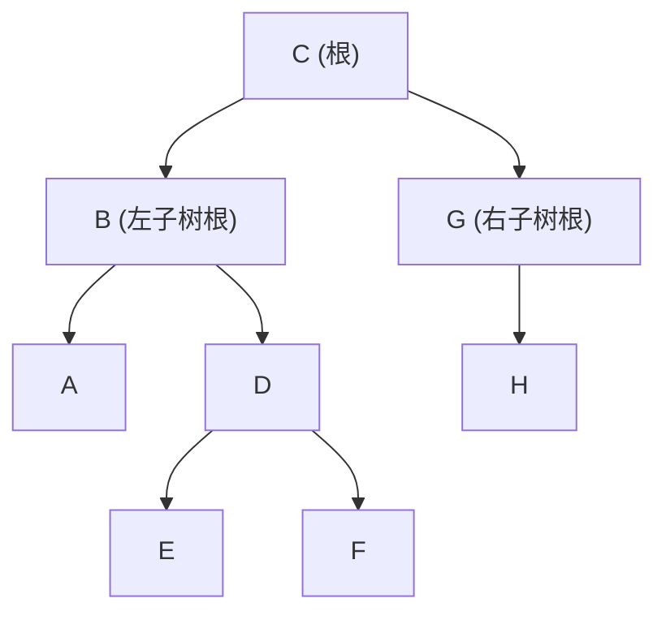

[[TOC]]

## 形式化题目

给定一棵二叉树的中序遍历序列与前序遍历序列，树中每个节点由唯一的大写英文字母标识（节点数 $n \le 26$）。求该二叉树的后序遍历序列。

## 正解

### 思路

根据二叉树遍历的定义：
- **前序遍历**的结构为：`[根节点] [左子树前序] [右子树前序]`。
- **中序遍历**的结构为：`[左子树中序] [根节点] [右子树中序]`。
- **后序遍历**的结构为：`[左子树后序] [右子树后序] [根节点]`。

由此可以得到经典的分治递归求解方案：
1. **确定根节点**：前序序列的第一个字符 `preorder[0]` 即为当前子树的根节点。
2. **划分左右子树**：由于节点字符唯一，在中序序列中找到根节点所在位置 `mid = inorder.index(root)`。
   - 根节点左侧即为左子树的中序遍历，长度为 $L = mid$。
   - 根节点右侧即为右子树的中序遍历。
   - 在前序序列中，紧随根节点之后的 $L$ 个字符即为左子树的前序遍历，剩余部分为右子树的前序遍历。
3. **递归生成后序**：
   - 分别递归处理左子树与右子树，得到各自的后序遍历字符串。
   - 按照 `左子树后序 + 右子树后序 + 根节点` 的顺序拼接并返回。
   - 递归基：当传入的序列为空时，返回空字符串。

### 代码

@include-code(./main.py, python)

### 复杂度

- **时间复杂度**：$\mathcal{O}(n^2)$。树的递归深度最大为 $\mathcal{O}(n)$，在每层递归中，查找根节点在中序序列中的位置与字符串切片耗时 $\mathcal{O}(n)$。在 $n \le 26$ 时，运算几乎瞬间完成。
- **空间复杂度**：$\mathcal{O}(n^2)$。递归栈深度最坏为 $\mathcal{O}(n)$，切片和字符串拼接占用的临时内存空间为 $\mathcal{O}(n^2)$，实际内存开销不足数十字节。

## 总结

已知前序与中序重构二叉树（或生成后序）的核心在于利用前序序列“根在首位”的性质确定树根，再利用中序序列“根居中间”的性质划分左右子树。无需显式建立指针二叉树，直接通过分治递归组合后序字符串即可简洁求解。

## 图示解析

以样例输入为例说明递归划分过程：
- 中序序列：`ABEDFCHG`
- 前序序列：`CBADEFGH`

划分与递归步骤如下：

| 步骤 | 当前前序序列 | 当前中序序列 | 根节点 | 左子树中序 / 前序 | 右子树中序 / 前序 | 后序拼接结果 |
| :--- | :--- | :--- | :--- | :--- | :--- | :--- |
| 1 | `CBADEFGH` | `ABEDFCHG` | `C` | `ABEDF` / `BADEF` | `HG` / `GH` | 后序(左) + 后序(右) + `C` |
| 2 (左) | `BADEF` | `ABEDF` | `B` | `A` / `A` | `EDF` / `DEF` | `A` + 后序(`EDF`) + `B` |
| 3 (右) | `GH` | `HG` | `G` | `H` / `H` | 空 / 空 | `H` + `G` |
| 4 | `DEF` | `EDF` | `D` | `E` / `E` | `F` / `F` | `E` + `F` + `D` |

最终由内向外回溯得到后序序列：`AEFDB` + `HG` + `C` = `AEFDBHGC`。
