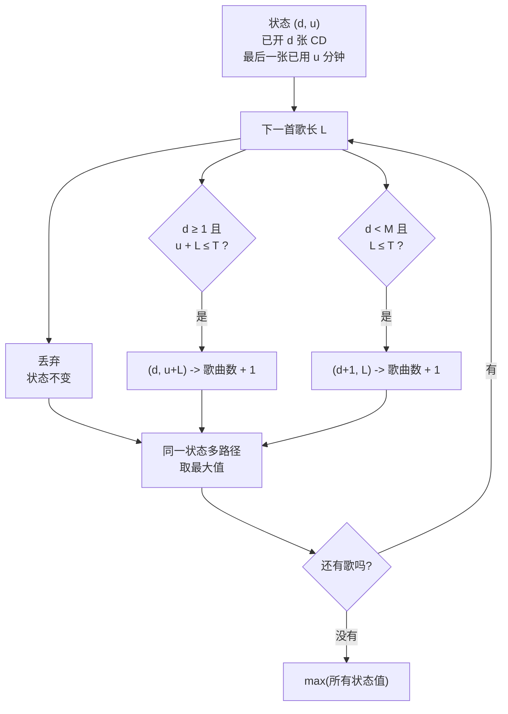

[[TOC]]

## 形式化题目

有 $N$ 首歌，第 $i$ 首的长度为 $a_i$，按创作时间顺序排列。要从中选出一个**保序子序列**
（即选出的歌在子序列中的相对顺序与创作顺序一致），把它们依次装入若干张 CD：

- 每张 CD 的总时长不超过 $T$；
- 使用的 CD 张数不超过 $M$；
- 一首歌不可拆分到两张 CD。

求最多能选多少首歌。

### 样例

输入（$N = 4$、$T = 5$、$M = 2$）：

```
4 5 2
4 3 4 2
```

一种最优选择是取第 1、2、4 首（长度 $4, 3, 2$）：第 1 首单独占 CD 1，第 2、4 首
（$3 + 2 = 5$）恰好装满 CD 2，共 3 首。可以验证这是本样例**唯一**能达到 3 首的选择。

观察重点：$4 + 3 + 4 + 2 = 13 > 2 \times 5 = 10$，说明**不可能全选**；而 $4 + 3 + 2 = 9 \leqslant 10$
说明丢掉第 3 首（长 4）之后剩下的刚好能装下。"丢哪一首、怎么配"不是随意的：
这正说明需要 DP 而不是简单贪心。

> 数据仓里的 `rockers0.in` 第二行写作 `4 2 4 3`（与这里的 `4 3 4 2` 顺序不同），
> 唯一最优选择仍是第 1、2、4 首，答案同为 3。正式评测以数据仓文件为准。

## 正解

### 思路

**朴素做法及其瓶颈。** 最直接的做法是枚举所有 $2^N$ 个子集，再逐个检查能否装进 $M$ 张 CD：
$N = 20$ 时约 $10^6$ 个子集，复杂度是指数级，且完全忽略了"顺序决策"这一结构。
退一步的贪心（能塞进当前 CD 就塞，塞不下就开新张）同样不可行：$T = 4, M = 2$，
歌曲 $[2, 3, 2, 3]$ 时，贪心把第 1 首（长 2）放 CD 1 后发现第 2 首放不进去
（$2 + 3 = 5 > 4$），只能开 CD 2 放它，两张 CD 都已封口，后两首全部丢弃，得 2；
而最优是 CD 1 $= [2, 2]$、CD 2 $= [3]$，得 3。贪心的瓶颈在于：它把"当前这张 CD
用掉多少"当成既成事实，丢失了"以后想换一种搭配"的自由。

**关键观察：顺序固定 ⟹ 逐首决策，状态只看最后一张 CD。** 因为选中的歌必须按创作
时间顺序出现，我们只需按输入顺序逐首决定它的命运：丢弃、接在**当前最后一张 CD** 末尾、
或**另开一张 CD**。一旦某张 CD 被封口（又开了新的一张），它的具体内容就再也不会被访问，
所以历史可以完全压缩成两个数：

$$f(d, u) = \text{已开出 } d \text{ 张 CD、最后一张已用 } u \text{ 分钟时，最多能选出的歌曲数}$$

$d = 0$ 表示一张 CD 都还没开，此时 $u$ 无意义（固定为 0）。

**转移：三种动作取最大。** 对当前这首歌长 $L$：

| 动作 | 条件 | 新状态 | 新值 |
| :--- | :--- | :--- | :--- |
| 丢弃 | 无 | $(d, u)$ | $f(d,u)$ |
| 接在当前 CD 末尾 | $d \geqslant 1$ 且 $u + L \leqslant T$ | $(d,\; u+L)$ | $f(d,u)+1$ |
| 另开一张新 CD | $d < M$ 且 $L \leqslant T$ | $(d+1,\; L)$ | $f(d,u)+1$ |

第三行把新 CD 的已用分钟直接置为 $L$，而不是"累加到某张旧 CD"——因为顺序约束不允许
回头往封口的 CD 里补歌，能动手的只有最后一张。这也是为什么不需要第三维枚举"放进第几张 CD"。

**为什么这个状态够用（无后效性）。** 处理到第 $i$ 首时，前 $i-1$ 首的具体分布已经不再
影响任何后续判断：所有旧 CD 只会被封口，唯一"还活着"的容器是最后一张，而它只由 $u$
描述。因此 $(d, u)$ 就是完备的历史摘要。

**样例推演。** 对样例 $a = [4, 3, 4, 2]$，表中列出每首歌处理完后所有可达状态
（`(d, u) -> 歌曲数`）：

| 已考虑歌曲数 | 当前歌长度 | 可达状态 |
| :---: | :---: | :--- |
| 0 | — | (0, 0) -> 0 |
| 1 | 4 | (0, 0) -> 0；(1, 4) -> 1 |
| 2 | 3 | (0, 0) -> 0；(1, 3) -> 1；(1, 4) -> 1；(2, 3) -> 2 |
| 3 | 4 | (0, 0) -> 0；(1, 3) -> 1；(1, 4) -> 1；(2, 3) -> 2；(2, 4) -> 2 |
| 4 | 2 | (0, 0) -> 0；(1, 2) -> 1；(1, 3) -> 1；(1, 4) -> 1；(1, 5) -> 2；(2, 2) -> 2；(2, 3) -> 2；(2, 4) -> 2；(2, 5) -> 3 |

读表的重点有两个。① 第 3 首（长 4）之后，状态 $(1,4)$ 的值仍是 1，没有变成 2——
因为 $4 + 4 > 5$，第 3 首**接不上**第一张 CD；但它可以另开一张，于是出现了
$(2, 4) \to 2$（CD 1 $= [4]$、CD 2 $= [3]$）。② 第 4 首之后 $(2, 5) \to 3$：它由
$(2, 3) \to 2$ 经"接尾"转移得到（$3 + 2 = 5$ 恰好装满 CD 2），对应
CD 1 $= [4]$、CD 2 $= [3, 2]$，这就是答案 3。

### 代码

@include-code(./main.py, python)

几个值得注意的实现点：

- 状态用 `tuple` 直接做 `dict` 的键，省掉 $u + (T+1) \cdot d$ 之类的手工编码，
  代码即状态定义。
- `nxt = dict(cur)` 一次性完成"丢弃"，之后只处理"接尾"和"开新张"两个分支——
  丢弃不需要单独循环。
- `nxt.get(key, NEG)` 处理多条路径汇入同一状态：取其中的最大值，不可达状态不会被选中。
- 所有放置条件都写成闭区间（`used + length <= T`），恰好装满时合法。

### 复杂度

- **时间复杂度**：$\mathcal{O}(NMT)$。每首歌扫描一遍状态表，状态表最多
  $(M+1)(T+1)$ 项，每项 $O(1)$ 转移。$N = M = T = 20$ 时约 $9 \times 10^3$ 次状态访问，
  实测 12 组真实数据单组约 0.017s（含解释器启动），远低于 1000ms 限制。
- **空间复杂度**：$\mathcal{O}(MT)$。状态表最多 $(M+1)(T+1)$ 项，$M = T = 20$ 时不到 500 项，
  实测峰值约 14.7MB，远低于 128MB 限制。由于状态表规模本身就很小，无需滚动数组。

## 总结

- 核心是把"保序子序列 + 多重背包"压缩成**顺序扫描 + 二维状态**：$f(d, u)$ = 已开 $d$ 张、
  最后一张用 $u$ 分钟时的最多歌曲数。顺序约束保证历史只需保留最后一张 CD，无后效性成立。
- 转移只有三条：丢弃、接在当前 CD 末尾（$u + L \leqslant T$）、另开一张新 CD（$d < M$）。
  不需要枚举"放入第几张旧 CD"，因为旧 CD 都已经封口。
- 三个易错点：① 单纯贪心会错（$[2,3,2,3]$ 反例）；② 一首歌比 $T$ 长时必须丢弃，
  不能强行放；③ $d = 0$ 时还没有 CD 可接，必须走"开新张"分支。
- 本题与一般装箱问题的区别在于**顺序**：顺序固定时，封口的 CD 不再参与决策，状态只需记最后一张；
  若顺序可以任意重排，就必须记住每张 CD 各自剩多少空间，状态规模会膨胀到 $(T+1)^M$。
  固定顺序正是把装箱问题变成一个可以逐项推进的 DP 的关键。

## 图示解析



上图是算法的主流程：一首歌只可能走「丢弃 / 接尾 / 开新张」三条边，每条边把状态推到
一个新的 $(d, u)$ 并让歌曲数最多加 1。图中 `H` 节点提醒：不同决策路径可能落到同一个
$(d,u)$，此时必须保留歌曲数更大的那条，否则会丢失最优解；这正是 DP 相对枚举的压缩所在。
循环回到 `B` 表示按创作顺序推进，因此"顺序"这一约束不需要额外的维度来记录。
