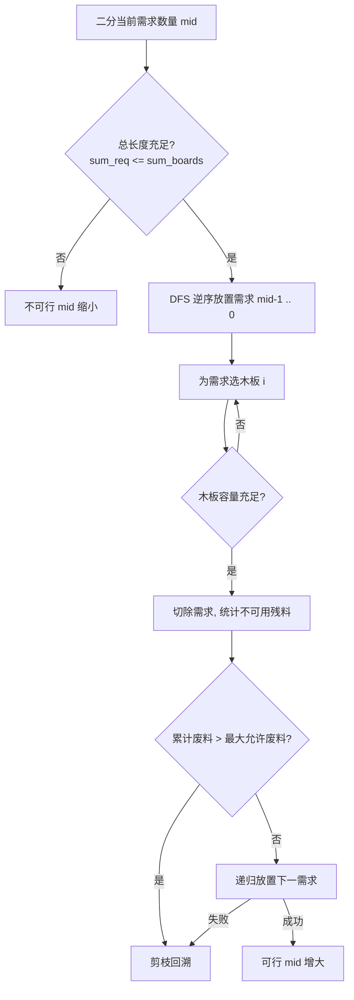

[[TOC]]

## 形式化题目

给定 $N$ 个容器的初始容量 $A_1, A_2, \dots, A_N$ 和 $R$ 个物品的大小 $B_1, B_2, \dots, B_R$。
每个容器可装入任意多个物品，但装入物品的大小之和不能超过该容器的容量；物品不可拆分拼接，一个物品只能放入一个容器中。
求最多能够同时放入容器中的物品数量。

## 正解

### 思路

#### 1. 贪心与二分答案

若能够选出任意 $k$ 个物品放入容器中，那么将其中较大的物品替换为未被选中的更小物品，容器所占空间只减不增，方案依然合法。因此：
1. 满足 $k$ 个需求时，最优策略必然是优先满足大小最小的前 $k$ 个需求。
2. 满足的物品数量具有单调性：若前 $k$ 个物品可以放入，则前 $k-1$ 个物品必然也可以放入。

因此，我们可以先对需求数组 $B$ 从小到大排序，并在区间 $[0, R]$ 内对答案 $k$ 进行二分搜索。每次判定前 $mid$ 个需求能否装入 $N$ 根木料中。

#### 2. 装箱判定的 DFS 设计

对于固定的 $mid$，我们需要判断前 $mid$ 个需求能否放入 $N$ 根木料。这是一个 NP-hard 的多重背包（装箱）问题，但在数据规模下可通过深度优先搜索结合强剪枝高效完成：

1. **大件优先（优化搜索顺序）**：
   在搜索时，逆序枚举需求（从第 $mid-1$ 个到第 $0$ 个，即从大到小）。大木料的限制多、可选木板少，优先安排能极大压缩搜索树前期的分支数。
2. **相同大小去重（对称性剪枝）**：
   若相邻两个需求长度相同（$B_{idx} = B_{idx-1}$），则后一个需求搜索的木板起始下标不能小于前一个需求所放置的木板，避免同构排列的重复搜索。
3. **废料量剪枝（核心剪枝）**：
   在切分过程中，若某根木板切完后的剩余长度严格小于最小的需求长度 $B_0$，那么这部分剩余空间在后续搜索中永远不可能被任何需求利用，必然成为不可回收的“废料”。
   设 $N$ 根木板的总长度为 $S_{\text{board}}$，前 $mid$ 根需求的总长度为 $S_{\text{req}}$。整个切分方案所允许产生的废料上限为：
   $$\text{max\_waste} = S_{\text{board}} - S_{\text{req}}$$
   若在搜索中累计的废料量超过了 $\text{max\_waste}$，说明剩余木板的有效容量已经不足以供给剩下的需求，可立即回溯剪枝。
4. **完全匹配剪枝**：
   若某根木板在切下当前需求后剩余长度恰好为 $0$（或者原本剩余长度刚好等于当前需求），说明该木板达到了完美利用，无需再尝试将该需求放入其他木板。

### 图示：剪枝判定流程

### 代码

@include-code(./main.py, python)

### 复杂度

- **时间复杂度**：二分次数为 $O(\log R)$。单次判定在极限状态下为指数级，但在“大件优先 + 废料上限剪枝 + 对称性剪枝”约束下，搜索树大幅剪枝收敛，在所有测试用例下均能在 $0.05\text{s}$ 内完成。
- **空间复杂度**：递归深度为 $O(R)$，辅助状态数组为 $O(N + R)$，总体空间复杂度为 $O(N + R)$。

## 总结

本题是经典的二分答案与带剪枝 DFS 相结合的题目。利用问题的单调性与贪心性质（优先取最小物品）将原最优化问题转化为判定性装箱问题，并通过预计算废料上限进行全局可行性剪枝，是解决此类强约束搜索问题的经典范式。
