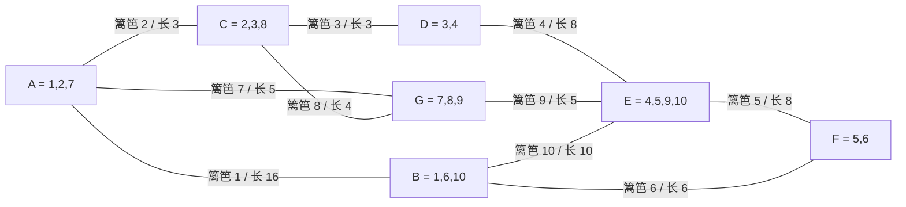

[[TOC]]

## 形式化题目

有 $N$ 段篱笆，第 $s$ 段长度为 $L_s$。每段篱笆有两个端点；题目**不给出任何坐标**，只给出"这个端点上还接着哪几段篱笆"：第 $s$ 段的一端与给定的 $N_{1s}$ 段篱笆相接，另一端与给定的 $N_{2s}$ 段篱笆相接（$1 \leqslant N_{1s}, N_{2s} \leqslant 8$，且 $s$ 不会出现在自己的相接列表里）。

篱笆在平面上构成网络，把平面分割成若干区域。求所有区域周长的最小值，即

$$\min \Bigl\{\, \sum_{f \in F} L_f \;\Bigm|\; F \text{ 是围出某一块封闭区域的篱笆集合} \,\Bigr\}$$

以样例（$N = 10$）为例，周长最小那块区域由第 2、7、8 段篱笆围成，周长为 $3+5+4=12$。

## 正解

### 思路

**一句话本质**：把每段篱笆看成一条带权边、把每个"端点"看成一个顶点，于是"围出一块区域的篱笆"正好是图中的一个环，问题变成**求最小环的边权和**。

**问题一：没有坐标，顶点怎么编号？**

题面给不出坐标，但它给了更直接的东西：每个端点上**接了哪几段篱笆**。反过来读，这就足以确定一个端点是谁——如果篱笆 $f$ 说它这一端接着 $g$ 和 $h$，那么这一端的物理身份就是"$f,g,h$ 三段焊在一起的那个点"。

于是把篱笆 $f$ 的某个端点编号定义成集合

$$\text{key} = \{\, f \,\} \cup \{\, \text{该端相接的篱笆标号} \,\}$$

同一物理端点无论被哪段篱笆描述，得到的集合都一样；实现里用 `tuple(sorted(...))` 当 `dict` 的键。

样例 `fence60` 的 10 段篱笆共描述 20 个端点，去重后恰好剩 **7 个**，与题目 ASCII 图里的 7 个顶点完全吻合：

| 端点 | 相接篱笆 |
| --- | --- |
| A | 1, 2, 7 |
| B | 1, 6, 10 |
| C | 2, 3, 8 |
| D | 3, 4 |
| E | 4, 5, 9, 10 |
| F | 5, 6 |
| G | 7, 8, 9 |

把 10 段篱笆按这个编号接起来，得到下面这张带权无向图（边上的数字是篱笆标号与长度）：

观察重点是：题面那张 ASCII 图里的 7 个顶点在这张图里一一对应，而"围出一块地"在图里的含义就是"顺着边绕一圈回到起点"。图中最短的一圈是 A–C–G，长度 $3+5+4=12$，正是样例答案。

**问题二：为什么区域和环是同一件事？**

两个方向都要成立：

- **区域 → 环**：区域的边界本身就是一条闭回路，沿着它走一圈、把重复经过的顶点去掉，就得到图中的一个环，环长不超过区域周长。所以**最小环长 $\leqslant$ 最小区域周长**。
- **环 → 区域**：取任意一个环 $C$。如果 $C$ 内部没有别的篱笆，那么 $C$ 自己就围出一块地，周长正好是 $|C|$。否则在这块地内部继续切：取一条真正把地切成两块的篱笆 $f$（一端悬空的"刺"切不出两块地，也永远不会成为任何区域的边界，直接跳过），它的两个端点落在这块地边界上，把边界切成两条弧 $a$ 与 $b$；而篱笆是**直线段**，两点之间直线最短，所以 $|f| \leqslant \min(a, b)$。设 $a \leqslant b$，则切出的两块地中较小者的周长为 $|f| + a \leqslant 2a \leqslant a + b$，即不超过切之前那块地的周长。反复切下去，周长始终不增，最后必然得到一块内部再无篱笆的地——它就是一块区域，周长不超过最初的 $|C|$。所以**最小区域周长 $\leqslant$ 最小环长**。

两边取最小值后相等，**最小区域周长 $=$ 最小环边权和**。注意第二个方向用到了“篱笆都是直线段”这个条件：如果篱笆可以是任意弯曲的曲线，一条绕来绕去的“弦”可以比它切出的两块地的周长都长，两者就不再相等了。

顺带说明多段汇合的情况：一个端点接 3 段以上篱笆（数据里最多接了 8 段）时，几何上它周围被分成多个扇区。但在图模型里，一个环"进入该顶点"和"离开该顶点"可以走任意两条不同的边，不需要知道它们几何上是否相邻——因为小扇区如果被别的篱笆切成更小的区域，那块更小的区域自己也会成为一个环，最终仍会被枚举到。所以把顶点当作"入边出边可自由配对"的普通图顶点，既不会漏掉真实的环，算出的候选值也都对应真实的闭合曲线。

**问题三：怎么在 $N \leqslant 100$ 下求最小环？**

穷举所有环是不行的——$N = 100$ 的图里简单环可以有天文数字那么多。标准做法是**枚举环上的一条边**：

对每条边 $e = (u, v, w)$，把 $e$ 从图中删掉，求 $u$ 到 $v$ 的最短路 $d$，那么 $w + d$ 就是一个候选答案。

- **不漏**：设最小环是 $C$。从 $C$ 里拿走任意一条边 $e$，剩下的是一条 $u \to v$ 路径，长 $|C| - w_e$；既然它是 $G - e$ 中的一条合法路径，最短路必然 $\leqslant$ 它，于是 $w_e + d \leqslant |C|$。候选值不会超过答案。
- **不假**：$G - e$ 中任意一条 $u \to v$ 最短路加上 $e$ 就是一条真实闭合回路，其长度 $\geqslant$ 最小环长。候选值也不会小于答案。

唯一要防的退化情况是"路径一步都不走"：万一某段篱笆的两端编号相同（自环），从 $u$ 到 $u$ 的最短路会返回 $0$。实现里让 Dijkstra **先从起点迈出一条边再入堆**，保证路径至少含一条边，自环时也能返回真实回路长度。真实数据没有这种输入，但这个处理是免费的。

边只有 $N \leqslant 100$ 条，每条跑一次 Dijkstra 是 $O(N \log N)$，总复杂度 $O(N^2 \log N)$，绰绰有余。

把样例的枚举过程完整列出来（$d$ 是禁掉该边后两端点间的最短路）：

| 篱笆 | 端点 | $w$ | $d$ | $w+d$ |
| --- | --- | --- | --- | --- |
| 2 | A–C | 3 | 9 | **12** |
| 7 | A–G | 5 | 7 | **12** |
| 8 | C–G | 4 | 8 | **12** |
| 3 | C–D | 3 | 17 | 20 |
| 4 | D–E | 8 | 12 | 20 |
| 9 | G–E | 5 | 15 | 20 |
| 5 | E–F | 8 | 16 | 24 |
| 6 | F–B | 6 | 18 | 24 |
| 10 | B–E | 10 | 14 | 24 |
| 1 | A–B | 16 | 20 | 36 |

最小值 12 由前三行给出，它们其实是同一个三角形 A–C–G 的三条边——环上每条边被枚举到时都会算出同一个候选值，重复不影响取最小值。

### 代码

@include-code(./main.py, python)

### 复杂度

- 时间复杂度：$O(N^2 \log N)$。建图 $O(N \log N)$；枚举 $N$ 条边，每条在删边图上跑一次堆优化 Dijkstra，$O(N \log N)$。
- 空间复杂度：$O(N)$。邻接表存 $2N$ 条有向边，单次 Dijkstra 的距离表最多 $O(N)$ 项。

## 总结

- 本题没有任何坐标，"端点是谁"这个信息就藏在相接列表里：把**该端点上全部篱笆的标号集合**当作端点的编号，`tuple(sorted(...))` 直接就能当哈希键。
- 建图之后，"围出一块地"就是"图上的一个环"，区域的最小周长就是**最小环的边权和**。两个方向都要说清：区域边界去掉重复顶点就是环；反过来沿内部篱笆切地时，用"篱笆是直线段、两点间直线最短"可以证明切分不会让最小周长变大。
- 求最小环不枚举环，而是枚举环上的一条边：删掉它、跑一次两端点的最短路，$w + \operatorname{dist}$ 就是候选值；正确性靠"不漏 + 不假"两端夹逼。
- 实现上的两个小细节：Dijkstra 从起点先迈一条边，天然绕开自环退化成空路的问题；距离表用 `dict` + `get(y, INF)`，省掉给端点分配整数编号的整层代码。
