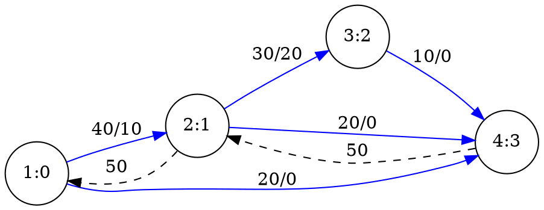

[[TOC]]

## 形式化题目

给定一张有向图：$M$ 个点（$2 \leqslant M \leqslant 200$）、$N$ 条边（$0 \leqslant N \leqslant 200$），第 $i$ 条边从 $S_i$ 指向 $E_i$，容量为 $C_i$（$0 \leqslant C_i \leqslant 10^7$）。可能存在平行边（两点之间多条边）与环。每条边上流动的量不能超过其容量，且除源汇外每个点流入量等于流出量。求从点 1（源）到点 $M$（汇）的最大流。

## 正解

### 思路

**从朴素贪心到残量网络。** 最直接的想法是：找一条从 1 到 $M$ 的路径，沿它推送"路径上最小容量"那么多水，重复直到没有路。但这样的贪心会犯错——先推的水可能堵死更优的组合。例如样例里，如果先把 `1→2→4` 的 20 全推给上面那条路，`2→4` 就满了；好在正确答案中 `1→2` 的 40 可以改走 `2→3→4`。我们需要一种"反悔"机制。

网络流的经典做法是**残量网络 + 反向边**：每沿边 $u \to v$ 推送 $f$ 单位水，就把 `cap[u][v]` 减 $f$，同时把 `cap[v][u]` 加 $f$。这条反向边代表"已推送的水可以退回来改道"。增广路定理保证：只要残量网络上还存在从源到汇的路径，就还能增大流量；不存在时就达到了最大流（同时等于最小割的容量）。

**Dinic 的两层加速。** 朴素的 Ford–Fulkerson 每次只找一条增广路，最坏情形会被低效路径拖慢。Dinic 加了两个标准优化：

1. **分层图**：每轮开始时 BFS 一遍残量网络，算出每个点到源的层次（最短边数）。之后 DFS 只允许从层次 $d$ 的点走到层次 $d+1$ 的点，保证所有增广都沿"最短路"进行。
2. **当前弧优化**：每个点记录"这一轮已经试到第几条邻接边"，被证明推不动的边不再重试。

每轮分层后，可以在同一张层次图上连续推送多条路径，直到沿层次图走不到汇点。汇点的层次每轮严格增加，所以最多 $O(V)$ 轮。

**本题的输入形态。** 平行边直接累加到 `cap[s][e]`；自环（$S = E$）不影响任何割，直接跳过；容量为 0 的边在 BFS 时被残量判断自然过滤。

下面的 Graphviz 图展示样例两轮分层增广后的结果（节点 label 为"交点:最终层次"，边 label 为"容量/剩余"，虚线为反向边）：

图后观察重点：第 1 轮 BFS 分层得到层次 $1{:}0,\ 2{:}1,\ 3{:}2,\ 4{:}2$，DFS 只走层次 +1 的边，所以推的是 `1→2→4` 的 20 和 `1→4` 的 20（`3→4` 因层次不递增暂时走不到）；第 2 轮在残量网络上 4 的层次升到 3，沿 `1→2→3→4` 再推 10，`3→4` 的 10 是唯一瓶颈。合计 $20+20+10=50$。虚线反向边记录已推送的流量：如果某一轮走了次优路径，后续可以沿反向边把水"退回"改道，这正是贪心不出错的原因。

### 代码

@include-code(./main.py, python)

### 复杂度

- 时间复杂度：Dinic 为 $O(V^2 E)$。本题 $V, E \leqslant 200$，实测全部 12 组官方数据在 0.02s 内通过。
- 空间复杂度：邻接矩阵 $O(V^2)$，加上分层与当前弧数组 $O(V)$，约 160KB，远低于 128MB 限制。

## 总结

- 本题是最大流模板题：排水沟 = 有向容量边，水潭 = 源，小溪 = 汇。
- 贪心推流会错，反向边提供"反悔"机制，增广路定理保证终止在最大流。
- Dinic 用 BFS 分层 + DFS 当前弧做多层增广，复杂度 $O(V^2 E)$，对 $N, M \leqslant 200$ 绰绰有余。
- 实现细节：平行边累加、自环跳过、容量 0 的边自然被过滤。
EOF
