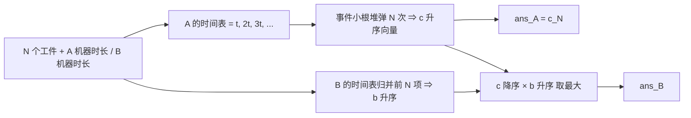

[[TOC]]

## 形式化题目

有两组同型并行机：A 型机器单次操作耗时为 $\alpha_1,\dots,\alpha_{m_1}$，
B 型机器单次操作耗时为 $\beta_1,\dots,\beta_{m_2}$。共有 $N$ 个工件，
每个工件必须先由某一台 A 型机器加工一次，再由某一台 B 型机器加工一次；
同一台机器同一时刻只能加工一个工件，缓冲库容量无限（工件可以在 A 完工后任意等待）。

记 $a_1 \leqslant a_2 \leqslant \dots \leqslant a_N$ 为全部 A 操作的完工时刻（排序后），
$b_1 \leqslant b_2 \leqslant \dots \leqslant b_N$ 为全部 B 操作的完工时刻（排序后）。

要求依次输出：

1. $\min \max_i a_i$，即 A 车间单独的最短完工时间；
2. 在允许 A、B 重叠（每个工件各自满足 A 先于 B）的前提下，
   $\min \max_i b_i$，即整个流水线的最短完工时间。

## 正解

### 思路

**关键观察一：每台机器的时间表就是自己的倍数序列。**
给一台耗时 $t$ 的机器派 $k$ 个工件，它的完工时刻永远是 $t, 2t, \dots, kt$，
与工件的先后无关（工件同型）。因此可以把「现在再给这台机器派一个工件」
看成一个**待选事件**，事件的键就是它产生的完工时刻。

把每台机器当前的下一个键 $t_j, 2t_j, 3t_j, \dots$ 放进小根堆，弹出 `N` 次：
弹出的第 $k$ 个键就是「全车间完工第 $k$ 个工件的最早时刻」，因为

$$
\text{全车间在时刻 } T \text{ 前最多完工 } S(T)=\sum_j \left\lfloor \frac{T}{t_j} \right\rfloor \text{ 件},
$$

所以第 $k$ 个完工时刻不可能早于 $c_k = \min\{T : S(T) \geqslant k\}$，而事件堆弹出的键序列
恰好逐项取到这些下界。于是

$$
\text{ans}_A = c_N,
$$

并且任何分配方案排序后的完工时刻向量，都逐项不小于 $c$——这一点在后面判断整体最优时会用到。

下面这张表是样例 A 车间（时长 `1, 1`，`N = 5`）的弹出过程，
每一行表示一次「把工件交给键最小的那台机器」：

| 第几次弹出 | 选中机器时长 | 产生完工时刻 | 该机器下次的键 |
| --- | --- | --- | --- |
| 1 | 1 | 1 | 2 |
| 2 | 1 | 1 | 2 |
| 3 | 1 | 2 | 3 |
| 4 | 1 | 2 | 3 |
| 5 | 1 | 3 | 4 |

得到 $c = (1, 1, 2, 2, 3)$，$\text{ans}_A = 3$。
注意第 3 次弹出时键从 1 跳到 2：这是机器完成一件后「顺延一档」的直接体现。

**关键观察二：B 车间的最优收尾可以闭式表达。**
把 B 各机器的时间表（$\beta_l, 2\beta_l, 3\beta_l, \dots$）归并，取前 $N$ 项
$b_1 \leqslant b_2 \leqslant \dots \leqslant b_N$。这是「B 车间从小到大的可用槽位」。
设工件到达 B 的时刻为 $r_1 \leqslant \dots \leqslant r_N$（即 A 的完工时刻）。

- **下界（可行性条件）**：若总收尾不超过 $T$，则对每个 $x$，
  在 $x$ 之后才到达的工件只能用 $x$ 之后的槽位：

  $$
  \#\{ i : r_i \geqslant x \} \leqslant \sum_l \left\lfloor \frac{T-x}{\beta_l} \right\rfloor .
  $$

  取 $x = r_{(p)}$（$r$ 降序第 $p$ 项）即得 $T \geqslant r_{(p)} + b_p$，对每个 $p$ 成立。
- **充分性**：反过来若 $T \geqslant \max_p (r_{(p)} + b_p)$，对任意 $x$ 令
  $p = \#\{i : r_i \geqslant x\}$，则 $r_{(p)} \geqslant x$，于是 $T \geqslant x + b_p$，
  上述条件成立，按 $x$ 由大到小逐层匹配即可排开。

所以在固定的到达序列下

$$
\text{best}_B(r) = \max_{1 \leqslant p \leqslant N} \bigl( r_{(p)} + b_p \bigr),
$$

即 **A 车间最晚完工的工件配 B 车间最早的槽位**。这个表达式对每个 $r_{(p)}$ 都单调不减。

**合并两阶段。** 设某个方案下 A 的完工向量为 $v$（降序记为 $v_{(1)} \geqslant \dots \geqslant v_{(N)}$）。
由观察一，$v_{(p)} \geqslant c_{(p)}$ 对每个 $p$ 成立；再由 `best_B` 的单调性，
该方案的收尾时刻至少是

$$
\max_{1 \leqslant p \leqslant N} \bigl( c_{(p)} + b_p \bigr),
$$

这就给出了下界。上界则由「取观察一的贪心分配（完工向量恰为 $c$），
再按观察二的充分性排程」给出。两个答案都出自这同一个最优分配，因此

$$
\boxed{\ \text{ans}_A = c_N, \qquad
\text{ans}_B = \max_{1 \leqslant p \leqslant N} \bigl( c_{(p)} + b_p \bigr)\ }
$$

这段推理里唯一容易做错的是配对方向：必须让 **A 降序** 对 **B 升序**，
因为「最晚出炉的工件应该优先抢占 B 车间最早的槽位」。下面用样例把这一步走一遍。

样例 `N=5`，A 时长 `1, 1`（得 $c = 1,1,2,2,3$），B 时长 `3, 1, 4`。
B 三台机器的时间表分别是 `3,6,…`、`1,2,3,4,5,…`、`4,8,…`，
归并取前 5 项得 $b = (1, 2, 3, 3, 4)$。注意 `3` 出现了两次，分别来自时长 3 的机器
和时长 1 的机器的第三件——$b$ 是**所有槽位**的归并，不是「每台机器一个」。

| $p$ | $c$ 降序 | $b_p$ | 和 |
| --- | --- | --- | --- |
| 1 | 3 | 1 | 4 |
| 2 | 2 | 2 | 4 |
| 3 | 2 | 3 | 5 |
| 4 | 1 | 3 | 4 |
| 5 | 1 | 4 | 5 |

最大值为 $5$，与样例输出 `3 5` 一致。
若误把 $c$ 也升序配对，会得到 $\max(1{+}1,1{+}2,2{+}3,2{+}3,3{+}4)=7$，
比正确值大 2，可见方向不能反。

### 代码

Python 版：

@include-code(./main.py, python)

C++ 版（同一算法）：

@include-code(./main.cpp, cpp)

### 复杂度

- **时间复杂度**：两次事件堆过程各弹出 `N` 次，堆大小不超过机器数 $M \leqslant 30$，
  故为 $O(N \log M_1 + N \log M_2) = O(N \log \max(M_1, M_2))$；
  最后的配对是 $O(N)$。$N = 1000$ 时是毫秒级。
- **空间复杂度**：两个长度 `N` 的完工向量加两个大小 $\leqslant 30$ 的堆，
  共 $O(N + M_1 + M_2)$，远低于 128 MB。

## 总结

- 本题是**两阶段流水车间**：缓冲库无限让两个阶段可以解耦，先最优安排 A，再在 A 的完工序列上最优安排 B。
- A 车间的最优完工向量可以用「事件小根堆」直接得到，等价于闭式
  $c_k = \min\{T : \sum_j \lfloor T/t_j \rfloor \geqslant k\}$；
  这个向量在任何方案下都逐项最优，是后续能直接用它算答案的原因。
- B 车间在固定到达序列下的最优收尾是
  $\max_p(r_{\text{降序},p} + b_p)$，其中 $b$ 是 B 各机器时间表归并后的前 $N$ 项；
  **晚完工的工件要配早的槽位**。
- 两个阶段的最优解来自同一个分配，所以两问可以一起算出来，总复杂度 $O(N \log M)$。

## 图示解析

这张图给出从输入到两个答案的主线：

A、B 两条时间表各自归并成升序向量；A 的向量既直接给出第一问，
又与 B 的向量反向配对给出第二问。读图时注意 $c$ 只算一次，同时服务于两个输出；
两路在 `F` 处汇合，正是「先定 A 的最优向量、再算 B」这一解耦的关键。
