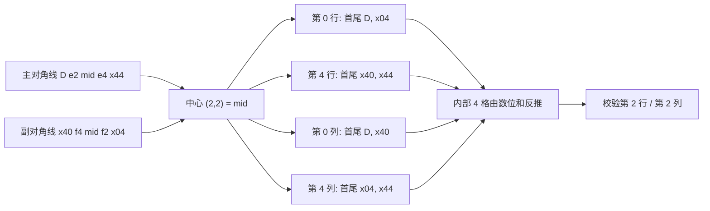

[[TOC]]

## 形式化题目

在 $5 \times 5$ 的方格中填入数字 $0 \sim 9$，把每行、每列、两条对角线都读成五位数：

- 5 行按**从左到右**读：第 $r$ 行是 $g_{r,0} g_{r,1} g_{r,2} g_{r,3} g_{r,4}$；
- 5 列按**从上到下**读：第 $c$ 列是 $g_{0,c} g_{1,c} g_{2,c} g_{3,c} g_{4,c}$；
- 主对角线从左到右读 $g_{0,0} g_{1,1} g_{2,2} g_{3,3} g_{4,4}$；
- 副对角线也按**从左到右**读，即 $g_{4,0} g_{3,1} g_{2,2} g_{1,3} g_{0,4}$。

这 12 个数必须同时满足两条：

1. 都是素数，且首位不为 $0$（即都落在 $[10000, 99999]$，所以四个角都非零）；
2. 各位数字之和都等于输入的 $S$。

输入另给左上角固定值 $g_{0,0} = D$。求**全部**方案；把每个方案的 25 个数字按行拼接成
一个 25 位数，按该数从小到大排序输出，方案之间空一行；无解输出一行 `NONE`。

形式化地，令 $\operatorname{dig}$ 表示五位数拆成数字的序列，$\operatorname{dsum}(x)$ 为其数字和，
$\mathcal{P} = \{\, p \text{ 是素数} : 10000 \leqslant p < 100000,\ \operatorname{dsum}(p) = S \,\}$，则要求

$$
\text{行}_r,\ \text{列}_c,\ \text{两条对角线} \in \mathcal{P},\qquad g_{0,0} = D .
$$

**副对角线不是"右上到左下"。** 题面说两条对角线都从左到右读，所以副对角线左端是
**左下角** $g_{4,0}$、右端是**右上角** $g_{0,4}$。这一点直接决定输出里第 5、1 行的数字，
写反了样例仍能全对、真实数据却全错（见下）。

## 正解

### 思路

**朴素做法。** 直接按候选素数枚举 5 行：预处理出 $S$ 的候选集 $\mathcal{P}$ 后，
枚举 $5$ 个素数填行，再检查 5 列与两条对角线。$\mathcal{P}$ 的规模在 $S \approx 23$ 时高达
$757$，$757^5 \approx 2.5 \times 10^{14}$，完全不可行。逐格 DFS 更差：$10^{25}$ 个状态。

**瓶颈的根源**是"把 12 条线当成彼此独立"。真正稠密的是交叉点：两条对角线共享
中心点 $(2,2)$，于是

- 主对角线定首值 $D$ → 定出 $g_{2,2}$ 与 $g_{4,4}$；
- 副对角线必须过同一个中心点 → 定出 $g_{4,0}$、$g_{0,4}$，且 $g_{0,4}$ 也是第 0 行的末位；
- 四角与中心全部落定后，四条**边框线**（第 0 行、第 4 行、第 0 列、第 4 列）
  各自的两个端点都已知。

一条五位素数若首末两位都固定，候选往往只剩个位数几个——我用
`headTail[h][t]` 把 $\mathcal{P}$ 按首末位分桶，边框候选直接查表，不必扫全表。

**关键的一步：内部 4 个格子不用枚举。** 边框的四个"肩部"数字一旦选定，
内部四格被**行/列数位和**唯一确定。把网格的符号约定写出来：

```text
          c0    c1    c2    c3    c4
   r0  [  D    b     c     d    x04 ]
   r1  [ g11  e2    h    f2    i  ]
   r2  [  l    m    mid    o    n  ]
   r3  [  q   f4    r    e4    s  ]
   r4  [ x40   v     w     x   x44 ]
```

其中主对角线数是 $D\,e_2\,mid\,e_4\,x44$，副对角线数是 $x40\,f_4\,mid\,f_2\,x04$
（左端 $x40$ 在左下角）。四个角 $D, x04, x40, x44$ 与中心 $mid$ 由两条对角线锁定；
第 0 行、第 4 行、第 0 列、第 4 列是四条边框线。把上面的符号代入数位和，得

$$
g_{2,1} = S - b - e_2 - f_4 - v,\qquad g_{2,3} = S - d - f_2 - e_4 - x,
$$
$$
g_{1,2} = S - g_{1,1} - e_2 - f_2 - i,\qquad g_{3,2} = S - q - f_4 - e_4 - s .
$$

前两式只依赖"第 0 行、第 4 行"的肩部；后两式再依赖"第 0 列、第 4 列"的肩部。
于是枚举收缩成两层：外层「主对角线 → 副对角线」先锁定四角与中心，
内层「第 0 行 → 第 4 行 → 第 0 列 → 第 4 列」铺满外框，
每一层都用 `headTail` 把候选压到常数级，内部四格全部由减法算出。
最后剩下的两个"和"约束（第 2 行、第 2 列）以及 4 条内部线的素数判定做校验即可。

**为什么最后只剩第 2 行、第 2 列要查数位和？** 12 条线里，第 1 行、第 3 行、
第 1 列、第 3 列的数字和被上面的反推式构造出来，必然等于 $S$；第 0/4 行、第 0/4 列
来自 $\mathcal{P}$；两条对角线来自 $\mathcal{P}$。只剩第 2 行 $g_{2,0}\dots g_{2,4}$
与第 2 列 $g_{0,2},g_{1,2},g_{2,2},g_{3,2},g_{4,2}$ 是"顺带凑出来"的，
所以要逐个查它们是否落在 $\mathcal{P}$ 里。把校验写成"是否在 $\mathcal{P}$ 中"，
一条语句同时覆盖了素数、首位非零和数位和三个条件。

**输出顺序。** 题目只要求按 25 位数升序，所以把每个解拼成 25 位字符串后
统一 `sort` 再输出，不必让搜索顺序去迎合字典序。

### 代码

Python 版：

@include-code(./main.py, python)

C++ 版（同一算法）：

@include-code(./main.cpp, cpp)

### 复杂度

- **预处理**：埃氏筛 $O(M \log\log M)$，$M = 10^5$；分桶 $O(|\mathcal{P}|)$。
- **搜索**：两层枚举。外层是「主对角线候选 $\times$ 过同一中心点的副对角线候选」的配对，
  真实数据上为 $785 \sim 7797$ 对（$|\mathcal{P}| \approx 143 \sim 757$）；
  内层四个 for 在 `headTail` 的分桶里走，最内层循环体的总执行次数为
  $3.3 \times 10^4 \sim 5.3 \times 10^6$。
  C++ 十个真实数据点全部 **$\leqslant 0.04$ s**（限时 1000 ms），峰值内存 8.3 MB。
- **空间**：筛表 $10^5$ 字节、候选与分桶表 $O(|\mathcal{P}|)$、答案 $O(\text{解数} \times 5)$。
  最大解数 152（$S=23, D=3$），空间为常数级。
- **与 C++ 解法的关系**：`main.py` 与 `main.cpp` 用完全相同的搜索顺序与剪枝，
  Python 最大点约 1.2 s——算法同阶，只是常数更大，不存在"为过时限而降级算法"的情况。

## 总结

- **交叉点就是剪枝点**：两条对角线共享中心、又各自带着两个角，先把它们定下来，
  12 条线里立刻有 6 条被完全确定、4 条只剩"中间三格"未知。选对枚举对象比任何常数优化
  都有效——本题的关键不是"填格子"，而是"先填约束最稠密的那两条线"。
- **能算出来的就别枚举**：内部四格由数位和反推，搜索深度从 25 格塌到外框 16 格 + 4 个减法。
  这是构造题里常见的手法：把一部分变量的取值变成前若干层变量的仿射函数。
- **把多重条件收进一张哈希表**：`valid = set(cand)` 让"是素数 且 数位和 = S 且 五位"
  退化成一次 `in`，校验代码短且不易漏条件。
- **对角线的读法要看清方向**：题面明确两条对角线都从左到右读，副对角线的左端是左下角。
  写成"右上到左下"时样例恰好三条解全都相同（$S=11,D=1$ 的例子里正副对角线首末对称），
  于是样例全对、10 个真实点全错——这是本题最容易踩的坑。
- 无解时输出单独一行 `NONE`，注意不要输出多余空行。

## 图示解析（对角线与外框的依赖）


