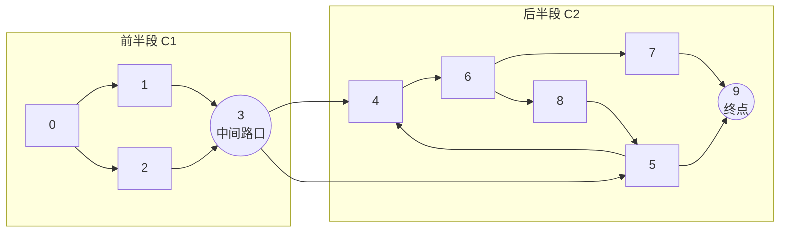

[[TOC]]

## 形式化题目

给定一个有向图 $G = (V, E)$，顶点编号为 $0, 1, \dots, N$。其中 $0$ 为唯一起点，$N$ 为唯一终点。保证从 $0$ 出发可到达图中所有顶点，且从图中任意顶点均可到达 $N$，$N$ 的出度为 $0$。

求满足以下条件的两类顶点集合（均不包含 $0$ 和 $N$，结果按升序输出）：

1. **不可避免的路口（必经点）**：从 $0$ 到 $N$ 的所有有向路径都必须经过的点。即在图中删去该点后，从 $0$ 无法到达 $N$。
2. **中间路口（分割点）**：属于必经点，且能将图划分为两部分 $C_1$（起点 $0$、终点 $S$）和 $C_2$（起点 $S$、终点 $N$），满足两部分无公共边，且 $S$ 是两部分的唯一公共点。

## 正解

### 思路

这是一道典型的有向图连通性与必经点判定问题。

#### 1. 必经点的判定

对于某个节点 $v \in \{1, 2, \dots, N-1\}$：
- 若要求所有从起点 $0$ 到终点 $N$ 的路径都经过 $v$，等价于：**若在图中移除顶点 $v$（禁止访问 $v$），从 $0$ 出发遍历图将无法到达 $N$**。
- 因此，我们可以枚举每个中间节点 $v$，在原图上做一次 BFS 遍历，标记禁止经过 $v$。如果终点 $N$ 不在遍历所得的可达点集 $V_0(v)$ 中，则 $v$ 即为一个不可避免的必经点。

#### 2. 分割点的判定

对于第一问中筛选出的必经点 $S$：
- 题目要求将图分成以 $0$ 为起点、$S$ 为终点的第一部分 $C_1$，以及以 $S$ 为起点、$N$ 为终点的第二部分 $C_2$。
- 两部分无公共边，且 $S$ 为唯一公共点。
- 考察点集划分：
  - 第一部分包含从 $0$ 出发不经过 $S$ 能到达的所有点 $V_0(S)$，以及汇合点 $S$；
  - 第二部分包含从 $S$ 出发能够到达的所有点 $V_S$。
- 若后半部分中存在某个点能够反向走回前半部分，即 $V_0(S) \cap V_S \neq \emptyset$，则两部分除了 $S$ 之外还存在其他公共点，甚至产生跨两部分的环路，违反“$S$ 为唯一公共点”且“第一天以 $S$ 为终点”的定义。
- 反之，只要 $V_0(S) \cap V_S = \emptyset$：
  - 前半段不能越过 $S$ 进入后半段（因为 $S$ 是必经点）；
  - 后半段不能绕回前半段（因为交集为空）；
  - 边集自然被完全划开，$S$ 成为两部分的唯一交汇点。
- 因此，对于每个必经点 $S$，只需从 $S$ 出发再做一次无限制的 BFS 得到 $V_S$，判断集合 $V_0(S)$ 与 $V_S$ 是否不相交（即 `V_0.isdisjoint(V_S)`）即可。

### 可视化流程

以样例为例，节点之间的划分关系如下：

在点 $3$ 处，前半段 $\{0, 1, 2\}$ 与后半段 $\{3, 4, 5, 6, 7, 8, 9\}$ 无任何交集，因此点 $3$ 是合法的分割点；而在点 $6$ 处，后半段会通过 $8 \to 5$ 走回前面的点 $5$（点 $5$ 在避开 $6$ 时可由 $0 \to 3 \to 5$ 到达），导致两段点集出现交集，故 $6$ 不是分割点。

### 代码

@include-code(./main.py, python)

### 复杂度

- **时间复杂度**：
  - 点数 $N \le 50$，边数 $M \le 100$。
  - 枚举每个点 $v \in [1, N-1]$ 执行一次删点 BFS，耗时 $O(N + M)$。
  - 对满足条件的必经点执行正向 BFS 并计算集合交集，单次耗时 $O(N + M)$。
  - 总时间复杂度为 $O(N(N + M))$，对于给定数据规模约几千次操作，耗时极短（远小于 1 秒）。
- **空间复杂度**：
  - 图的邻接表存储开销为 $O(N + M)$，BFS 队列与访问集合占用 $O(N)$。
  - 总空间复杂度为 $O(N + M)$。

## 总结

- **必经点判定**：利用“删点后起点与终点不连通”的等价性质，转化为单次图遍历。
- **分割点判定**：利用“两段除了割点外互不相交”的性质，通过判断 $0$（避开 $S$）可达集与 $S$ 可达集的交集是否为空，极简且严谨地完成了验证。
