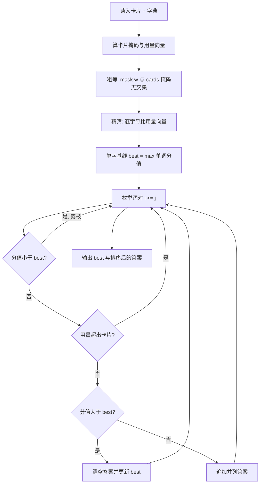

[[TOC]]

## 形式化题目

给定一个字母多重集 $C$（用 26 维计数向量 $c_a,\dots,c_z$ 表示，$3 \leqslant |C| \leqslant 7$）、一张分值表 $value(\cdot)$，以及一个按字典序升序排列、最多含 $40000$ 个互不相同单词的字典 $D$（每个单词长度在 $3$ 到 $7$ 之间）。

每个单词 $w$ 有自己的计数向量 $u(w)$ 与分值

$$s(w) = \sum_{ch \in w} value(ch).$$

求所有满足 $u(w_1) + u(w_2) \leqslant C$（逐分量比较）的单词或词对 $(w_1, w_2)$ 中，$s(w_1) + s(w_2)$ 的最大值，并输出所有取到该最大值的方案。

## 正解

### 思路

**先看清答案的形状。** 单词长度至少是 $3$，而卡片最多 $7$ 个字母：三个单词至少要 $3 + 3 + 3 = 9$ 个字母，卡片根本不够。所以**词组里最多只能有两个单词**，答案只可能是单字或词对。这一点让枚举空间天然封闭。

**朴素做法错在哪。** 直接双重循环枚举字典里的每一对单词：$N \leqslant 40000$ 时组合数是 $1.6\times10^9$ 量级，每组还要比 26 个字母，必然超时。瓶颈不在"检查是否合法"，而在**组合数**——而绝大多数单词根本不可能被拼出来，因为它们含有卡片里没有的字母。

**第一步：用位掩码粗筛。** 把卡片和单词都压成一个 26 位整数，第 $i$ 位表示字母 `'a' + i` 是否出现：

$$\text{mask}(s) = \bigvee_{ch \in s} 2^{\,ord(ch)-97}.$$

于是"单词含有卡片外的字母"这件事，等价于一次按位与非的结果不为零：

```python
kept = [w for w in words if (letter_mask(w) & ~cards_mask) == 0]
```

$O(N)$ 扫一遍，每个单词 $O(1)$ 判断，绝大部分单词在这一步就被扔掉。

**第二步：掩码抓不住重复字母，必须再比计数。** 卡片是 `abc`（各 1 个）时，单词 `abb` 需要的 2 个 `b` 掩码看不出来，会被放行。因此粗筛只能当作快速过滤器，幸存者还要逐字母比 26 维用量向量：

```python
playing = [item for item in playing if all(x <= y for x, y in zip(item[2], card_usage))]
```

注意卡片本身可以有重复字母（例如 `jicuzza` 有 2 个 `z`、2 个 `a`），所以用量向量必须按**实际重复次数**建立，不能退化成集合。

**第三步：单字基线 + 词对枚举。** 先把候选里的最大单词分值当作当前最高分 `best`，这样词对枚举一开始就有门槛可以剪枝。然后在候选表上做两两枚举，内层下标从外层的 $i$ 开始：

```python
for i, (word_a, score_a, usage_a) in enumerate(playing):
    for word_b, score_b, usage_b in playing[i:]:
        if score_a + score_b < best:      # 追不平当前最高分
            continue
        if any(x + y > z for x, y, z in zip(usage_a, usage_b, card_usage)):
            continue                      # 卡片不够拼这一对
        if score_a + score_b > best:      # 刷新纪录：清空旧答案
            best, winners = score_a + score_b, []
        winners.append(f"{word_a} {word_b}")
```

内层从 $i$（而不是 $i+1$）开始有两个作用：允许同一个单词在词对里出现两次（与官方"在剩余卡片上枚举第二个词"的语义一致），同时因为输出时统一取字典序较小的单词在前，`rag prom` 与 `prom rag` 只会以一种形式出现一次，天然满足"不许重复表示字对"。只有在分值**严格大于** `best` 时才清空答案，相等时追加，这样并列方案不会被覆盖。

整体流程：



图里有两条剪枝边（分值不够、用量不够）和两条更新边（刷新纪录、追加并列），它们合起来保证枚举结束时 `best` 与 `winners` 正好是全部最优方案。

**样例推演。** 题面样例中卡片为 `prmgroa`，小字典只有 6 个词。先看掩码粗筛：`profile` 含有卡片里没有的 `i`、`e`、`f`、`l`，直接淘汰；其余 5 个词的字母都在卡片里。再看计数：卡片里 `r`、`o`、`a`、`p` 各 1 个、`m` 1 个，`program` 用掉 `p r o g r a m` 共 7 个字母，用量恰好落在卡片容量内。

| 单词 | 分值 | 卡片够用 | 说明 |
| :---: | :---: | :---: | --- |
| `profile` | 21 | 否 | 含卡片外的 `i`、`e`、`f`、`l`，掩码粗筛淘汰 |
| `program` | 24 | 是 | 单字最优，`best` 先取 24 |
| `prom` | 15 | 是 | 单独 15，需配词 |
| `rag` | 9 | 是 | 单独 9 |
| `ram` | 9 | 是 | 单独 9 |
| `rom` | 10 | 是 | 单独 10 |

`best = 24` 来自 `program`。接着枚举词对，只有 `prom`（15）与 `rag`（9）相加为 24，用掉的卡片是 `p r o m` + `r a g`，`r` 恰好用满 1 个，其余也都不超；`prom` 与 `ram` 的 `r` 会冲突（需要 2 个 `r`），`prom` 与 `rom` 的 `r`、`o` 都冲突。所以与 24 并列的只有 `prom rag` 一条，输出：

```text
24
program
prom rag
```

这也解释了为什么题面样例输出里两个答案一个来自单字、一个来自词对——它们分值相同，必须同时输出。

### 代码

Python 版：

@include-code(./main.py, python)

C++ 版（同一算法）：

@include-code(./main.cpp, cpp)

### 复杂度

设字典规模为 $N$，精筛后的候选数为 $k$。

- 粗筛：$O(N \cdot L)$，$L \leqslant 7$ 为单词长度；
- 精筛：$O(k \cdot 26)$；
- 枚举词对：$O(k^2 \cdot 26)$。

总计 $O(NL + 26k^2)$，与标准 C++ 解法同阶。$k$ 被"单词长度 $\geqslant 3$、卡片 $\leqslant 7$"压缩得很小：真实数据中最大为 $44$（卡片 `abcdefg`），随机采样 3 万组 7 字母卡片最大也只有 $172$，所以 $k^2$ 完全在可接受范围内。空间 $O(NL + k)$，实测峰值约 $18\,\text{MB}$。

真实数据验证：$12$ 组测例全部通过，最慢约 $0.04\,\text{s}$，无 TLE/MLE 风险。

## 总结

- **先定形状再选算法**：单词长度 $\geqslant 3$、卡片 $\leqslant 7$ 直接推出"最多两个字"，答案空间随即封闭。
- **瓶颈在组合数，不在判定**：$O(N^2)$ 不可行，但绝大多数单词压根拼不出来；先用 26 位掩码做 $O(1)$ 粗筛，把 $N$ 压到几十。
- **掩码 ≠ 计数**：位掩码只管字母种类，重复字母必须靠 26 维用量向量精筛，否则卡片 `abc` 会误收 `abb`。
- **枚举顺序即去重规则**：内层从 $i$ 开始、输出时小者在前，`a b` 与 `b a` 自然只出现一次；只有严格更大才清空答案，并列方案不丢。
