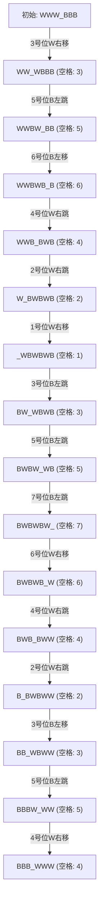

[[TOC]]

## 形式化题目

给定长度为 $2N+1$ 的序列，初始下标 $1 \sim N$ 为白棋 $W$，下标 $N+1$ 为空格 $\_$，下标 $N+2 \sim 2N+1$ 为黑棋 $B$。

定义每次操作可将空格 $\_$ 与某位置棋子交换，合法操作为：
1. 相邻平移：空格与相邻棋子交换（距离为 $1$）；
2. 跨越跳跃：棋子跳过一个与其**异色**的棋子到达空格（距离为 $2$）。

求将序列变为左侧 $N$ 个 $B$、中间空格 $\_$、右侧 $N$ 个 $W$ 的最少步数操作序列。输出每一步被移动入空格的原棋子下标（即每次操作后空格所在的绝对位置，从 $1$ 开始计数）。若有多组最少步数解，输出字典序最小的一组解。

## 正解

### 思路

#### 1. 理论最少步数推导

考虑目标状态下所有黑棋都位于所有白棋的左侧：
- 初始状态下，任意一对 $(W, B)$ 中白棋均在黑棋左侧。目标状态下，所有黑棋均在白棋左侧。
- 共有 $N$ 个白棋与 $N$ 个黑棋，总共构成了 $N \times N = N^2$ 个异色棋子对。
- **相邻平移**：棋子仅移动 1 格入空格，未发生棋子之间的跨越，异色对的相对先后顺序不变。
- **跨越跳跃**：一个棋子跳过一个与其异色的棋子，恰好交换了这一对黑白棋子的相对顺序，使逆序对数加 1。
- 要使全部 $N^2$ 个异色对完成翻转，必须且恰好需要发生 $N^2$ 次跳跃！

再考察棋子的净位移：
- 每个白棋最终从左半部分到达右半部分，总净向右位移至少为 $N+1$ 格，$N$ 个白棋总位移至少为 $N(N+1)$ 格；
- 每个黑棋最终从右半部分到达左半部分，总净向左位移至少为 $N+1$ 格，$N$ 个黑棋总位移至少为 $N(N+1)$ 格；
- 所有棋子的总移动距离至少为 $2N(N+1) = 2N^2 + 2N$ 格；
- 每次跳跃贡献 2 格位移，共 $N^2$ 次跳跃贡献 $2N^2$ 格位移；
- 剩余位移必须全部由相邻平移提供，每次平移贡献 1 格位移，因此平移次数至少为 $2N$ 次。

由此得出，达成目标所需的**最少移动步数恒等于**：
$$S = N^2 + 2N = (N+1)^2 - 1$$

#### 2. 搜索设计与字典序保证

由于步数已被严格确定为 $(N+1)^2 - 1$，且为保证无回退和最少步数，棋子遵循单向移动规则：
- 白棋只能向右移或向右跳（移入左侧的空格）；
- 黑棋只能向左移或向左跳（移入右侧的空格）。

设当前空格位置为 `blank`（下标 $0 \sim 2N$），合法的移入棋子候选位置为：
1. `blank - 2`（白棋右跳）：需满足第 `blank - 2` 位为白棋且第 `blank - 1` 位为黑棋；
2. `blank - 1`（白棋右移）：需满足第 `blank - 1` 位为白棋；
3. `blank + 1`（黑棋左移）：需满足第 `blank + 1` 位为黑棋；
4. `blank + 2`（黑棋左跳）：需满足第 `blank + 2` 位为黑棋且第 `blank + 1` 位为白棋。

题目要求输出序列的字典序最小。输出的数字即为被移动棋子的原位置编号（从 1 起始）。
因此，在每一层递归中，我们将所有合法的候选棋子位置 `pos` **从小到大**升序排序，依次尝试转移。只要首次搜索到深度为 $(N+1)^2 - 1$ 且状态完全匹配目标状态，即刻终止搜索并输出路径，所得即为字典序最小的最优解。

### 代码

@include-code(./main.py, python)

### 复杂度

- **时间复杂度**：$\mathcal{O}((N+1)^2)$ 状态展开。由于棋子严格单向移动且避免了死锁构型，每一步的合法前向转移极少。在 $N \le 12$ 的最大数据下，实际回溯次数仅为 28,618 次，运行时间在几十毫秒以内。
- **空间复杂度**：$\mathcal{O}(N^2)$。状态数组长度为 $2N+1$，递归调用栈深度与路径记录长度最大为 $(N+1)^2 - 1 = 168$，空间占用可忽略不计。

## 总结

本题是经典的跳棋互换谜题（Shuttle Puzzle）。解题的核心切入点在于分析**逆序对**与**总位移**：
1. 每次跳跃必定且只能颠倒一对异色棋子的相对次序，因而必须进行恰好 $N^2$ 次跳跃；
2. 结合总位移守恒确定平移次数必为 $2N$，从而严格锁定了最少总步数必然为 $(N+1)^2 - 1$；
3. 将步数作为深度限制，按原下标升序贪心枚举转移，使 DFS 能够极快锁定字典序最小的目标解。

## 图示解析

以 $N=3$ 为例，棋盘长度为 $7$，初始空格在位置 $4$。
游戏状态转移过程如下（共 15 步）：

