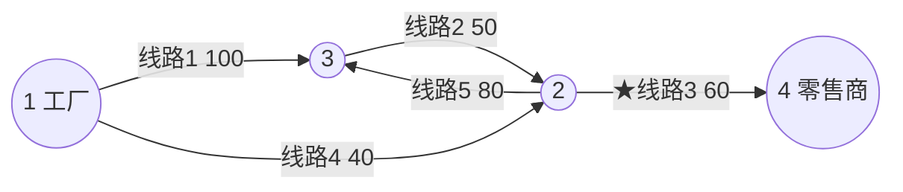

[[TOC]]

## 形式化题目

有 $n$ 个仓库（节点）和 $m$ 条单向运输线路（有向边，各带停运损失 $c$）。仓库 $1$ 是
坏牛奶的发货工厂，仓库 $n$ 是零售商。要停运若干条线路，使坏牛奶无法从 $1$ 送达 $n$，
要求：

1. 停运损失**总和最小**（主目标）；
2. 总和相同时，停运的**线路数最少**（次级目标）。

输出最小总损失、最少线路数，以及这些线路的输入行号（从小到大）。

从数学结构看，这是带权有向图上的 **s-t 最小割**：把节点分成含 $1$ 的集合 $A$ 与含 $n$
的集合 $B$，停运所有从 $A$ 指向 $B$ 的边。

样例输入与输出（milk60 数据）：

```
4 5
1 3 100
3 2 50
2 4 60
1 2 40
2 3 80
```

```
60 1
3
```

下面用样例网络演示“割”的含义，★ 标出的边就是最终要停运的线路：



把节点分成 $A=\{1,2,3\}$、$B=\{4\}$ 时，只有线路 3（$2\to4$）从 $A$ 指向 $B$，割值恰好是
它的代价 60。下表对比了几个候选割，可见 60 就是最小割值，且只含一条边：

| $A$ 侧节点 | 跨过 $A\to B$ 的线路 | 总代价 |
| --- | --- | --- |
| $\{1,2,3\}$ | 线路3（60） | **60 ← 最优** |
| $\{1\}$ | 线路1（100）、线路4（40） | 140 |
| $\{1,3\}$ | 线路2（50）、线路4（40） | 90 |
| $\{1,2\}$ | 线路1（100）、线路5（80） | 180 |

## 正解

### 思路

**1. 先认出来：这就是最小割。** 最朴素的思路是枚举停运哪些线路再检查连通性，有 $2^m$
种；换一种枚举（把节点划成两组，统计组间线路）也有 $2^{n-2}$ 种，两者都不可行。但第二个
枚举暴露了本质：**任何“删掉边后 $1$ 到不了 $n$”的方案，都完整覆盖了某个顶点二分
$(A,B)$（$1\in A$、$n\in B$）的全部跨边**。所以问题退化成：找总代价最小的顶点二分——
这正是最小割，而“最小割值 = 最大流值”可以一次 Dinic 求出。

**2. 次级目标“线路数最少”用容量变换吸收。** 普通最大流只保证主目标。把每条边的容量改成

$$
w_e = c_e \cdot K + 1, \qquad K = m + 1
$$

那么任意割的新容量 $= K \cdot (\text{原代价}) + (\text{边数})$。因为任何割的边数都不超过
$m < K$，比较两个割的新容量时，“商”先分胜负（原代价小者赢），“余数”再分胜负（边数少者
赢）。于是**修改图上的最小割，就是原图“总代价最小、其次边数最少”的割**，两个目标一步到位。

**3. 找出具体是哪几条线路：贪心逐条删测流。** 最大流算法只给“割值”，还要把割边找出来。
在当前图上临时删掉边 $e$ 再重跑一次最大流，观察最大流的变化：

- 若恰好减少了 $w_e$（等于 $e$ 自己的修改容量），说明任何最大流都无法绕开 $e$，$e$ 必然
  属于当前图的某个最小割 —— 保留删除，计入答案；
- 若减少不足 $w_e$，说明流量可以绕行，$e$ 不在最小割里 —— 恢复容量。

按输入顺序处理完全部 $m$ 条边后，被保留删除的线路恰好组成了那个最优割：每条计入答案的边
贡献 $c_e\cdot K + 1$，总削减量正好等于修改图的最大流 $F$，所以最小损失是 $F \div K$、
最少线路数是 $F \bmod K$，答案行号天然按输入顺序排列。若 $1$ 本来就到不了 $n$，$F=0$，
输出 `0 0`。

### 代码

@include-code(./main.py, python)

### 复杂度

- 一次 Dinic 最坏 $O(V^2E)$，本题 $V=n\leqslant 32$、$E=m\leqslant 1000$，实际分层少、单次很快。
- 贪心阶段对每条边重跑一次最大流，共 $O(m)$ 次，总复杂度 $O(m \cdot V^2E)$。
  实测 12 组官方数据单测最长约 0.27 s。
- 空间 $O(V+E)$。

## 总结

把“停运卡车防送达”还原成带权有向图的最小割：最大流给出最小割值；容量变换
$w_e=c_e\cdot K+1$（$K=m+1$）把“代价最小、其次边数最少”两个排序目标合并成一次最小割；
最后按输入顺序逐条删边重测最大流，把属于最小割的线路精确挑出来输出。

## 图示解析

```text
带权有向图 1→n        删边使 1 不可达 n         枚举 2^m / 2^(n-2) 都爆炸
     │                    │                              ▲
     ▼                    ▼                              │
 建模：问题 = 最小割 ──▶ 最大流 = 最小割值 ──► 容量变换 w_e = c_e·K+1 (K=m+1)
     │                                                       │ 新割值 = K·代价 + 边数
     ▼                                                       ▼
 Dinic 求出 F ──────────────────────────────► 贪心：逐条删边重测流，恰好损失 w_e 的边入答案
                                                               │
                                                               ▼
                                        输出 F//K（最小损失）与按输入顺序的行号（最少边数）
```

从左到右读：**建模**把删边方案等价成顶点二分（最小割）；**变换**让一次最大流同时满足
“总代价最小”与“边数最少”两个排序目标；**贪心**把最小割的每一条边按输入顺序精确找出来，
直接输出。
