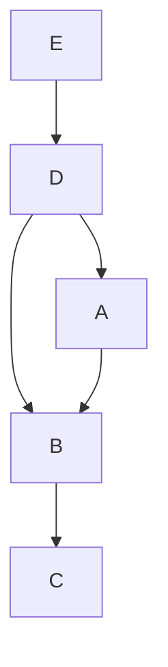

[[TOC]]

## 形式化题目

给定一个大小为 $H \times W$（$3 \le H, W \le 30$）的字符网格，由若干个不同大写字母构成的矩形边框（边宽为 1，长宽均 $\ge 3$）自底向上依次覆盖堆叠而成。
未被覆盖的背景为 `.`。每个矩形的每条边至少有一部分在最终网格中可见。
求所有可能的从底部到顶部的堆叠顺序（即拓扑序列）。若有多种可能，按字典序升序输出所有情况。

## 正解

### 思路

本题由两部分组成：**依赖关系的确定（建模建图）** 与 **全拓扑排序的枚举（搜索输出）**。

#### 1. 还原每个矩形边框的几何范围
题目给出了关键条件：*每个矩形的每条边中，至少有一部分是可见的*。
这意味着对于任意出现在网格中的字母 $C$：
- 其最上边缘所在行一定是所有字母 $C$ 出现位置的最小行号 $r_{\min}$；
- 最下边缘所在行一定是最大行号 $r_{\max}$；
- 最左边缘所在列一定是最小列号 $c_{\min}$；
- 最右边缘所在列一定是最大列号 $c_{\max}$。

因此，只需遍历一次网格，即可唯一确定每个矩形边框的四条外边构成的空心矩形区域：
- 上边：$(r_{\min}, c)$，其中 $c_{\min} \le c \le c_{\max}$
- 下边：$(r_{\max}, c)$，其中 $c_{\min} \le c \le c_{\max}$
- 左边：$(r, c_{\min})$，其中 $r_{\min} \le r \le r_{\max}$
- 右边：$(r, c_{\max})$，其中 $r_{\min} \le r \le r_{\max}$

#### 2. 由覆盖关系构建有向无环图（DAG）
对于矩形 $u$，其原本四条边上应当全部由字母 $u$ 填充。如果最终网格中该边上的某个位置显示的是字母 $v$（且 $v \ne u$），说明矩形 $v$ 覆盖在了矩形 $u$ 之上。
因此，在自底向上的堆叠顺序中，矩形 $u$ 必须早于矩形 $v$ 被放置。我们建立一条有向边：
$$u \to v$$
表示 $u$ 必须排在 $v$ 前面（$u$ 在更底层，$v$ 在更顶层）。

#### 3. 回溯搜索所有合法的全拓扑序列
问题转化为了：在一个有向无环图（DAG）中，求出所有自底向上的拓扑排序，并按字典序输出。
由于字母数量最多 26 个，我们可以采用深度优先搜索（DFS）加回溯：
- 每一层按字典序枚举所有当前入度为 0 且尚未加入序列的字母 $u$；
- 将 $u$ 追加到当前路径，并将其所有后继节点 $v$ 的入度减 1；
- 递归搜索下一层；
- 回溯时恢复入度并从路径中弹出 $u$；
- 当序列长度等于总字母数时，找到一种合法的全排列并输出。

### 代码

Python 版：

@include-code(./main.py, python)

C++ 版（同一算法）：

@include-code(./main.cpp, cpp)

### 复杂度

- **时间复杂度**：
  - 极值坐标提取：扫描网格 $O(H \cdot W)$，最多 26 个字母，复杂度为 $O(26 \cdot H \cdot W)$。
  - 边框覆盖检查建图：对每个矩形扫描四条边周长，最多 $26 \times 2(H + W)$ 步，常数极小。
  - 回溯搜索全拓扑排序：状态空间受拓扑偏序严格约束，只有合法的拓扑前缀才会继续展开，耗时主要取决于解的个数 $K$。对于全部数据，耗时均在 0.1 秒以内。
- **空间复杂度**：存储邻接表与入度数组需 $O(|V|^2)$，递归栈深度最大为 $|V| \le 26$，空间复杂度为 $O(H \cdot W + |V|^2)$，完全在内存限制之内。

## 总结

- 利用“边框每条边至少有一部分可见”的性质，通过坐标极值唯一逆向推导各矩形边框。
- 通过边框上的字符覆盖重叠关系导出偏序关系，建立有向无环图（DAG）。
- 利用字典序回溯枚举 DAG 的全拓扑排序，结构清晰、实现紧凑。

## 图示解析

以样例数据为例，字母间的覆盖依赖关系如下：

在网格中，矩形边框上的覆盖产生先后依赖，如：
- $E$ 的边框被 $D$ 覆盖，必须先放 $E$ 再放 $D$；
- $D$ 的边框被 $A$ 和 $B$ 覆盖，必须先放 $D$ 再放 $A, B$；
- $A$ 的边框被 $B$ 覆盖，必须先放 $A$ 再放 $B$；
- $B$ 的边框被 $C$ 覆盖，必须先放 $B$ 再放 $C$。

最终自底向上的合法堆叠顺序即为拓扑序：`EDABC`。
