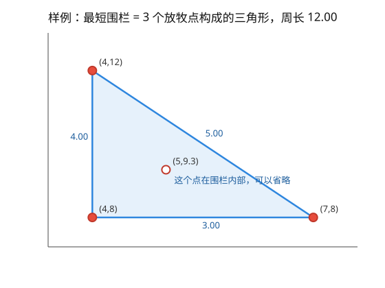
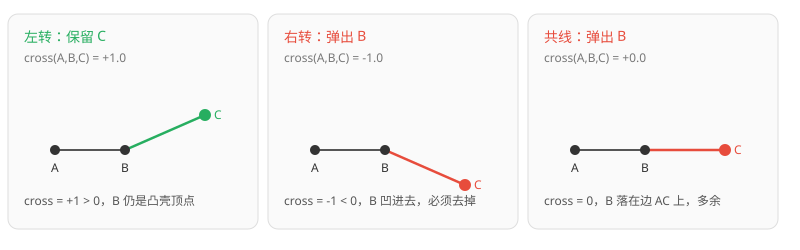

[[TOC]]

## 形式化题目

给定平面上的点集 $S = \{P_1, P_2, \dots, P_N\}$，$P_i = (X_i, Y_i)$，坐标均为实数。

求一条闭合曲线 $C$，使得每个 $P_i$ 都落在 $C$ 上或 $C$ 的内部，并且 $C$ 的长度最小；
即求 $\min_C |C|$ 这一最优值。

样例：$S = \{(4,8), (4,12), (5,9.3), (7,8)\}$，最短闭合曲线是三角形
$(4,8) \to (7,8) \to (4,12) \to (4,8)$，周长 $3 + 5 + 4 = 12$。

## 正解

### 思路

#### 第一步：把"最短围栏"换成"凸包周长"

围栏是一条闭合曲线，看起来要搜的对象是无穷多条曲线。但有两条性质能把它压成一个
确定的几何对象：

- **拐点一定取自输入点。** 若最优围栏的拐点 $P$ 不是输入点，设它两侧的拐点是
  $A, B$，把 $P$ 沿角平分线朝多边形内部挪一点得到 $P'$。由三角不等式，
  $|AP'| + |P'B| < |AP| + |PB|$，包含性不变而周长变短，矛盾。
- **最优围栏一定是凸的。** 若它有凹口，用弦代替凹口内的折线，长度更短且包含的
  区域更大，同样矛盾。

一个凸多边形能围住 $S$，当且仅当它能围住 $S$ 的凸包；而在所有能围住凸包的凸
多边形里，周长最小的就是凸包本身。于是**答案恰好是点集凸包的周长**，问题变成
"求出凸包顶点序列"。

以样例为证：$(5, 9.3)$ 落在其余三点构成的三角形内部，去掉它周长不变，
而 $3 + 5 + 4 = 12$ 就是答案。下图标出这三个围栏顶点和那个可以省略的内部点。



图上红点是围栏顶点，空心蓝点是落在三角形内部的放牧点。读者应注意到：内部点既不
影响包含关系、也不贡献周长，所以候选顶点只需考虑凸包上的点。

#### 第二步：Andrew 单调链求凸包

候选顶点定了，还要知道它们**按什么顺序连**。$N$ 最大 $10000$，允许 $O(N \log N)$，
所以"排一次序 + 两遍线性扫描"是完全够用的复杂度，不必考虑更重的做法。
做法的骨架是先排序，再左右各扫一遍：

1. 把点按 $(x, y)$ 升序排序。这样最左点就是 $y$ 最小的那个，最右点就是 $y$ 最大
   的那个，两条链的端点被固定下来。
2. 从左往右扫一遍，维护一个栈，得到**下凸壳**（从左下走到右上）。
3. 从右往左再扫一遍，同样维护栈，得到**上凸壳**（从右上走回左下）。
4. 两个栈各自的首尾端点是同一个最左点、最右点，去掉重复后拼接，就得到了逆时针
   排列的完整凸包。

关键在于扫描时**该不该保留新点**。维护的信息是"栈里已经构成一段凸壳"，新点 $p$
进来后，要看栈顶 $B$（及其前驱 $A$）相对 $p$ 的转向：

- `cross(A, B, p) > 0`：$A \to B \to p$ 左转，$B$ 仍是凸壳顶点，保留；
- `cross(A, B, p) < 0`：右转，$B$ 被"顶"进了新边的下方，不可能是顶点，弹出；
- `cross(A, B, p) = 0`：$A, B, p$ 共线，$B$ 落在边 $A p$ 上。留着不改周长，
  但弹掉能让凸包严格凸、没有冗余顶点，所以也弹出。

三种情况合起来就是一句判断：**只要新点不能让栈顶保持左转（`cross(...) > 0`
不成立），就把栈顶弹掉**。代码把这个判断写成 `if cross(...) > 0: break` 加
`pop()`，比把条件挤进 `while` 里更好读。下面的特写图把这三条判定并排画出来，
红色表示要弹掉的点。



左转时中间点 $B$ 是凸壳顶点；右转说明 $B$ 凹进去了；共线说明 $B$ 在边上多余。
因此只要弹出条件写成"不能左转就弹"，一次扫描就能得到正确的凸壳。

#### 第三步：累加闭合周长

凸包顶点序列首尾相接才是围栏，所以相邻顶点两两求欧氏距离，最后再把末顶点连回
首顶点。实现上用 `pairwise(ring + ring[:1])`：把首顶点复制到末尾，一次推导式
就能同时处理"内部相邻边"和"闭合边"。

### 代码

Python 版：

@include-code(./main.py, python)

C++ 版（同一算法）：

@include-code(./main.cpp, cpp)

### 复杂度

- 时间复杂度：排序 $O(N \log N)$；下凸壳、上凸壳各扫描一遍，每个点最多入栈一次、
  出栈一次，合计 $O(N)$；求周长 $O(h) \subseteq O(N)$。总计 $O(N \log N)$，
  与标准 C++ 凸包解法同阶。
- 空间复杂度：排序后的点表、两个点栈、凸包序列均为 $O(N)$。

## 总结

- 最短围栏不是一条要搜索的曲线，而是点集的**凸包边界**：拐点取自输入点 + 最优解
  必凸，这两步把问题压成了确定的几何对象。
- 凸包顶点用 Andrew 单调链求：排序固定两端点，两条链各扫一遍；新点不能与栈顶
  构成左转（`cross(A, B, p) <= 0`）时弹掉栈顶。
- 求周长时把首顶点复制到末尾，用 `pairwise` 一次处理闭合边，$O(N \log N)$ 全部结束。
- 边界：凸包退化成 1 个点时周长是 `0.00`；退化成 2 个端点（点全共线）时，
  最短闭合曲线就是沿线段走个来回，即两倍线段长。两种情况都由闭合折线公式自然算出，
  代码里不需要额外的 `if` 分支。

## 图示解析

这张图串起本题从建模到得到答案的主线：

```text
N 个放牧点
`- 关键观察 1：拐点取自输入点（三角不等式）
   `- 关键观察 2：最优围栏必凸（凹口换成弦更短）
      `- 模型：最短围栏 = 点集凸包的周长
         |- 排序：按 (x, y) 升序，固定最左/最右端点
         |- 下凸壳：从左往右扫，不能左转（cross <= 0）就弹栈顶
         |- 上凸壳：从右往左扫，同样的弹出条件
         `- 拼接去重 → 逆时针顶点序列 → 相邻距离求和 + 闭合边 = 答案
```

先看前两个节点如何把"搜索一条曲线"压成"求一个确定的几何对象"，再顺着三个分支看
单调链怎样在两遍线性扫描里得到凸包，最后一步只是把顶点序列的边长加起来。
图中只保留正文已经证明过的关系，不替代正文中的样例推演与复杂度分析。
