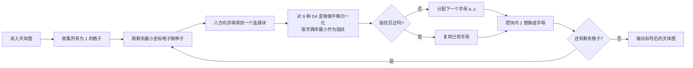

[[TOC]]

## 形式化题目

给定 $H \times W$ 的 0/1 字符矩阵，`1` 表示星星。

- **星座**：由水平、垂直或对角相邻（即 8 连通）的星星组成的极大连通块。
- **相似**：两个星座经过任意次旋转（$90^\circ$、$180^\circ$、$270^\circ$）或翻转（共 8 种等距变换）后形状完全一致。相似的两个星座星星数必然相同。

任务：按从上到下、从左到右的扫描顺序，给互不相似的星座依次分配小写字母 `a`、`b`、`c`、……（不相似的星座不超过 26 种），相似的星座共用同一个字母；把星座中每颗星的 `1` 替换成对应字母后输出整个矩阵。

数据范围：$0 \leqslant W, H \leqslant 100$，星座数 $\leqslant 500$，每个星座 $1 \sim 160$ 颗星。

## 正解

### 思路

**第一步：提取星座。** 天体图里的每个 8 连通块就是一个星座。从左上角扫描网格，遇到还没被访问过的 `1` 就从它出发做一次洪填（DFS/BFS，八方向扩展），得到一个连通块的所有格子。扫描时第一个碰到的格子一定落在「尚未标号的最左上角的星座」里，所以按这个顺序处理星座，分配字母的顺序天然就是题面要求的顺序。

**第二步：把「相似」变成「指纹相等」。** 朴素的判同方法是：对每对新星座，枚举其中一方的 8 种变换，再逐格比对（还要平移对齐）——星座最多 500 个，两两比较再加 8 变换逐格比对，最坏大约 $500^2 \times 8 \times 160$ 次 cell 级操作，太慢也不必要。

更好的办法是给每个形状算一个**规范指纹**：

1. 对形状的 8 种 D4 变换（恒等、旋转 $90^\circ/180^\circ/270^\circ$、三种镜像），分别把变换后的点集**平移到最小行、最小列为 0**（消除位置差异）；
2. 把点集转成排好序的坐标序列，8 个形态里取字典序最小的那个作为指纹。

两个星座相似 ⟺ 它们的指纹相同。于是「判同」退化成一次 dict 查找：

```text
marks: 指纹 -> 字母
mark = marks.setdefault(指纹, 下一个未用过的字母)
```

`setdefault` 一行同时完成「查重」和「分配」：第一次见到的指纹领走新字母，之后所有相似星座查到同一个字母。

**第三步：回写网格。** 把连通块里的每个格子对应的字符从 `1` 改成字母，最后整图输出。

下面的样例局部展示了指纹的思想——同一个三连块无论怎么放，8 种平移归一化形态里最小的那个都一样：

| 摆放方向 | 连通块内的格子（行, 列） | 平移归一化后 | 规范指纹 |
| --- | --- | --- | --- |
| 竖放 | (0,0) (1,0) (2,0) | 不动 | (0,0) (1,0) (2,0) |
| 横放 | (0,0) (0,1) (0,2) | 旋转 $90^\circ$ 后归一化 | (0,0) (1,0) (2,0) |
| 反横放 | (0,2) (0,3) (0,4) | 旋转 $90^\circ$、平移 | (0,0) (1,0) (2,0) |

三种摆法算出的指纹完全一致，因此共享同一个字母；而一个 L 形三连块的指纹集合不同，会领走下一个字母。

整个流程如下：



### 代码

@include-code(./main.py, python)

实现里有一个值得单独指出的细节：规范化时不能把 8 个形态保留成 `frozenset` 再用 `min` 挑最小——Python 里集合的 `<` 是「真子集」判断而非全序，两个不可比的同构形态会让 `min` 的结果随迭代顺序漂移，把本来相似的星座分到不同字母上。正确做法是先转成 `tuple(sorted(...))` 再比较。

### 复杂度

设总星数为 $S$（$S \leqslant 100 \times 100$，且每星座 $\leqslant 160$ 格）。

- 洪填每个格子进出栈一次：$O(S)$。
- 每个星座算一次指纹：8 种变换各 $O(\text{块大小})$，合计 $O(8S)$。
- 指纹的 dict 操作与字母回写：$O(S)$。

总时间 $O(8S) \approx 8 \times 10^4$ 次基本操作，空间 $O(S)$，与 C++ 正解同阶。

## 总结

- 星座 = 8 连通分量，一次扫描 + 洪填即可全部提取。
- 「旋转/翻转后形状相同」用 **D4 规范形指纹** 判等：8 种变换各自平移归一化，取字典序最小形态，判同从两两比对降到一次哈希查找。
- 字母分配只需 `dict.setdefault(指纹, 下一个字母)`，与扫描顺序天然一致。
- 实现陷阱：集合比较是子集偏序，规范化结果必须转有序元组再比大小。

## 图示解析

### 官方样例的标号结果

以官方样例（$23 \times 15$）为例，标号后同一字母的星座形状互为旋转/翻转。观察输出中部的三个 `c` 块和 `b` 块：它们星数相同、形状相同，只是摆放方向不同，所以共用字母；而星数不同的块永远不会共享字母。

### 指纹识别的局部演示

取样例里的一个真实例子说明指纹如何把不同方向「折叠」到同一个键上。设某星座的格子为 `(0,0) (1,0) (2,1)`（一个斜 L）：

| D4 变换 | 变换后点集 | 平移归一化后 |
| --- | --- | --- |
| 恒等 | (0,0) (1,0) (2,1) | (0,0) (1,0) (2,1) |
| 上下翻转 | (0,0) (-1,0) (-2,1) | (0,1) (1,1) (2,0) |
| 旋转 $90^\circ$ | (0,0) (0,-1) (1,-2) | (0,2) (0,1) (1,0) |
| ……（其余 5 种同理） | …… | …… |

8 个归一化形态中字典序最小的是 `(0,0) (0,1) (1,0)` 方向的某个序列——无论原星座在天体图的位置和朝向如何，这个最小值都不变，它就是该星座的身份证。
