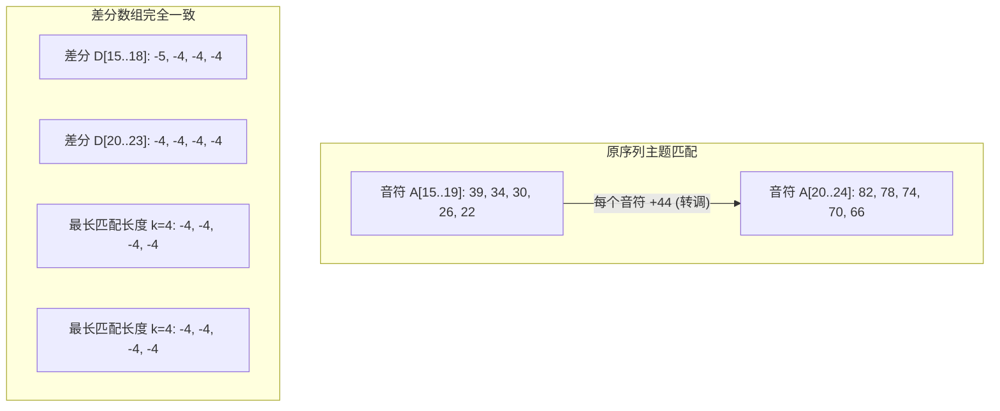

[[TOC]]

## 形式化题目

给定一个长度为 $N$ 的正整数序列 $A = (A_1, A_2, \dots, A_N)$。

寻找一个最大的整数 $L$，使得序列中存在两个长度为 $L$ 的连续子串 $A[i \dots i+L-1]$ 与 $A[j \dots j+L-1]$，满足：
1. **长度下限**：$L \ge 5$；
2. **互不重叠**：$j \ge i + L$（不妨设 $i < j$）；
3. **整体转调**：存在整数 $c$，使得对任意 $0 \le k < L$，均有 $A_{j+k} - A_{i+k} = c$。

若存在这样的子串，输出最大长度 $L$；若不存在满足条件的子串，输出 $0$。

## 正解

### 思路

#### 1. 转调的本质：相邻差分

题目中“转调”的定义是子串中的每一个音符都加上或减去同一个常数 $c$。

设两段子序列分别为 $A[i \dots i+L-1]$ 和 $A[j \dots j+L-1]$。条件 $A_{j+k} = A_{i+k} + c$ 对所有 $0 \le k < L$ 成立，等价于相邻两个音符的差值对应相等：
$$A_{j+k+1} - A_{j+k} = A_{i+k+1} - A_{i+k} \quad (0 \le k < L-1)$$

因此，构造原序列的相邻差分数组 $D$：
$$D_k = A_{k+1} - A_k \quad (1 \le k \le N-1)$$
那么原序列中长度为 $L$ 的“转调主题”，在差分数组 $D$ 中恰好对应长度为 $k = L - 1$ 的**完全相同**的连续子数组。

#### 2. 不重叠约束的转化

原序列中两段长度为 $L$ 的子串起点分别为 $i, j$ ($i < j$)，不重叠要求：
$$j \ge i + L$$
将差分串长度 $k = L - 1$ 带入，即要求：
$$j - i \ge k + 1$$
这一步的细节至关重要：虽然差分串自身的长度是 $k$，但原音符子串长度是 $k+1$。若差分串起点之差仅为 $k$，则原序列的两个子区间会恰好在端点处重叠 $1$ 个音符。因此必须严格满足 $j - i \ge k + 1$。

#### 3. 二分答案 + 滚动哈希判定

显然，如果存在长度为 $k$ 的合法差分匹配，那么取其前缀也一定能构成合法的长度更小的差分匹配（条件 $j - i \ge k + 1 > k' + 1$ 天然满足）。因此合法长度具有二分单调性。

我们二分差分子串的长度 $k \in [4, \lfloor N/2 \rfloor]$（对应原串主题长度 $L = k + 1 \ge 5$）：
1. 取大素数模数 $MOD = 2^{61} - 1$ 与进制基数 $BASE = 2003$；
2. 利用滚动哈希（Rolling Hash）维护长度为 $k$ 的滑动窗口哈希值；
3. 用哈希表记录每个哈希值**最早**出现的起始下标 `first_pos[hash]`；
4. 线性扫描差分数组，若当前窗口哈希值已存在且当前下标 $i - \text{first\_pos}[\text{hash}] \ge k + 1$，则说明找到了合法的不重叠重复串，返回 `True`；否则记录首次出现的位置。

单次判定只需 $O(N)$，二分总耗时 $O(N \log N)$。

### 代码

@include-code(./main.py, python)

### 复杂度

- **时间复杂度**：计算差分耗时 $O(N)$；二分范围上界为 $N/2$，迭代次数为 $O(\log N)$；每次滑动窗口与哈希表查询耗时 $O(N)$。整体时间复杂度为 $O(N \log N)$。在 $N \le 5000$ 规模下几毫秒即可完成。
- **空间复杂度**：存储差分数组及哈希表所需空间均为 $O(N)$。

## 总结

解决本题的关键在于两个核心转化：
1. **转调 $\to$ 差分数组**：将相对变化的加减常数转变为差分序列的绝对匹配；
2. **原串不重叠 $\to$ 差分串间距 $\ge k + 1$**：仔细推导端点索引，避免差分长度与原串长度混淆而导致的重叠漏洞。
最后结合经典的**二分答案 + 滚动哈希**，在 $O(N \log N)$ 的优异复杂度下完成了全局最长公共不重叠子串的查找。

## 图示解析

以样例数据为例：
原音符序列前一段末尾为 `[45, 39, 34, 30, 26, 22]`，后一段开头为 `[82, 78, 74, 70, 66, 67]`。

差分数组中两段起点分别为 $16$ 和 $21$，满足下标之差 $21 - 16 = 5 \ge 4 + 1$，对应原音符长度为 $4 + 1 = 5$ 的非重叠主题。
