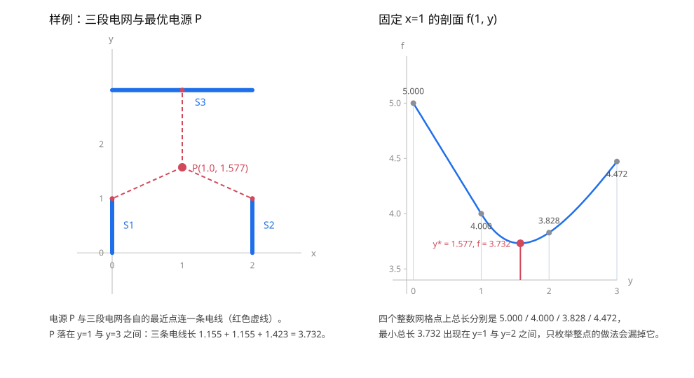

[[TOC]]

## 形式化题目

给定 $F$ 条与坐标轴平行的线段 $s_1, s_2, \dots, s_F$（"电网"），端点坐标为整数且落在 $[0,100]^2$ 内。
记 $\operatorname{dist}(P, s_i)$ 为点 $P$ 到线段 $s_i$ 上**任意一点**的最短距离，求

$$\min_{P \in \mathbb{R}^2} g(P), \qquad g(P) = \sum_{i=1}^{F} \operatorname{dist}(P, s_i).$$

要求输出取到最小值的点 $P^* = (x^*, y^*)$ 以及最小值 $g(P^*)$，各保留一位小数。

样例：三段电网分别为 $x=0,\ y \in [0,1]$、$x=2,\ y\in[0,1]$、$y=3,\ x\in[0,2]$，
最小总长为 $2 + \sqrt3 \approx 3.732$，在 $P^* = (1,\ 1 + 1/\sqrt3)$ 处取到，输出 `1.0 1.6 3.7`。

## 正解

### 思路

**一句话本质**：目标函数是"到线段的距离之和"，线段是凸集，所以每个距离函数都是凸函数、
$g$ 是凸函数；凸函数的边缘最小化仍然凸，于是可以用"外层对 $x$ 三分、内层对 $y$ 三分"的
嵌套三分，稳定地找到全局最小值（最小值点可能不唯一，此时任意一个都对）。

**先把目标函数算出来。** 题面把"电线"定义为从电源连到一段电网的**任意一点**，
那么显然应该连到该线段上离电源最近的那一点，于是每段电网的贡献就是点到线段的距离。
设线段端点为 $A, B$，则

$$t = \frac{(P-A)\cdot(B-A)}{\|B-A\|^2}, \qquad
\operatorname{dist}(P, AB) = \big\| P - \big(A + \operatorname{clamp}(t, 0, 1)\,(B-A)\big) \big\|.$$

$\operatorname{clamp}$ 是必须的：它把垂足夹回线段内部，把"到直线的距离"改造成"到线段的距离"。
当 $A = B$（线段退化成点）时分母为 $\|B-A\|^2 = 0$，要单独返回 $\|P-A\|$。

**问题？为什么不能直接枚举候选点？**

一个很自然的想法是"最优点应该在端点或整数点上"。样例就能否掉它。三段电网的端点只有
$x \in \{0,2\}$、$y \in \{0,1,3\}$，光固定 $x=1$（两竖线的中点，已经不在端点集合里）就有

$$f(1,1) = 1+1+2 = 4, \quad f(1,2) = \sqrt2+\sqrt2+1 \approx 3.828, \quad
f(1,3) = 2+2+0 = 4.472, \quad \min_y f(1,y) = 2+\sqrt3 \approx 3.732 .$$

整数网格上的最小总长是 3.828，比真最优 3.732 大了近 0.1，四舍五入后正好是 `3.8` 与 `3.7`
的区别。随机数据上这个差距还会更大：用 4000 组小规模随机线段做检查，$101 \times 101$ 个整点
上的最优值最多比真最优差 **0.123**。所以整数枚举一定会输出错误的一位小数。

下面这张图用样例把两件事画在一起：左图是几何布局，右图是固定 $x=1$ 后的一维剖面。



左图里电源 $P$ 与三段电网各自的最近点各连一条电线，长度 $1.155 + 1.155 + 1.423 = 3.732$；
注意 $P$ 的 $y = 1.577$ 落在 $y=1$ 与 $y=3$ 之间，两条电线连到竖线的**内部**而不是端点。
右图的曲线就是 $f(1,y) = g(1,y)$ 关于 $y$ 的图像：它是一条凸曲线，最小值在 $y \approx 1.577$；
四个整数点 $y = 0,1,2,3$ 上分别是 $5.000, 4.000, 3.828, 4.472$——**最小值出现在两个整数之间**。
这条曲线的凸性是整个解法的支点，下面推导它从哪里来。

**关键性质：每段电网贡献一个凸函数。**

线段 $s_i$ 是凸集。对任意凸集 $S$，距离函数 $d_S(P) = \min_{Q \in S}\|P-Q\|$ 是凸函数：
取各自最近点 $Q_1, Q_2$，由 $S$ 的凸性有 $Q_\lambda = \lambda Q_1 + (1-\lambda)Q_2 \in S$，于是

$$d_S(\lambda P_1 + (1-\lambda)P_2) \leqslant \|\lambda(P_1 - Q_1) + (1-\lambda)(P_2 - Q_2)\|
\leqslant \lambda d_S(P_1) + (1-\lambda) d_S(P_2).$$

$F$ 个凸函数相加仍凸，所以 **$g$ 是凸函数**。凸函数在凸集上的最小值点构成凸集，
$g$ 在 $[0,100]^2$ 上取到的全局最小值不会有"局部最优陷阱"——这正是三分能用的前提。
（顺带解释了为什么最优 $P$ 一定在 $[0,100]^2$ 内：把点沿坐标轴投影回去，每段距离都只会变小。）

**二维怎么降成一维。** 凸函数的**边缘最小化仍然凸**：令 $h(x) = \min_{0 \leqslant y \leqslant 100} g(x, y)$，
设 $y_1^*, y_2^*$ 分别是 $x_1, x_2$ 处的最优 $y$，则 $y_\lambda = \lambda y_1^* + (1-\lambda)y_2^*$ 合法，且

$$h(\lambda x_1 + (1-\lambda)x_2) \leqslant g(\lambda x_1 + (1-\lambda)x_2,\ y_\lambda)
\leqslant \lambda g(x_1, y_1^*) + (1-\lambda) g(x_2, y_2^*) = \lambda h(x_1) + (1-\lambda) h(x_2).$$

所以 $h$ 也是凸的，可以对 $h$ 再套一层三分。两层三分各司其职：

| 层次 | 被最小化的函数 | 手段 | 作用 |
| --- | --- | --- | --- |
| 外层 | $h(x) = \min_y g(x,y)$ | 对 $x$ 在 $[0,100]$ 上三分 | 定位最优的 $x$ |
| 内层 | $g(x_0, \cdot)$，$x_0$ 固定 | 对 $y$ 在 $[0,100]$ 上三分 | 求 $h(x_0)$ 的值与最优 $y$ |
| 求值 | $g(x, y)$ | 遍历全部线段 | 提供比较用的数值 |

**三分为什么成立。** 三分维护区间 $[lo,hi]$，每轮取两个内点 $m_1 < m_2$：

- 若 $f(m_1) < f(m_2)$，则最小值点 $x^* \leqslant m_2$：反设 $x^* > m_2$，
  则 $m_1 < m_2 < x^*$，由凸性 $f(m_2) \leqslant \max(f(m_1), f(x^*)) = f(m_1)$，矛盾。
  于是可以安全地令 $hi \leftarrow m_2$；
- 否则对称地令 $lo \leftarrow m_1$。

每轮区间缩到 $2/3$。`TERNS = 60` 轮后长度是 $100 \times (2/3)^{60} \approx 2.7\times10^{-9}$，
而输出只要一位小数。即使坐标有微小误差，$g$ 是 $F$-Lipschitz 的
（每项都是 1-Lipschitz），误差 $\leqslant 150 \times 10^{-8} \approx 1.5\times10^{-6}$，
对 `%.1f` 的舍入毫无影响。

**边界。** 退化线段 $A = B$ 会造成除零，代码在 `seg_dist` 开头用 `length2 == 0` 分支返回点距；
真实数据 `fence39.in` 里就有一条 `68 97 68 97`。

### 代码

`seg_dist` 对应上面的距离公式（`t` 的两次夹紧就是 `clamp`），`total_length` 是 $g$，
`minimize_1d` 是一维三分的骨架（内外层共用），`best_on_line` 与 `on_line_min` 分别给出
内层的最优 $y$ 和 $h(x)$，`solve` 里对 `on_line_min` 的那次三分就是外层。

@include-code(./main.py, python)

### 复杂度

- 一次 $g$ 求值：$O(F)$。
- 一次内层三分：$2T$ 次求值，$O(TF)$。
- 外层三分：$T$ 轮 × 2 次内层，合计 $4T^2F = O(T^2F)$；$T = 60$、$F = 150$ 时约
  $2.2\times10^6$ 次点到线段距离。
- 空间：$O(F)$，只存线段坐标；实测峰值 15 MB，单点最慢 0.52 s（$F=130$）。

对照：网格搜索想达到同样的 $10^{-9}$ 精度，每个维度要约 $10^{11}$ 个格点，二维合计
$10^{22}$ 次求值——凸性带来的降维是本题的关键。

## 总结

本题的难点不在实现，而在**判断能不能用三分**。把"电线"翻译成"点到线段距离"后，
目标函数 $g$ 是 150 个线段距离函数之和；线段是凸集，凸集的距离函数凸，和的凸性保持，
所以 $g$ 凸。再补上一条"凸函数的边缘最小化仍然凸"，二维问题就拆成了两层一维三分：
外层对 $x$ 三分，比较的是"固定 $x$ 后整条竖线上的最小值"，内层负责算出这个值。
正确性的两个支点是三分的排除论证（$f(m_1) < f(m_2) \Rightarrow x^* \leqslant m_2$）和
$g$ 的 Lipschitz 界（保证数值误差远小于输出精度）。

需要避开的坑有三个：整数枚举（整点最优值最多差 0.123，会输出错的一位小数）、
把"到线段"写成"到直线"（垂足跑出线段时会低估距离）、退化线段引起的除零。
实测 12 个真实评测数据点全部一致。

## 图示解析

如果只记一张结构图，就记下面这个三层嵌套——它同时说明了算法的层次和每层的开销。

```text
x ∈ [0, 100] ──三分──► m1, m2                   外层 T 轮，每轮 2 个内点
                        │
                        └─► h(m) = min_y g(m, y) ← 内层三分，2T 次 g 求值
                                    │
                                    └─► g(x, y) = Σ_i dist((x,y), s_i)   每项一次 clamp 投影
```

各层开销相乘：外层 $T$ 轮 × 每轮 2 次内层 × 内层 $2T$ 次求值 × 每次 $F$ 项
$\approx 4T^2F$ 次点到线段距离。

三层之间的接口非常干净：外层只问"这个 $x$ 的竖线上最小是多少"，内层只问"这些点到这些
线段的距离和是多少"。三分的判据在中间那一层——外层比较的两个数都是"整条竖线上的最小值"，
而不是两个点上的值；正因为比较对象已经被内层最小化过，$h$ 才仍然凸、外层三分才成立。
