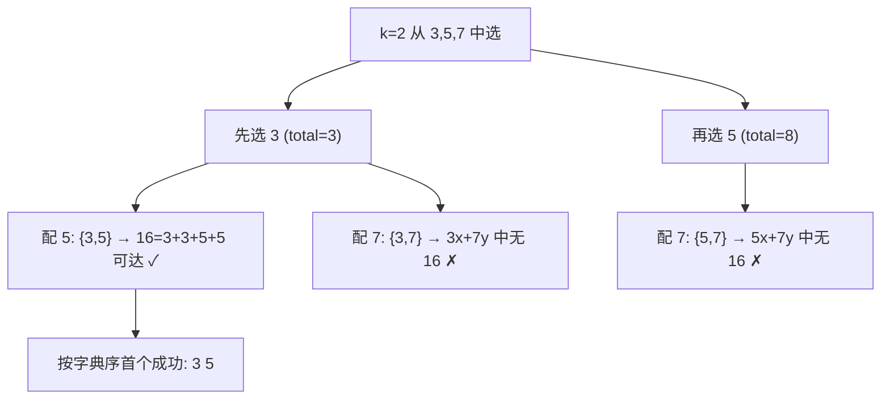

[[TOC]]

## 形式化题目

给定目标量 $Q$ 和一个容积集合（商店里的桶）。要选出一个子集 $S$，使得 $Q$ 能表示成 $S$ 中若干个容积的非负整数和（$Q = \sum_{v \in S} x_v \cdot v,\ x_v \geqslant 0$，即每个买来的桶都可以装满并倒入任意多次）。要求：

1. $|S|$ 最小；
2. 在所有最小的 $S$ 中，把元素升序排序后字典序最小。

输出 $\lvert S\rvert$ 和升序排列的 $S$。数据保证有解。

样例：$Q = 16$，商店桶 $\{3, 5, 7\}$。用两个桶 $\{3, 5\}$ 可以：$3+3+5+5 = 16$，而任何单个桶都不行，答案为 `2 3 5`。

## 暴力解法

### 思路

最朴素的做法是把 $\leqslant 100$ 个桶的每个子集都枚举一遍（$2^{100}$ 个），对每个子集做一次"能否恰好量出 $Q$"的判定，最后在所有可行子集里挑桶数最少、字典序最小的。

判定本身不难：对子集做一次完全背包，$dp[x]$ 表示能否恰好量出 $x$，$dp[0] = \text{true}$，逐个桶做 $dp[x] \mathrel{|}= dp[x - v]$ 即可。

但 $2^{100}$ 的子集枚举完全不可行，必须换成“逐层搜组合 + 强剪枝”的结构。

### 代码

<!-- 暴力只作文字推演用于暴露瓶颈，无独立 brute 代码，略 -->

### 复杂度与瓶颈

瓶颈在于无序地枚举全部 $2^{100}$ 个子集，且对每个子集都从头做一遍背包，连"最小桶数"都要枚举完才知道。

## 正解

### 关键观察

把要求拆成三个可以逐层兑现的观察：

1. **最少桶数可以逐层试**：先问"1 个桶行不行"，再问"2 个桶行不行"……第一个可行的 $k$ 就是最小桶数，不需要枚举完所有子集。
2. **字典序可以由枚举顺序天然保证**：把桶按容积升序排序后，用组合式 DFS（每层下标严格递增、同一层从小容积先试）枚举大小为 $k$ 的子集，生成的组合恰好按升序字典序排列——**第一个成功的组合就是平局规则的胜者**，无需收集所有解再比较。
3. **强剪枝来自"每个桶至少倒一次"**：买来的桶一定都要用上（不然不买它），而桶按升序排列，所以已选容积之和 $\text{total}$ 沿 DFS 路径单调递增且不超过 $Q$。一旦 $\text{total} + v > Q$，后面所有更大的桶都装不下，整条分支直接 `break`。

### 思路

外层枚举桶数 $k = 1, 2, \dots$，内层做上面带剪枝的字典序组合 DFS。每往深走一层、选中一个桶 $v$，就用**增量位集完全背包**把 $v$ 并进"已选桶能恰好量出的夸脱集合"：

- 用一个 $Q+1$ 位的整数（Python 大整数）`bits` 表示可达集合，第 $x$ 位为 1 表示恰好量出 $x$ 夸脱；
- 加入桶 $v$ 的效果是"对每个已可达的 $x$，再倒入任意整数桶 $v$"，即与 $\{0, v, 2v, 3v, \dots\}$ 做加法闭包。用倍增实现：`bits` 依次左移 $v, 2v, 4v, \dots$ 再或回去，恰好覆盖所有倍数增量（任何 $j \cdot v$ 的 $j$ 都能按二进制拆分），超过 $Q$ 的位直接截断；
- 递归到第 $k$ 层时，看 `bits` 的第 $Q$ 位：为 1 则该组合可行。

`total` 剪枝保证搜索树极小；位集让每次可行性传递都只是一次大整数位运算。注意这里 DFS 只负责按字典序枚举候选子集，"恰好量出 $Q$"始终由位集背包严格判定，不做任何贪心假设。

以样例 $Q = 16$、$k = 2$ 为例，DFS 的搜索树如下（$\checkmark$ 表示该组合能恰好量出 16）：

观察重点：DFS 先在第一个桶位置试最小的 3，第二层又先试 5，`{3, 5}` 成为第一个被验证成功的组合——这正是"升序字典序优先"的含义；`{3, 7}`、`{5, 7}` 即使可行也会排在它后面。

位集的一步转移可以看这个例子（已选 $\{3\}$，再选 $5$，$Q = 16$）：

| 步骤 | bits（可达的 $x$ 集合） |
| --- | --- |
| 初始 | $\{0, 3, 6, 9, 12, 15\}$（3 的倍数） |
| 左移 5 再或 | $\{0,3,5,6,8,9,11,12,14,15\}$ |
| 左移 10 再或 | 并入 $\{10,13,16\}$，第 16 位变 1 ✓ |
| 左移 20（$>Q$，截断） | 不变 |

观察重点：倍增步长 $5 \to 10 \to 20$ 让三轮就覆盖了"再倒任意多桶 5"的全部增量（$16 = 6 + 5 + 5$，正是 $\{3\}$ 的可达位 6 再倒两桶 5）；一旦第 $Q$ 位变 1，$\{3, 5\}$ 即被确认可行，DFS 立刻沿原路返回并输出答案。

### 代码

@include-code(./main.py, python)

### 复杂度

- **时间**：对每个 $k$，DFS 节点数被 $\text{total} \leqslant Q$ 与下标递增双重约束；每个节点做至多 $\log Q$ 次长度 $Q+1$ 的位集或运算（Python 大整数按 64 位字压缩）。整体远低于朴素 $2^P$ 枚举，与官方正解（同样的"桶数递增 + 字典序 DFS + 可行性判定"结构）同阶，实测 10 组数据全部毫秒级通过。
- **空间**：$O(Q / 64)$ 的位集沿递归栈保存，加桶列表 $O(P)$。

## 总结

本题的本质是"最小字典序子集选择 + 可行性判定"：最少桶数靠 $k$ 从小到大逐层枚举，字典序靠升序组合 DFS 的枚举顺序天然保证，可行性靠增量位集完全背包严格判定，而"每个桶至少倒一次 + 桶升序"推出的 $\text{total} \leqslant Q$ 剪枝把搜索树压到极小。三件事各自简单，组合起来正好是这道题的正解结构。
