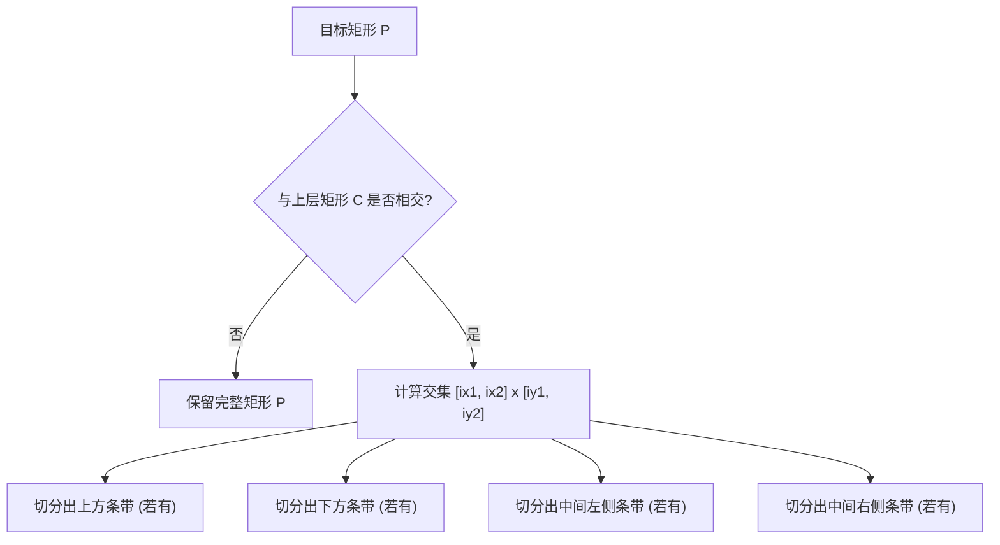

[[TOC]]

## 形式化题目

维护一个二维平面上的矩形窗体序列，每个窗体具有唯一标识符及两对角顶点坐标。支持以下动态操作：
1. **创建窗体**：加入新矩形，并将其置于图层最顶端；
2. **置顶窗体**：将指定矩形移动到图层最顶端；
3. **置底窗体**：将指定矩形移动到图层最底端；
4. **删除窗体**：从图层中移除指定矩形；
5. **查询可见度**：给定窗体标识符，求该矩形未被其上方任何矩形遮挡的可见区域面积占该矩形初始总面积的百分比，四舍五入保留 3 位小数。

## 正解

### 思路

本题窗体的最大特点在于具有严格的前后覆盖层级（Z-Order）。当查询某一窗体的可见面积时，只有在图层层级上位于其**上方**的窗体才会造成遮挡，位于其下方的窗体对其没有任何影响。

#### 1. 图层层级维护
我们可以用一个列表维护当前所有存在的窗体，列表由底至顶排列：
- 创建新窗体：追加到列表末尾（即置顶）；
- 置顶操作：在列表中定位后取出，再追加到末尾；
- 置底操作：在列表中定位后取出，插入到列表头部；
- 删除操作：直接在列表中删除对应元素。

由于窗体标识符取自大小写字母及数字，同时存在的窗体数量最多不超过 $62$ 个，列表调整的代价极小。

#### 2. 矩形切割（Rectangular Clipping）
针对单次查询，假设目标窗体为矩形 $R$，其上方有遮挡矩形序列 $C_1, C_2, \dots, C_k$。
我们使用**矩形切割法**逐步精细化可见区域：
维护一个初始仅包含目标矩形自身的未遮挡矩形集合 $S = \{ R \}$。依次考虑上方的每个遮挡矩形 $C_i$：
对于 $S$ 中的每一个子矩形 $P = [x_1, x_2] \times [y_1, y_2]$：
1. 若 $P$ 与 $C_i$ 无交集，则 $P$ 依然完全保留；
2. 若 $P$ 与 $C_i$ 相交，则设它们的交集为 $[ix_1, ix_2] \times [iy_1, iy_2]$，交集部分被遮挡剔除。剩余的可见部分可以精确分割为至多 $4$ 个互不重叠的小矩形：
   - 上方条带：$[x_1, x_2] \times [iy_2, y_2]$（若 $y_2 > iy_2$）；
   - 下方条带：$[x_1, x_2] \times [y_1, iy_1]$（若 $y_1 < iy_1$）；
   - 中间左侧条带：$[x_1, ix_1] \times [iy_1, iy_2]$（若 $x_1 < ix_1$）；
   - 中间右侧条带：$[ix_2, x_2] \times [iy_1, iy_2]$（若 $x_2 > ix_2$）。

用切割后产生的新碎片替换原矩形 $P$。若集合 $S$ 中途被完全削减为空，说明目标窗体已被完全遮挡，可提前退出。

最终，集合 $S$ 中所有碎片的面积之和即为目标窗体的可见面积，乘以 $100$ 并除以窗体总面积即得所求百分比。

### 可视化流程

下图展示了一个矩形在被上层矩形部分遮挡时，被四条交集边界切割为至多 $4$ 个互不相交的可见碎片的过程：

### 代码

@include-code(./main.py, python)

### 复杂度

- **时间复杂度**：
  - 窗体增删置顶置底操作：由于总窗体数 $N \leqslant 62$，单次列表操作时间复杂度为 $O(N)$；
  - 查询操作：对于至多 $N$ 个遮挡矩形，每次切割将碎片分裂为互不相交的子矩形。在数据范围内，碎片总数规模极小，整体单次查询耗时在数毫秒以内；
  - 总时间复杂度为 $O(Q \cdot N \cdot M)$（其中 $Q$ 为操作总数，$M$ 为单次查询的最大碎片数），完全可以在时限内通过所有测试点。
- **空间复杂度**：$O(N + M)$，仅需存储当前活跃的窗体列表及查询过程中的临时碎片集合。

## 总结

本题的关键在于利用矩形的正交性，通过“矩形切割”把遮挡问题转化为若干小矩形在被交集剔除后的无重叠分割。相比全局离散化扫描线，矩形切割法代码简短优雅，非常契合本题窗体数量小、图层顺序动态变化的特点。
