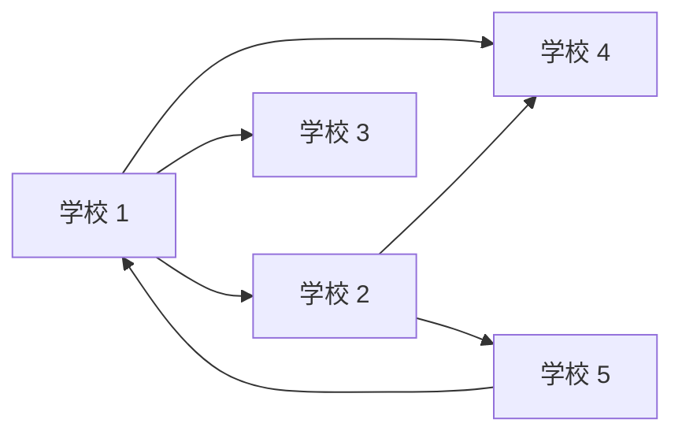
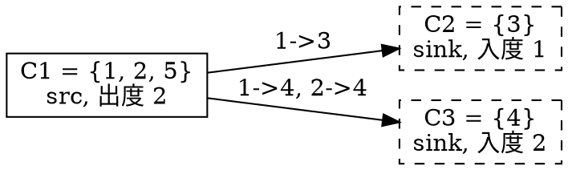

[[TOC]]

## 形式化题目

给定 $N$ 个点（$2 \leqslant N \leqslant 100$）和一张有向图 $G$：边 $i \to j$ 表示学校 $i$ 会把软件转发给学校 $j$。边是单向的，$i \to j$ 并不蕴含 $j \to i$。

一次「发放」指定一个起点 $S$，则 $G$ 中所有从 $S$ 可达的点都装上软件。求：

1. 最少需要发放几个起点，才能使全部 $N$ 个点都装上软件；
2. 在只能**新增**边、不能删边的条件下，最少新增多少条有向边，才能使图强连通（即从任意一个点发放都能到达其余所有点）。

以样例 `schlnet0` 为例，分发列表为 `1: 2 4 3`、`2: 4 5`、`3:`（空）、`4:`（空）、`5: 1`，对应下面这张图（箭头方向就是软件流动方向）。

可以看到 $1 \to 2 \to 5 \to 1$ 已经成环，而 $3$、$4$ 只会被动接收；因此样例答案为 `1`（只需发给学校 1）和 `2`（至少补两条边）。

## 正解

### 思路

**为什么不能直接枚举加边。** 题面要的是「覆盖」和「强连通」这类**全局可达性**性质。子任务 A 还能靠「枚举起点集合 $+$ 验证是否覆盖全部点」硬做，代价是 $\binom{N}{k}$ 级别；但子任务 B 要枚举「加 $k$ 条边」的所有方案，候选边有 $O(N^2)$ 条，方案数 $\binom{N^2}{k}$ 在 $N = 100$ 时完全不可行。所以必须换思路：把图中具有传递性的结构先提取出来。

设缩点后的 DAG 为 $D$，下面反复用到 $D$ 的两条基本性质：任意点沿有向路径前进必停在某个出度为 $0$ 的点，沿反向路径前进必停在某个入度为 $0$ 的点。

**第一步：把「互相可达」的点压成一个点。** 若 $u$、$v$ 互相可达，则「在 $u$ 放一份副本」与「在 $v$ 放一份副本」覆盖的点集完全相同（两条可达关系可以叠加）。于是同一**强连通分量**（SCC）内的所有学校完全等价，可以合并成一个点。用 Tarjan 或 Kosaraju 求出所有 SCC 并缩点，得到的必然是一张 **DAG**（否则还能继续合并）。

下图是样例缩点后的 DAG，虚线框标出两个汇分量：

样例原图共 $6$ 条边：$1\to2$、$2\to5$、$5\to1$ 落在 $C_1$ 内部被消掉，剩下的 $1\to3$、$1\to4$、$2\to4$ 三条跨分量边收缩成图中的两条。**分量内部的边（含自环）对可达性没有额外贡献**，这正是缩点的意义：$C_1$ 内部的 $6$ 种可达关系被压缩成一个点，DAG 上只剩「谁在谁上游」这一层信息。

**第二步：子任务 A 变成数入度为 $0$ 的分量。**

- 必要性：设分量 $C$ 的入度为 $0$，即没有任何一条边从别的分量指向 $C$。那么软件不可能从 $C$ 之外的起点流进 $C$，$C$ 里必须有一个初始发放点。入度为 $0$ 的分量两两不同，所以答案 $\geqslant$ 这类分量的个数。
- 充分性：DAG 中从任意点出发沿**反向**边走，因为无环所以一定会停在某个入度为 $0$ 的点，也就是说每个分量都能被某个入度为 $0$ 的分量到达。因此对每个入度为 $0$ 的分量各发一份，就覆盖了全部点。

两侧夹逼，**子任务 A = 缩点后入度为 $0$ 的分量个数**（记作 $\mathrm{src}$）。

**第三步：子任务 B 变成入度为 $0$ 与出度为 $0$ 的分量个数取较大值。**

先看下界。设 $\mathrm{sink}$ 为出度为 $0$ 的分量个数。要把图补成强连通：

- 每个入度为 $0$ 的分量必须获得一条新的入边（原图里根本没有，只能靠新增），而一条新增边 $u \to w$ 只能给**一个**分量提供入边，所以至少要加 $\mathrm{src}$ 条；
- 同理，每个出度为 $0$ 的分量必须获得一条新的出边，至少要加 $\mathrm{sink}$ 条。

两条限制同时成立，因此新增边数 $\geqslant \max(\mathrm{src}, \mathrm{sink})$。

再看这个下界可以达到（这是 Eswaran–Tarjan 的经典结论，下面给出一个可直接验证的构造）。设 $p = \mathrm{src}$，$q = \mathrm{sink}$，不妨 $p \leqslant q$（否则把所有边反向、让源和汇的角色互换，构造完把新增边也反向即可）。在「源—汇」二分图上连边 $s \sim t$ 当且仅当 $D$ 中源 $s$ 能到达汇 $t$，取一个**最大匹配**。这里有一个关键性质：

> 未匹配的源一定到达不了未匹配的汇。否则把这一对补进匹配就得到更大的匹配，与最大性矛盾。

设共匹配了 $k$ 对，记作 $s_i \leftrightarrow t_i$（$D$ 中 $s_i \leadsto t_i$，$i = 1, \dots, k$）；剩下未匹配的源为 $a_1, \dots, a_{p-k}$，未匹配的汇为 $u_1, \dots, u_{q-k}$。**只加 $q$ 条边**：

1. $t_i \to s_{i+1}$（$i = 1, \dots, k$，规定 $s_{k+1} = s_1$）：把匹配上的源汇首尾接成环，$k$ 条；
2. $u_j \to a_j$（$j = 1, \dots, p-k$）：给每个未匹配源补上入边，$p-k$ 条（$q \geqslant p$ 保证 $q - k \geqslant p - k$）；
3. $u_j \to s_1$（$j = p-k+1, \dots, q-k$）：多出来的未匹配汇一律接回环上，$q-p$ 条。

合计 $k + (p-k) + (q-p) = q = \max(\mathrm{src}, \mathrm{sink})$ 条，边数正好到达下界。为什么补完一定强连通：

- **每个源都能进环**：未匹配源 $a$ 沿 $D$ 的有向边前进必能停在某个汇，而由关键性质这个汇不可能是未匹配汇，只能是某个匹配汇 $t_i$，于是 $a \leadsto t_i \to s_{i+1}$ 进入环；匹配源 $s_i$ 本身就在环上。
- **每个点都能到未匹配汇 $u$**：$u$ 作为汇一定能被某个源到达，而这个源不可能未匹配（关键性质），只能是某个匹配源 $s_i$；环上所有点都能先走到 $s_i$，再由 $s_i \leadsto u$ 到 $u$。
- **环内互相可达**：$t_i \to s_{i+1}$ 让环上每个汇都能回到环，未匹配汇 $u_j \to a_j$（或 $\to s_1$）也进入环，再由上面两条走遍全图。

因此从任意分量都能走到任意分量，补完的图强连通，新增边数恰为 $q = \max(\mathrm{src}, \mathrm{sink})$，下界取得。（本题只要输出个数，代码里并不需要真的构造出来，所以只统计度数即可。）

**唯一的特判**：如果缩点后只剩 **一个** 分量，DAG 已经是单点，本身就强连通，子任务 B 的答案是 $0$（而不是 $1$）。数据 `schlnet2`（$10$ 个点组成一个大环）就是专门用来卡这个点的。

回到样例，三分量的度数如下：

| 分量 | 成员 | 出边去向 | 入度 | 出度 |
| --- | --- | --- | --- | --- |
| $C_1$ | $\{1, 2, 5\}$ | $C_2,\ C_3$ | $0$ | $2$ |
| $C_2$ | $\{3\}$ | 无 | $1$ | $0$ |
| $C_3$ | $\{4\}$ | 无 | $2$ | $0$ |

$\mathrm{src} = 1$、$\mathrm{sink} = 2$，故子任务 A 输出 $1$，子任务 B 输出 $\max(1, 2) = 2$，与样例一致。

**实现要点。** 求 SCC 用两遍 Kosaraju：第一遍在反图上求逆后序，第二遍按逆后序在原图上扩散染色。为保证第二遍的正确性，**必须在展开点 $v$ 的那一刻就标记 `seen[v]`**（而不是等它出栈时），否则同一个点会被多次展开，得到的顺序不再是合法后序，SCC 会划分错误。两遍 DFS 都用手写栈写成迭代形式，不依赖 `sys.setrecursionlimit`。缩点时不必显式建 DAG，直接遍历原图每条边，只在 `comp[v] != comp[w]` 时登记 `has_out[comp[v]]` 与 `has_in[comp[w]]`，分量内边和自环自动被过滤掉。

### 代码

`component_ids` 返回的编号从 $0$ 连续排到「SCC 数 $- 1$」，所以 `max(comp) + 1` 就是分量总数；`has_in` / `has_out` 是 `bytearray` 标记数组，`total - sum(标记)` 直接给出源、汇的个数。最后一行用 `0 if total == 1 else max(sources, sinks)` 完成前面说的那个特判。

@include-code(./main.py, python)

### 复杂度

设 $N$ 为学校数，$M = \sum_i |adj_i|$ 为分发列表的总长度（$N \leqslant 100$ 时 $M = O(N^2)$）。

- 时间复杂度：$O(N + M)$。建反图、Kosaraju 两遍 DFS、缩点统计各扫描一遍边表，都是线性。在 $N \leqslant 100$ 的范围内等价于 $O(N^2)$。
- 空间复杂度：$O(N + M)$，存正向边表、反向边表与分量编号。

实测在 $N = 100$ 的最坏数据上运行约 $0.02$ 秒、峰值内存约 $15$ MB，远低于 $1000$ ms / $128$ MB 的限制。

## 总结

本题的关键只有一句话：**互相可达的学校缩成一个强连通分量，问题就退化成在 DAG 上数度数**。

- 子任务 A：缩点后入度为 $0$ 的分量个数。必要性是「没人能送进来」，充分性是「DAG 里任意点都能被某个源分量到达」。
- 子任务 B：$\max(\text{入度为 } 0 \text{ 的分量数},\ \text{出度为 } 0 \text{ 的分量数})$；下界由「源要补入边、汇要补出边、一条边只能补一边」给出，上界由经典构造给出（先在源、汇之间求最大匹配，再把匹配上的源汇首尾接成环，多余的未匹配汇接回环上）。
- 边界：缩点后只剩一个分量时，子任务 B 输出 $0$。

这道题也是「缩点 + 度数统计」这一套路的最经典模板，同样的结构可以直接迁移到其他「最少加边使图强连通」的题目上。
