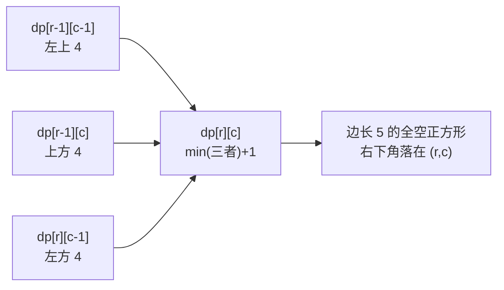

[[TOC]]

## 形式化题目

给定一个 $N \times N$ 的网格（$1 \leqslant N \leqslant 1000$）和 $T$ 个（$1 \leqslant T \leqslant 10\,000$）"有树"的格子坐标，其余格子为空地。求一个边与网格线平行、内部不含任何树格子的正方形的最大边长。

## 正解

### 思路

**朴素做法**：枚举正方形的右下角 $(r, c)$ 和边长 $s$，再检查这块 $s \times s$ 区域里有没有树。检查若用二维前缀和，单次 $O(1)$，总复杂度 $O(N^3)$；$N = 1000$ 时是 $10^9$ 量级，会被时限卡掉。瓶颈在于：同一个右下角，边长从 $1$ 到 $s$ 的所有检查互不相关地重复做了，前一个问题的信息没有被下一个复用。

**关键观察（把"枚举边长"变成 $O(1)$ 转移）**：设

$$dp[r][c] = \text{以 } (r, c) \text{ 为右下角、内部全空的正方形的最大边长}$$

若 $(r, c)$ 是树格子，显然 $dp[r][c] = 0$。若 $(r, c)$ 是空地，一个以它为右下角、边长为 $s$ 的正方形，恰好由三部分拼成：**上方** $s-1$ 格高的竖条、**左方** $s-1$ 格宽的横条，以及**左上角**那个边长为 $s-1$ 的正方形。反过来，这三块都是"全空且尺寸 $s-1$"当且仅当：

- 上方格子的 $dp[r-1][c] \geqslant s-1$（它作为右下角能撑起 $s-1$，说明它头顶那条竖线全空）；
- 左方格子的 $dp[r][c-1] \geqslant s-1$（同理保证横条全空）；
- 左上格子的 $dp[r-1][c-1] \geqslant s-1$（保证内部主体全空）。

三者的最小值就是 $s-1$ 能取到的上限，于是得到转移：

$$dp[r][c] = \min\big(dp[r-1][c],\ dp[r][c-1],\ dp[r-1][c-1]\big) + 1 \quad (\text{(r,c) 为空地})$$

以样例（$N=8$，树在 $(2,2),(2,6),(6,3)$）为例，完整的 DP 值表如下（`#` 行即树所在行）：

| dp\[r\]\[c\] | c=1 | c=2 | c=3 | c=4 | c=5 | c=6 | c=7 | c=8 |
| --- | --- | --- | --- | --- | --- | --- | --- | --- |
| r=1 | 1 | 1 | 1 | 1 | 1 | 1 | 1 | 1 |
| r=2 `#(2,2)(2,6)` | 1 | **0** | 1 | 2 | 2 | **0** | 1 | 2 |
| r=3 | 1 | 1 | 1 | 2 | 3 | 1 | 1 | 2 |
| r=4 | 1 | 2 | 2 | 2 | 3 | 2 | 2 | 2 |
| r=5 | 1 | 2 | 3 | 3 | 3 | 3 | 3 | 3 |
| r=6 `#(6,3)` | 1 | 2 | **0** | 1 | 2 | 3 | 4 | 4 |
| r=7 | 1 | 2 | 1 | 1 | 2 | 3 | 4 | 5 |
| r=8 | 1 | 2 | 2 | 2 | 2 | 3 | 4 | 5 |

观察重点有三处：

1. **树格是"断点"**：$(2,2)$、$(2,6)$、$(6,3)$ 三处 $dp$ 直接归零，并把周围格子的值压低——$(3,5)$ 之所以只有 $3$，是因为它头顶隔两格就有树 $(2,6)$。
2. **对角线阶梯**：右下区域 $(6,6) \to (8,8)$ 的值沿对角线从 $3$ 一路涨到 $5$，每往右下一格 $+1$，说明这片区域可以扩张出边长 $5$ 的全空正方形——这正是答案。
3. **转移只在局部发生**：每个格子只看左、上、左上三个邻居，因此按行递推时整张表可以滚动压缩成一行。

注意第一行整行全空时 $dp[1][c] = 1$：边界上"越界的邻居"贡献为 $0$，公式 $\min(0,0,0)+1 = 1$ 自动处理了边界，无需特判。

答案就是全表中 $dp$ 的最大值。

图示说明转移的几何含义：三个邻居各自"担保"了一个方向上的 $s-1$ 长度全空，三者中最短的那条边限制了新正方形的大小，所以取 $\min$ 再加一。

### 代码

@include-code(./main.py, python)

实现上的两个要点：

- **滚动数组**：$dp[r][\*]$ 只依赖 $dp[r-1][\*]$ 和当前行左侧的 $dp[r][c-1]$，因此只需保留上一行 `row` 和当前行 `cur`，空间从 $O(N^2)$ 降到 $O(N)$。第 0 列放一个恒为 $0$ 的哨兵，`c = 1` 时 `cur[c-1]` 自动越界安全，也无需特判。
- **树用 `set` 存坐标**：$T \leqslant 10\,000$ 远小于格子数 $N^2 \leqslant 10^6$，内层循环用 $O(1)$ 的集合查询判断 `(r, c) in trees`，整体不被树的数量拖慢。

### 复杂度

- 时间：$O(N^2 + T)$。递推遍历全部 $N^2$ 个格子一次，读入树坐标 $O(T)$。
- 空间：$O(N + T)$。滚动数组 $O(N)$，树的坐标集合 $O(T)$。

$N = 1000$ 时约 $10^6$ 次状态转移，远低于朴素做法的 $O(N^3) = 10^9$，本地 15 组测试数据每组均在 0.1s 内完成。

## 总结

本题是"全空最大正方形"的经典网格 DP：把"枚举右下角 + 枚举边长 + 逐块检查"的 $O(N^3)$ 朴素流程，压缩成"每个格子由左、上、左上三个邻居 $O(1)$ 转移"的 $O(N^2)$ 递推。核心不等式是 $dp[r][c] = \min(dp[r-1][c], dp[r][c-1], dp[r-1][c-1]) + 1$，几何直觉是"三个方向的全空长度中，最短的木桶板决定新正方形的边长"。配合滚动数组和树坐标集合，代码不到三十行；同一模型也适用于"最大全 1 子正方形"等一批变式题。
