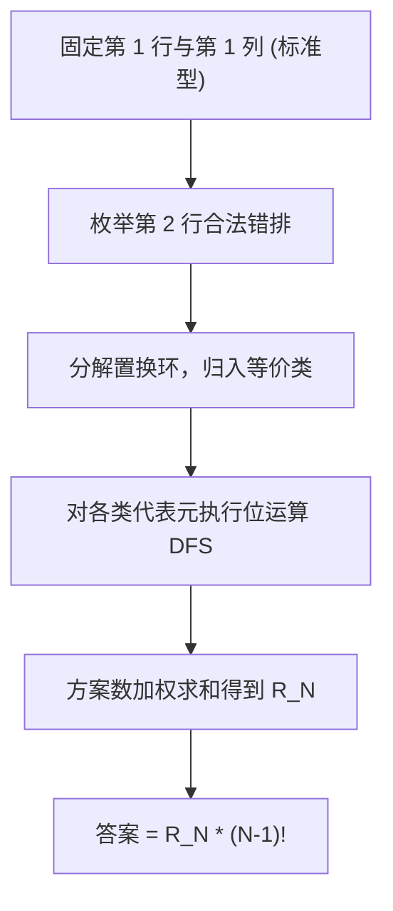

[[TOC]]

## 形式化题目

给定正整数 $N$（$2 \le N \le 7$）。
求满足下列条件的 $N \times N$ 矩阵 $A$ 的总数：
1. 每个元素 $A_{i,j} \in \{1, 2, \dots, N\}$；
2. 每行、每列均是 $\{1, 2, \dots, N\}$ 的一个置换（即 $A$ 是一个 $N$ 阶拉丁方阵）；
3. 第一行固定为 $A_{1, j} = j$（$1 \le j \le N$）。

## 题目解析

### 思路

直接从上到下、逐格尝试填数是经典的爆搜思路。但当 $N = 7$ 时，合法的拉丁方阵数量超过百亿，单纯剪枝也难以在时限内跑出结果。我们需要利用题目的对称性大幅压缩搜索状态。

#### 1. 归约为标准型拉丁方阵（Reduced Latin Square）

一个第一行和第一列均为 $(1, 2, \dots, N)$ 的拉丁方阵称为**标准型拉丁方阵**。

题目只固定了第一行为 $(1, 2, \dots, N)$，对第一列没有限制。
但在任意合法方阵中，第一列的各元素必定是 $\{1, 2, \dots, N\}$ 的一个排列。由于第一行第一列的元素已确定为 $1$，第 $2 \dots N$ 行在第一列上的元素必然是 $\{2, 3, \dots, N\}$ 的某种全排列。

如果我们对方阵的第 $2 \sim N$ 行按其第一列元素的大小进行重排：
- 第一行未参与重排，仍保持 $(1, 2, \dots, N)$；
- 第一列排序后变为 $(1, 2, \dots, N)$；
- 行与列的唯一性性质在行置换下完全保持。

这意味着：**每一个标准型拉丁方阵，通过对后 $N-1$ 行进行任意排列，都能唯一生成一个符合题意的方阵**。
后 $N-1$ 行共有 $(N-1)!$ 种置换方式，因此：
$$\text{答案} = (N-1)! \times (\text{标准型拉丁方阵总数 } R_N)$$

当 $N=7$ 时，$(7-1)! = 720$，此步骤直接将计算量压缩了 $720$ 倍。

#### 2. 第二行置换环同构剪枝

在标准型拉丁方阵中，第一行与第一列均已固定为 $(1, 2, \dots, N)$。此时考虑第二行：
- 其首项固定为 $2$；
- 其余第 $2 \dots N$ 项填入 $\{1, 3, 4, \dots, N\}$ 的一个排列，且对于每个位置 $c \ge 2$，填入的数值不能等于 $c$（不能与第一行同列元素冲突）。

将第二行看作一个将位置映射到数值的置换：
任意一个置换都可以唯一分解为若干个互不相交的轮换（置换环）。
由于同时置换后续的行标、列标和数值符号保持拉丁方阵的结构不变，**只要两个第二行排列的置换环长度多重集相同，它们后续能够填出的合法方阵数就完全相等**。

以 $N=7$ 为例，合法的第二行排列有 $1853$ 个，但它们的置换环长度多重集仅有以下 $4$ 种：

| 环长结构类型 | 出现次数 | 后续方案数（代表元搜索结果） |
| :--- | :--- | :--- |
| $(2, 2, 3)$ | $35$ | $55296$ |
| $(2, 5)$ | $84$ | $55040$ |
| $(3, 4)$ | $70$ | $54528$ |
| $(7)$ | $120$ | $54720$ |

因此，我们无需对所有排列都执行深度优先搜索，只需要：
1. 枚举合法的第二行排列，按环结构分类计数；
2. 对每种类型只选出一个代表排列，运行一次位运算回溯搜索；
3. 将搜索结果乘上该类型的频次后累加，即可得到 $R_N$。

在位运算 DFS 中，维护每一行与每一列已填数值的二进制掩码，每次利用 `avail & -avail` 快速枚举可行数字填入下一格，搜索极其高效。

### 代码

@include-code(./main.py, python)

## 复杂度分析

- **时间复杂度**：
  - 第二行全排列的枚举量最多为 $(N-1)! \le 6! = 720$ 种，环分解耗时在数毫秒内。
  - 对于 $N \le 7$，等价类最多仅 $4$ 种，位运算 DFS 只需执行 $4$ 次，总搜索节点数很少，总运行时间约 $0.6$ 秒，远低于 $1000\text{ ms}$ 时限。
- **空间复杂度**：
  - 递归调用深度为网格剩余格子数，至多不超过 $N^2 \le 49$ 层。
  - 仅需维护长度为 $N$ 的整型位掩码数组，空间复杂度为 $\mathcal{O}(N)$，内存占用极小。
